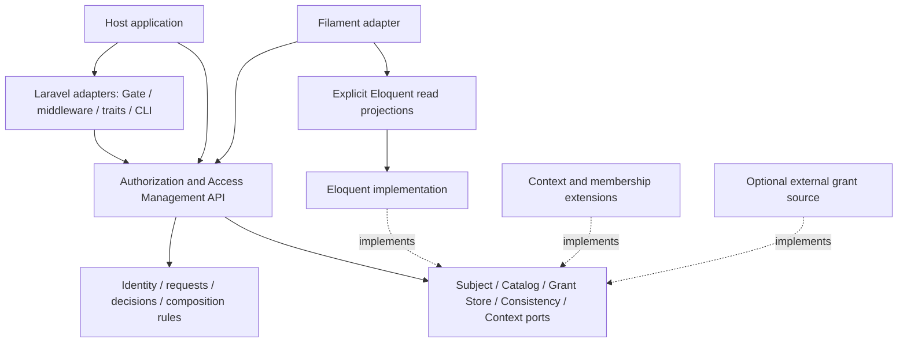

# Свободный redesign: целевая архитектура AzGuard

Это предложения для обсуждения Opus, не спецификация реализации. Владелец разрешает полностью менять структуру и API. Основания: [дополнительный аудит](additional-audit.md), R25–R30 и [первичные источники](Research/primary-sources.md).

## Три целостных варианта

| Вариант | Устройство | Сильные стороны | Цена и ограничения |
|:--|:--|:--|:--|
| A. Laravel-native modular authorization | Один core с явными Authorization/AccessManagement/Catalog модулями; Eloquent — supported adapter contract; context и Filament подключаются через SPI | Native Laravel UX, простая установка, меньше mapping, configurable models | Kernel types могут зависеть от Illuminate; смена storage ограничена model/transaction контрактом |
| B. Authorization kernel + adapters | Чистые input/decision/identity/composition types; application services и storage/subject/runtime ports; Laravel, Eloquent, context и Filament — adapters | Самая ясная зависимость, explicit input, deterministic tests, alternate storage и runtime доступны через capabilities | Mapping и дополнительные types; UI read projections; нужно сдерживать ширину SPI |
| C. Policy/relationship engine | Policy model с attributes/relations, RBAC как projection; optional Cedar/OpenFGA-like adapter | Гибкое object/relationship authorization, distributed consumers, выраженные политики | Новый language/data model, operational burden при external service, сложнее explain/consistency и adoption |

Мой предпочтительный вариант — **B с удобными Laravel adapters**. Причина: он отвечает приоритету полного структурного redesign, переносит globals к boundaries и делает расширяемость явной. A — полноценная альтернатива, если основной смысл configurability — Eloquent/Laravel customization. C заслуживает отдельной оценки при реальной необходимости relation graphs или общих прав для нескольких сервисов; текущие исследования не доказывают такую потребность.

Независимость kernel от framework не требует немедленно публиковать отдельный Composer package. Можно иметь логическую границу в одном distribution; выделение `azguard-kernel`/contracts обсуждается отдельно. Число существующих пакетов не фиксировано. Ошибка — выбрать множество distributions, не определив их API и release coordination.

## Направление зависимостей для B



Domain/kernel не знает о `app()`, Facades, Eloquent, HTTP Request, Carbon или Filament. Laravel provider собирает engine; adapters преобразуют trusted host identity и input. Условие не должно превратиться в запрет использовать framework idioms внутри framework adapters.

## Модули и их смысл

| Модуль | Ответственность | Примеры публичных concepts |
|:--|:--|:--|
| Authorization | Оценить один или batch explicit requests; reason/trace | `Authorizer`, `AuthorizationRequest`, `Decision`, `DecisionReason` |
| AccessManagement | Проверить полномочия actor и изменить grants/assignments | `GrantService`, `RoleAssignmentService`, `RolePermissionService`, mutation results |
| Catalog | Определения permissions, принадлежность namespace, metadata | `PermissionCatalog`, `PermissionDefinition`, `CatalogProvider` |
| Identity | Канонические references и кодирование | `SubjectRef`, `ContextRef`, `ResourceRef`, `RoleKey`, `PermissionKey` |
| Composition | Grant union, обязательные constraints, override policy | `GrantSource`, `AuthorizationConstraint`, `SuperAdminPolicy`, выбранная decision strategy |
| Persistence | Хранение, authoritative snapshot и атомарная mutation | `GrantReadStore`, `AccessWriteStore`, `PermissionStateCoordinator` — названия предварительные |
| Runtime | Время, execution scope, settings/policy versions, diagnostics | `Clock`, validated settings, execution context adapter |
| Integrations | Native UX и явные conversions | Laravel Gate/CLI/trait; Filament plugin/resources/pages |

Сервисные названия выше иллюстрируют границы, а не требуют интерфейс для каждого класса. Нужна единая semantic contract вместо дублей `Manager`/`Service`/`Repository`, делающих одно и то же.

## Предлагаемый словарь

- **Subject** — тот, чьи права проверяются или изменяются. **Actor** — инициатор управления правами. В обычном read/check actor может совпадать с subject; в выдаче права это разные роли.
- **Permission** — объявленная возможность; **PermissionKey** — её canonical identity; **Ability** оставить для Laravel bridge, если не нужно самостоятельное значение.
- **Grant** — выдача permission. **RoleAssignment** — назначение роли. **ContextGrant** — прямой grant в context; нынешнее `ContextRole` неверно направляет понимание, когда запись не является ролью.
- **RoleDefinition** — кодовое объявление; **RoleRecord** — persistence representation; **RoleKey** — стабильный machine key; display label и PHP binding не входят в identity.
- **PermissionNamespace** — namespace каталога; допустимое альтернативное имя `AccessPanel`, если product UX требует panel. **FilamentPanel**, auth **Guard**, tenant **Context** и resource **Scope** должны оставаться различимыми.
- **Decision** — local engine результат и reason. **GateResult** — перевод результата в Laravel tri-state. Эти вещи не взаимозаменяемы.

Getter style можно сделать `id()`, `label()`, `permissions()`. Если используется fluent builder, mutation methods либо живут на отдельном builder, либо возвращают immutable copy. Название method должно позволять понять, выполняет ли он IO.

## Эскизы API для обсуждения

Следующие вызовы — псевдо-API нового дизайна; ни один из них не существует и не утверждён как совместимый с текущим AzGuard.

```php
$request = new AuthorizationRequest(
    subject: $subjectMapper->fromAuthenticatable($user),
    permission: PermissionKey::in('backoffice', 'documents.update'),
    context: ContextRef::of('workspace', $workspaceId),
    resource: ResourceRef::of('document', $documentId),
);

$decision = $authorizer->evaluate($request);
$allowed = $decision->isAllowed();
$reason = $decision->reason();

$grant = $grantService->issue(
    actor: $actor,
    subject: $recipient,
    permission: $permission,
    context: $workspace,
    expiresAt: $deadline,
);
```

Trait и Facade остаются удобными projection adapters, например `$user->hasPermission($permission, context: $workspace)`. Они не должны определять отдельную grammar/default panel или собственный policy engine. Объект `ContextRef` сам по себе не доказывает membership: constraint получает verified subject/resource relationship из trusted provider.

Конфигурируемый batch API должен фиксировать, делят ли решения один evaluated snapshot или каждое читает свежую revision. Это продуктовая гарантия, а не просто оптимизация `foreach`.

## Decision algebra и superadmin

Предлагаю разделить **contributions** (`GrantSource` даёт grants) и **mandatory constraints** (membership, resource scope, expiry, host policy). Дефолтная модель: все обязательные constraints должны пройти; хотя бы один grant/explicit allowed rule должен обосновать allow. Unknown/abstain и error имеют отдельные значения.

Superadmin — explicit policy с scope, а не побочный эффект `'*'` в любом source. Нужно задать, может ли override обходить membership/resource constraints, в каком namespace, кем выдаётся и как журналируется break-glass. Настройка должна говорить это прямо.

Laravel adapter переводит чужую ability в `null`. Для owned no-grant выбирается одна documented integration policy: authoritative deny или additive abstain. Общее обещание deny-by-default относится к окончательной composition boundary, а не к каждому extension, обязанному поддерживать coexistence.

[Cedar](https://docs.cedarpolicy.com/auth/authorization.html) полезен как пример явной allow/forbid семантики; его skip-on-error не следует переносить автоматически в source failure handling AzGuard. [Symfony](https://symfony.com/doc/current/security/voters.html) показывает, что affirmative/unanimous/priority — разные продуктовые стратегии. Research: R08, R20, R29.

## Конфигурируемость как явный контракт

| Настройка | Возможность | Что проверять при сборке |
|:--|:--|:--|
| Namespace definitions | Несколько каталогов, local/qualified translation, display metadata | Grammar, uniqueness, immutable registry, duplicate ownership |
| Subject mapping | Разные механизмы аутентификации, int/UUID/ULID/morph refs | Canonical ID, storage namespace, null/transient subject policy |
| Grant sources | Code roles, DB roles, direct/context/external grants | Deterministic registration, volatility/version/deadline capabilities |
| Constraints / composition | Membership, resource scope, organization policy | Обязательность, порядок, error behavior и override capability |
| Storage implementation | Eloquent default или другой adapter | Atomic write+state version, authoritative reads, transactions и identity support |
| Model/table mapping | Custom Eloquent classes и таблицы | Shared atomic connection, fixed/declared columns, indexes, read projection compatibility |
| Cache policy | Disabled/request/durable; generation | Complete key dependencies, expiry, inability to override security state silently |
| Filament UI | Replacement resources/pages/actions, labels, subject picker | Server-side policies, namespace context, scalable search и configurable provider |
| Events/audit | Local afterCommit, durable audit adapter, optional outbox | Delivery guarantee, actor attribution, payload version и failure policy |

Settings предпочтительно валидировать в один immutable effective configuration. Laravel config содержит scalars, arrays и class names, совместимые с `config:cache`; execution closures/services собираются provider. Per-namespace overrides имеют один documented precedence, а `doctor` показывает effective values и найденные конфликты.

Неизменные guarantees: сравнение identity совпадает с lookup/cache; expired grant не даёт allow; supported mutation не отделяется от state update; unknown runtime capability не выдаётся за поддерживаемую. Выбор grammar или override policy можно менять конфигом только при явном version/deployment boundary.

## Storage, state и events

Read port возвращает snapshot с grant data, сроком и dependency versions. Write coordinator выполняет mutation и обновление state атомарно. External source может объявить volatile/no-cache вместо ложного revision participation. Общий state counter возможен как надёжный baseline; granular counters допускаются при полном dependency fan-out, а не просто ради меньшего количества misses.

Storage abstraction имеет смысл только при описанных consistency capabilities. Интерфейс с `currentRevision(): int` и `advanceRevision(): int` слишком легко позволяет нарушить атомарность двумя независимыми вызовами. Лучше договориться об atomic mutation/session или versioned snapshot API, детали которого проработает Opus.

Integration events отправляются после commit по выбранной гарантии. Outbox нужен, когда событие обязано пережить crash и попасть external consumer/audit; DB revision correctness не требует автоматически внедрять брокер. Domain process events и durable security audit — разные каналы.

## Как оценить выбранный вариант

Попросить Opus провести architecture stories: новый membership constraint; alternate user provider; context-aware queued job; смена role PHP namespace при постоянном key; alternate storage; concurrent revoke/cache miss; Filament stale form; tenant switch после открытия страницы; custom catalog/source с меняющейся policy.

Хороший вариант показывает явные входы, место каждой проверки, transaction/state boundary и результат ошибки. Если для истории приходится редактировать kernel или полагаться на undocumented model events, граница расширяемости ещё не завершена.
