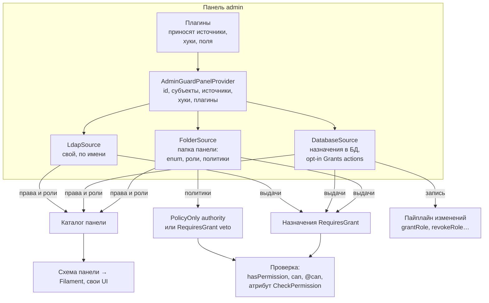
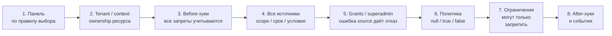
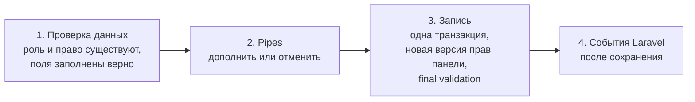

# 00 — AzGuard простыми словами

Этот файл объясняет целевую архитектуру без технических деталей. Точные решения — в [02](02-decisions.md), API — в
[05](05-php-api.md). Нормативные границы и крайние случаи — в 08/09; журнал 02 фиксирует причины решений. При расхождении это дефект досье, который нужно исправить.

## 1. Что такое AzGuard в одном абзаце

AzGuard отвечает на вопрос «может ли этот субъект сделать это действие здесь». Главная идея — **панели**. Панель — это
**конструктор прав** для одной части приложения: админки, личного кабинета, кабинета продавца, API, модуля. Панель —
это папка в приложении, а детали конструктора — **источники**: папка панели с enum прав, ролями и политиками, база
данных, связи сущностей, Laravel Gate и любые свои источники. Источники сочетаются, и их можно менять, не трогая код
проверок. Проверка — одна короткая строка: `$user->hasPermission('orders.view')`.

### Что остаётся из сегодняшнего AzGuard

Идеи текущего репозитория — основа. Новая версия их сохраняет, развивает и исправляет найденные дефекты.

| Сегодня | В новой версии |
|---|---|
| Панели — отдельные пространства прав, `…GuardPanelProvider`, список панелей в конфиге | остаются; панель становится конструктором из источников |
| Панель — папка: провайдер, роли, права, политики | корни `Permissions/{Group}`, `Policies/{Group}`, `Abilities/{Group}` по D72; папку читает `FolderSource`, как сейчас читает автопоиск |
| Enum прав с короткими именами; панель добавляет свой id (`scopedByPanelId`) | остаётся: префикс по умолчанию — id панели; можно свой или без префикса |
| Политики с `#[GateAbility]` и `#[GuardPolicy(model)]`, `AuthorizesPermission` | явный PolicyOnly authority или RequiresGrant veto: `#[Decides]`, `#[PolicyFor]`, `#[Resource(model:)]`, `PolicyBinding` |
| Статичные роли (классы `BaseRole`) и динамические (БД) | только PHP-классы ролей; назначения через БД/правило/связь; атрибуты `#[Role]`, `#[SuperAdmin]` |
| Прямые выдачи прав со сроком (direct grants) | остаются как выдачи прав |
| Роли и права внутри сущности (entity scopes, context-пакет) | остаются, объединены в один параметр `on:` и влиты в ядро |
| Роль суперадмина | остаётся ролью; звёздочка `*` убирается |
| Свои источники прав (`GrantSource`), построители каталога | становятся главным механизмом: фабрика источников, как драйверы в Laravel |
| `#[CheckPermission]` на контроллерах, `#[SkipGuardCheck]`, строгий режим | остаются; `#[CheckPermission]` теперь применяет сам роутер Laravel |
| `#[RoleOnly]` для прав без политики | остаётся как `#[RequiresGrant]` |
| Filament: ресурсы ролей и выдач, typed definitions Enums/Resources + explicit authority | остаются; редакторы строятся по схеме панели |
| Abilities DTO для фронтенда, `explain`, `doctor`, `AzGuardFake` | остаются, работают от той же проверки |

**Добавляется:** фабрика источников (свои источники по имени, как драйверы кэша), связи сущностей и Gate как источники,
одно правило выбора панели, панель по умолчанию, трейт на любой модели, хуки и ограничения в стиле Laravel, схема
панели для интерфейсов, хранилища и свои поля, динамические права, папка `Shared/`, модули, контракт интеграций.

**Исправляется:** 24 дефекта из [01](01-review.md) — межпанельная звёздочка, запись класса роли из Filament,
расхождение Gate и остальных проверок, утечки между сущностями и другие.

## 2. Панели — отдельные части приложения со своими правами

В одном приложении может быть сколько угодно панелей. Они не мешают друг другу:

| Панель | Кто в ней | Откуда права | Меняются ли из админки |
|---|---|---|---|
| `cabinet` (по умолчанию) | покупатели | папка панели: права «всем» («каждый видит свой профиль»), политики («заказ — только свой») | нет |
| `seller` | продавцы | роль «Продавец» автоматически всем, у кого есть магазин; доступ к конкретным магазинам через связь `store.staff` | частично: доступ к магазину даёт владелец магазина |
| `admin` | сотрудники | роли и права в БД, редактируются в Filament; группы LDAP | да |
| `api` | API-клиенты | роли пользователя + ограничение способностями токена | как у панели пользователя |
| `features` | проекты (не люди) | тарифный план проекта (свой источник) | через оплату |
| `blog` (из модуля) | авторы | принёс Laravel-модуль Blog | как решил модуль |

У каждой панели **своё**: список прав, роли, кто может быть субъектом, какие источники подключены, как работают
сущности (проект, магазин), префикс имён прав, хранилище и свои поля, кэш, хуки, middleware входа.

**Общее** у всех панелей: движок проверки, формат имён прав, события, команды, тестовый набор.

## 3. Панель — конструктор из источников

**Источник** — класс, который целиком отвечает за один способ получить права. Панель берёт из источников четыре
вещи: определения прав и PHP-ролей, назначения человеку и явные policy bindings.
Authority каждого action задаётся отдельно: PolicyOnly или RequiresGrant.

| Источник | Что даёт | Пример |
|---|---|---|
| `FolderSource` — папка панели (есть всегда) | enum прав, роли-классы, автоматические роли, права «всем», политики доменов | «Менеджер»; «Продавец» — всем с магазином; «свой заказ — всегда» |
| `DatabaseSource` — вся работа с БД | выдачи PHP-ролей и прав с сущностью и сроком; по флагу — дополнительные Grants права | Анне выдана роль «редактор» в проекте 7 до конца месяца |
| `RelationSource` — связи сущностей | права из данных приложения | участник проекта с ролью `editor` в pivot-таблице |
| `GateSource` — Laravel Gate | явно mapped Laravel ability: PolicyOnly authority или RequiresGrant veto | фича-флаг «бета-доступ» |
| свой источник | всё, что можно написать классом | LDAP-группы, capabilities отдельного service principal, тарифный план |

Свой источник регистрируется так же, как свой драйвер кэша в Laravel: атрибутом `#[AsSource('ldap')]` на классе или
`AzGuard::sources()->extend('ldap', …)`. После этого панель подключает его по имени: `->permissions(['ldap'])`.
Тот же массив принимает enum class-strings; они добавляются к найденным в Permissions/ через FolderSource (D73).



Как это сочетается на примере пользователя Анны в панели `cabinet`:

- право «всем» (`#[GrantedToAll]` на кейсе enum) даёт ей `profile.view` и `orders.list`;
- политика домена решает `orders.view` для каждого заказа: свои заказы — да;
- через связь `project.members` она редактор в проекте 7, поэтому у неё есть `projects.edit` именно там;
- если к кабинету подключить `DatabaseSource`, администратор сможет выдать ей роль «Бета-тестер» на месяц.

Для кода, который проверяет права, всё это выглядит одинаково: `$anna->hasPermission('projects.edit', on: $project)`.
Если завтра право «всем» переедет в БД, чтобы его можно было выключать из админки, проверки не изменятся.

## 4. Панель — это папка

Всё, что относится к панели, лежит в её папке: провайдер, роли, домены, свои источники, ограничения, модели. Так
сохраняется принцип панели как папки; целевая раскладка уточнена в D72. Панель сама находит в своей папке enum прав, PolicyOnly bindings и роли.
Optional RequiresGrant veto подключается явно через PolicyBinding, чтобы удаление метода не снимало запрет. Общее для нескольких панелей лежит в `Shared/`.

```
app/Guards/
├── Admin/
│   ├── AdminGuardPanelProvider.php
│   ├── Permissions/                      группы действий над объектами
│   │   ├── Orders/OrderPermission.php
│   │   └── Users/UserPermission.php
│   ├── Policies/Orders/OrderPolicy.php       решения по действиям
│   ├── Abilities/Orders/OrderAbilities.php   DTO для фронтенда
│   ├── Queries/Orders/OrderVisibility.php    парная фильтрация списка
│   ├── Roles/ManagerRole.php            наборы прав
│   ├── Scopes/ProjectScope.php      типы областей назначения
│   ├── Sources/                         откуда приходят права
│   ├── Restrictions/                    общие запреты
│   ├── Changes/                         pipes изменений доступа
│   └── Models/                          свои модели хранения grants
└── Shared/                              явно подключаемые общие роли/источники/плагины
```

```php
#[Resource(label: 'Заказы', model: Order::class)]
#[RequiresGrant]
enum OrderPermission: string
{
    #[Describe('Смотреть заказ')]      #[PolicyOnly] case View = 'orders.view';
    #[Describe('Смотреть все заказы')] case ViewAny = 'orders.view_any';
    #[Describe('Вернуть деньги')]      case Refund = 'orders.refund';
}

// лежит в Policies/Orders; связь метода с action задаётся #[Decides]
final class OrderPolicy
{
    #[Decides(OrderPermission::View)]
    public function view(User $user, Order $order): ?bool
    {
        return $order->user_id === $user->id ? true : null;        // PolicyOnly: своё разрешено, null/чужое запрещено
    }

    #[Decides(OrderPermission::Refund)]
    public function refund(User $user, Order $order): ?bool
    {
        return now()->between('09:00', '18:00') ? null : false;    // вне 9–18 — нет, даже если выдано
    }
}
```

Grant-side veto привязан явно, чтобы исчезновение метода не отключало запрет:

```php
$panel->policies([
    PolicyBinding::for(OrderPermission::Refund, OrderPolicy::class),
]);
```

**Режим задан на праве.** PolicyOnly решает policy и не читает назначения. RequiresGrant требует
qualified role/direct/fixed/relation assignment; policy true/null только пропускает, false ограничивает.
Именно RequiresGrant подходит для «менеджер назначен на проект, но клиент запретил звонки». Политика не заменяет
такое назначение. Dynamic actions опциональны и имеют только Grants mode. Подробнее — [19](19-oop-and-permission-authority.md).

## 5. Как это выглядит в коде

```php
// app/Guards/Admin/AdminGuardPanelProvider.php
return $panel
    ->id('admin')
    ->for(model: User::class, guard: 'web')
    ->permissions([
        DatabaseSource::make()->dynamicPermissions(),       // назначения PHP-ролей/прав и opt-in дополнительные actions
        'ldap',                                             // свой источник по имени
    ])
    ->restrictions([AccountLocked::class])
    ->plugins([AuditTrailPlugin::make()]);
    // enum, роли и политики из app/Guards/Admin/ найдутся сами
```

Имена методов — своя система (D57): проверки — короткие вопросы, изменения — одна пара «выдать / забрать» (`grant` /
`revoke`) для ролей и прав.

```php
// Проверки — панель по умолчанию не пишем
$user->hasPermission(OrderPermission::View, on: $order);
$user->hasRole('seller');
$user->can('orders.view', $order);                    // обычный Laravel Gate тоже работает
@can('projects.edit', $project) … @endcan

// Другая панель — явно
$user->guard('admin')->hasPermission('orders.refund');
$user->hasPermission('admin.orders.refund');          // префикс указывает на панель admin
$user->hasPermission('admin:orders.refund');          // полное имя работает всегда

// Изменения — тоже с модели
$user->grantRole('editor', on: $project, until: now()->addMonth());
$user->revokeRole('editor', on: $project);
$user->grantPermission('reports.export');
$user->guard('admin')->grantRole('support');

// Суперадмин
$user->isSuperAdmin();

// Контроллер — как сейчас
#[CheckPermission(OrderPermission::Refund, on: 'order')]
public function refund(Order $order) { … }
```

## 6. Одна модель — несколько панелей

У пользователя может быть несколько панелей: личный кабинет, кабинет продавца, админка. При загрузке приложения
регистрируются определения панелей. При проверке вычисляются права выбранного субъекта **в выбранных
панели и tenant/context**; все пользователи и организации при boot не загружаются. Для non-tenant примера:

```
Анна
├── cabinet  (по умолчанию)  profile.view, orders.list, orders.view (политика), projects.edit в project:7
├── seller                    stores.manage в store:12
└── admin                     — (Анна не сотрудник)
```

Какая панель используется в проверке — одно правило для всех случаев:

1. **Явно указанная:** полное имя `admin:orders.refund`; имя с префиксом панели `admin.orders.refund`; enum, который
   знает свою панель; `->guard('admin')`.
2. **Панель по умолчанию для запроса.** Группа маршрутов привязана к панели middleware `azguard.panel:seller`. Внутри
   неё короткие имена относятся к `seller`. Это как `auth:web` в Laravel, который меняет guard по умолчанию. Задачи
   в очереди, поставленные из этого запроса, помнят панель.
3. **Панель по умолчанию для модели** (`cabinet`).
4. Иначе — понятная ошибка «не удалось определить панель», а не тихий отказ.

**Префикс имён.** Как и сейчас, панель добавляет к именам своих прав свой id: `admin.orders.refund`. Такое имя само
указывает на панель, поэтому его удобно писать в Blade, в общем коде и на фронтенде. Префикс можно заменить своим
(`->resourcePrefix('backoffice')` → `backoffice.orders.refund`) или выключить (`->resourcePrefix(false)`). В БД и в enum
хранится имя без префикса, так что префикс можно поменять в любой момент.

Сейчас в коде четыре разных правила выбора панели, и часть проверок отвечает не про ту панель. Одно правило убирает
эту проблему, а синтаксис остаётся коротким.

Права бывают не только у людей. Проект тоже может быть субъектом: `$project->hasPermission('features.export')` в
панели `features`.

## 7. Как проходит проверка



- **Before-хуки** возвращают Continue/Deny (например, замороженный аккаунт — Deny даже для суперадмина); они не разрешают доступ.
- **Суперадмин** определяется из проверенных назначений ролей в выбранном tenant/context.
- **RequiresGrant** требует проверенное назначение: direct/role/fixed/relation или scoped superadmin.
  Явно привязанная политика может запретить; `true`/`null` не заменяют отсутствующее назначение.
- **PolicyOnly** решается единственной политикой: `true` разрешает, `false`/`null` запрещают;
  ядро не читает назначения/роли/их DB state для этого права.
- **Ограничения** — «нельзя, даже если право есть»: пользователь заблокирован, режим «только чтение». Они действуют
  на **любое** «да», в том числе на суперадмина. Ограничение может само освободить суперадмина: так устроено
  «только сотрудники магазина» — освобождение от членства явно настраивается; tenant/resource boundary остаётся.
- **Ошибка на любом шаге = «нельзя».** Сломанный источник не превращается в доступ.
- На вопрос «почему нет?» `explain()` покажет весь путь: какая панель, какой источник что дал, кто отказал.

## 8. Как проходит изменение прав

Меняется только то, что хранит источник-писатель панели — обычно `DatabaseSource`: выдачи PHP-ролей и прав,
дополнительные opt-in Grants права. Права из папки панели и политики меняются в коде.



- Проверка данных ловит опечатки: неизвестная роль или право — ошибка, а не тихая запись.
- PolicyOnly назначения запрещены. RequiresGrant назначение допускает explicit policy veto;
  изменение данных не меняет authority mode права.
- **Кто может менять права — решает приложение, а не AzGuard.** Страницу «Роли» в Filament защищает обычное право
  админки, как любую другую страницу. Правила «нельзя выдать то, чего нет у тебя» или «изменение подтверждает второй
  админ» — это pipes на шаге 2, устроенные как middleware в Laravel.

## 9. Суперадмин — это роль

Суперадмином человека делает **PHP-роль** с `#[SuperAdmin]` или superAdmin() override.
БД хранит её назначение; этот признак не редактируется в Filament. Scope/expiry/boundaries и policy veto обязательны.

- Роль выдана глобально — суперадмин всей панели. Выдана в сущности — все права только внутри неё («суперадмин
  магазина 7»). Это authority только для RequiresGrant; PolicyOnly проверяется своей политикой.
- «Суперадмин по флагу `is_root`» — автоматическая роль с `#[SuperAdmin]` в `Shared/Roles/`.
- «Суперадмин во всех панелях» — та же роль, подключённая к каждой панели.
- Метод `isSuperAdmin()` отвечает на вопрос прямо.

## 10. Схема панели и редакторы

Панель умеет описать себя: какие права есть и по каким доменам сгруппированы, какие решаются политикой, какие PHP-роли
можно назначать, какие поля заполнять при выдаче. Каждый источник добавляет в схему своё. По этой **схеме** Filament
строит read-only каталог ролей и редакторы назначений. Так же может построить форму любой свой интерфейс (Inertia, Vue, API).

Если у панели нет `DatabaseSource` (например, кабинет на одних политиках), редактировать в ней нечего. Схема всё
равно есть: по ней видно, как устроены права.

## 11. Хуки, события, плагины — на механизмах Laravel

AzGuard не придумывает своё там, где у Laravel уже есть механизм:

| Что | Как в Laravel |
|---|---|
| Свои источники по имени | как драйверы кэша: `Manager` и `extend()` |
| `before` / `after` — preliminary Continue/Deny, observation | native DI; typed BeforeResult, без Gate authority shortcut |
| Pipes изменений — дополнить или отменить | как middleware и `Pipeline` |
| Реакция на изменения | обычные события и слушатели: `RoleGranted`, `PermissionRevoked`, … — после сохранения |
| Проверка на маршруте | `#[CheckPermission]` — наследник атрибута `#[Middleware]` Laravel |
| Плагин с миграциями и конфигом | обычный Laravel-пакет со своим `ServiceProvider` |
| Кэш каталога | `php artisan optimize` |

**Ограничения** — единственный свой вид хуков: они умеют только запрещать, поэтому их безопасно подключать откуда
угодно.

**Плагины** — готовые наборы для панелей: источники, ограничения, pipes, поля, проверки doctor. Плагин не привязан к
одной панели: его подключают к любой, и каждая получает свой экземпляр со своими настройками. Модуль может принести
свою панель или дополнить чужую.

## 12. Хранилище и свои поля

Таблицы нужны только панелям с `DatabaseSource`. По умолчанию такие панели хранят данные в общих таблицах `azg_*` и
различаются колонкой `panel`. Панели можно дать свои таблицы или другую базу — это настройка `DatabaseSource`.
Выдачи ролей и прав расширяются своими полями: настоящими колонками или лёгкими полями в JSON-колонке `meta`. Поля
описываются в модели (тип, подпись, правила), попадают в схему панели и в формы Filament, проверяются при выдаче и
при необходимости участвуют в решении.

## 13. Имена и атрибуты

Имена строятся по нескольким правилам ([D57](02-decisions.md#d57)):

- **методы:** проверки — вопросы (`hasPermission`, `isSuperAdmin`), изменения — `grant` / `revoke` / `sync`,
  записи — `RoleGrant`, `PermissionGrant`, события — `RoleGranted`;
- **атрибуты:** существительное — «что это» (`#[Resource]`, `#[Role]`), глагол — «что делает» (`#[Decides]`,
  `#[CheckPermission]`), признак — «какое» (`#[SuperAdmin]`, `#[RequiresGrant]`, `#[GrantedToAll]`), `As…` —
  регистрация по имени (`#[AsSource]`), как в Laravel и Symfony;
- **классы:** по роду — `…Permission`, `…Policy`, `…Role`, `…Source`, `…Plugin`, `…Restriction`; провайдер —
  `…GuardPanelProvider`;
- **папки:** по роду классов во множественном числе (`Roles/`, `Sources/`), домены — по сущности (`Orders/`).

У большинства атрибутов есть запись без атрибута (метод или соглашение об именах): атрибут — удобство, а не
отдельный механизм.

## 14. Что не так в текущем коде

Пакет ещё не в работе, поэтому старый код не патчится. Новая версия строится так, чтобы эти ошибки были невозможны.
Каждая остаётся автоматическим тестом ([evidence](evidence/README.md)):

1. Роль со звёздочкой в одной панели даёт права во **всех** панелях.
2. В Filament можно вписать роли произвольный PHP-класс и сломать проверки.
3. Gate (`@can`) может отвечать не так, как остальные способы проверки.
4. Фильтр записей по выдачам в фоновых задачах показывает всё, а при двух выдачах — ничего.
5. Право в одной сущности из-за склейки строк срабатывает в другой.
6. Четыре разных правила выбора панели; мост Vaulter из-за этого всегда получает отказ.

## 15. Порядок работ

1. **Основа:** ядро понятий, панели-папки, правило выбора панели и префиксы, хранилище ([13](13-workstreams.md), F1–F3).
2. **Источники и проверка:** фабрика источников, папка панели, БД, связи, Gate, хуки, суперадмин, кэш (F4).
3. **Модель и изменения:** трейт, пайплайн изменений, события, схема панели (F5).
4. **Laravel, Filament, интеграции:** middleware и атрибуты, команды, doctor, редакторы по схеме, контракт для
   пакетов (F6–F8).
5. **Выпуски:** `1.0.0-beta` для обкатки на реальных проектах, затем `1.0.0` с автоматическим контролем
   совместимости.

## 16. AzGuard и другие пакеты (Vaulter и не только)

AzGuard — фундамент для пакетов экосистемы: Vaulter (файлы и документы) и будущих. AzGuard даёт им стабильные точки
опоры и не пишет интеграции за них:

- **спросить** «можно ли?» по одному или пакетом (1000 файлов одним вызовом), с причиной ответа;
- **понять, что изменилось** — версия прав панели для своего кэша и события;
- **встроиться** — плагин пакета приносит в выбранную приложением панель свои права, роли, политики, источники;
- **проверить себя** — готовые тестовые наборы против настоящего AzGuard.

У AzGuard и Vaulter общие инженерные правила (vendor `axiomasoft`, конфиги, команды, события, ошибки, тесты), но свои
предметные слова. Мост к Vaulter делает Vaulter; идея моста описана в [10](10-integrations.md#9-идея-моста-vaulter--azguard).


## 12. Самый сложный пример: CRM, организации и проекты

У Анны две организации: в A она менеджер обзвона проектов P1/P2, в B — аналитик P3.
Организация — **tenant**, проект — **assignment scope**: область действия назначения внутри неё. Класс проекта описывает этот тип области,
класс роли ссылается на него, а назначения связывают пользователя с конкретными проектами.

```php
// app/Guards/Crm/Scopes/ProjectScope.php
final class ProjectScope extends BaseAssignmentScope // реализует собственный AssignmentScopeDefinition SPI
{
    public function type(): string { return 'crm.project'; }
    public static function make(): self { return new self(); }
    public function query(): Builder
    {
        return Project::withoutGlobalScopes(); // исходный набор проектов; key/owner проверяет ядро
    }
    public function tenantOf(Model $record): TenantRef
    {
        if (!$record instanceof Project) { throw new InvalidArgumentException('Expected Project'); }
        return TenantRef::of('crm.organization', $record->organization_id);
    }
}

// app/Guards/Crm/Roles/CallerRole.php
#[Role('caller', label: 'Менеджер обзвона')]
final class CallerRole extends BaseRole
{
    public function scopes(): array { return [ProjectScope::make()->filter(new SellerProjects())]; }
    public function scopeRequired(): bool { return true; }
    public function permissions(): array
    {
        return [ClientPermission::View, ClientPermission::Update];
    }
}

// RequiresGrant: назначение выдано на проект, но клиент запретил звонки.
final class ClientPolicy
{
    #[Decides(ClientPermission::Update)]
    public function update(User $user, Client $client): ?bool
    {
        return $client->do_not_call ? false : null;
    }
}

// app/Guards/Crm/CrmGuardPanelProvider.php, внутри panel():
// CrmGuardPanelProvider::getId() возвращает 'crm'; compiler задаёт builder id из него.
return $panel->id(self::getId())->for(model: User::class, guard: 'web')
    ->tenants(TenantPolicy::required(Organization::class)
        ->requireMembership(OrganizationMembership::class))
    ->scopes(AssignmentScopePolicy::inherit(ProjectScope::make()->filter(new ActiveProjects())))
    ->resourceScopes([Client::class => ClientScopeResolver::class])
    ->permissions([DatabaseSource::make()->dynamicPermissions()])
    ->policies([PolicyBinding::for(ClientPermission::Update, ClientPolicy::class)])
    ->restrictions([AccountLockedRestriction::class])
    ->changing([AuthorizeCrmAccessChange::class]);

$crmA = $anna->guard('crm')->inTenant($organizationA);
$crmA->grantRole('caller', on: $projectA1);
$crmA->grantRole('caller', on: $projectA2);

// Тот же PHP-класс может быть назначен Борису на другой проект:
$boris->guard('crm')->inTenant($organizationA)->grantRole(CallerRole::class, on: $projectA4);

$crmA->hasPermission(ClientPermission::View, on: $clientA1);   // да: назначена в P1
$crmA->hasPermission(ClientPermission::View, on: $clientA4);   // нет: P4 не назначен
$crmA->hasPermission(ClientPermission::View, on: $clientB3);   // нет: tenant B вместо A
$crmA->hasPermission(ClientPermission::Update, on: $clientA1); // нет, если do_not_call=true
```

`ProjectScope` не заменяет business model `Project`, не хранит записи проектов и не становится самой ролью.
У него **свой контракт AssignmentScopeDefinition**. Для Eloquent база реализует resolve() через query():
одна загрузка проекта подтверждает существование и его tenant. Дополнительные filter() задают active/city.
Роли CallerRole, AnalystRole и другие PHP-классы ролей могут использовать его одновременно.
Другой пакет приносит свой AssignmentScopeDefinition и mapping tenant identities, используя те же разъёмы.

ClientScopeResolver берёт организацию/проект **из клиента**, а не из выбранной вкладки браузера.
Текущая организация проверяется на совпадение; это исключает смешивание роли A и проекта B.
Список клиентов фильтруется exact query adapter **до** подсчёта/пагинации; политика Update не подменяет View.
UI выдачи роли повторно проверяет actor, target tenant и project на сервере.

Полный пример с enum, аналитиком, dynamic actions, external providers, SQL, Filament и
обходом 22 рабочих цепочек — [16-crm-and-workflows.md](16-crm-and-workflows.md).


## 13. Почему Permissions/Users, а не Users/ в корне

`Permissions/Users/UserPermission.php` содержит **действия над пользователями**: показать профиль,
заблокировать пользователя. `for(model: User::class)` задаёт **того, кому назначаются права**.
Business model User остаётся в приложении. `Models/` панели — свои модели хранения выдач.
`Permissions/Projects` описывает действия над проектами; `Scopes/ProjectScope` — область назначения роли.
Группа `Permissions/Sources` не конфликтует с механизмом `Sources/` в корне.

Для каждой группы классы разложены по виду: `Permissions/Clients`, `Policies/Clients`, `Queries/Clients`,
`Abilities/Clients`. Все эти каталоги находятся прямо в панели; вложенного контейнера Resources нет.
Политика и enum связываются по правилу D56, query adapter подключается явно.
`#[Resource(model:)]` остаётся метаданными объекта доступа на enum, а не указанием на папку Resources.

Конструктор читается `->for(model: User::class, guard: 'web')`: эти модели могут быть субъектами панели.
`AzGuard::panel('crm')->for($anna)` выбирает конкретного субъекта. SubjectRef остаётся именем позиции в запросе;
Relations обозначает связи, читаемые RelationSource. Владелец подтвердил эту раскладку — D72.

<a id="14-контекст-настраивается-для-панели-и-роли"></a>
## 14. Область назначения настраивается для панели и роли

Панель задаёт ProjectScope::make()->filter(new ActiveProjects()), роль возвращает
ProjectScope::make()->filter(new SellerProjects()). Common правила действуют для всех; правила роли — только для
её выдачи. Callback получает query, target user, actual BaseRole и AssignmentScopeRuntime; не нужно читать глобальный Auth.
BaseRole — настоящий PHP-класс данной contribution; его permissions/filters меняются только в коде. Direct grant имеет role=null.

Плагин получает typed models/context/settings через собственную named factory; PluginContext содержит build metadata;
runtime user/role/actor/grant идут в его filters/hooks/pipes при вызове. Defaults/settings не захватывают
текущего пользователя при загрузке worker. Подробности — [18](18-contexts-and-runtime-inputs.md).
Вызов на модели теперь user->guard('crm')->inTenant(organization); guard('crm') выбирает authorization panel,
а for(model: User::class, guard: 'web') — Laravel authentication guard. Контексты не требуют новых PHP-классов на каждый project.
Готовность проверяется реальными CRM flows, описанными отдельно в [17](17-crm-acceptance-tests.md), а не числом unit tests.
