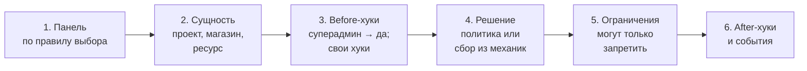
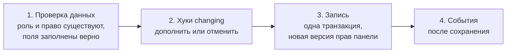

# 00 — AzGuard простыми словами

Этот файл объясняет целевую архитектуру без технических деталей. Точные решения — в [02](02-decisions.md), API — в
[05](05-php-api.md). Если что-то здесь расходится с 02, прав 02.

## 1. Что такое AzGuard в одном абзаце

AzGuard отвечает на вопрос «может ли этот субъект сделать это действие здесь». Главная идея — **панели**. Панель — это
**конструктор прав** для одной части приложения: админки, личного кабинета, кабинета продавца, API, модуля. В каждую
панель подключают те механики, которые ей нужны: жёсткие правила в коде, роли-классы, Laravel-политики и Gate, роли и
права в базе данных (как в Spatie Permission), доступ через связи сущностей, свои источники. Механики сочетаются, и
их можно менять, не трогая код проверок. Проверять права так же просто, как в Spatie:
`$user->hasPermissionTo('orders.view')`.

## 2. Панели — отдельные части приложения со своими правами

В одном приложении может быть сколько угодно панелей. Они не мешают друг другу:

| Панель | Кто в ней | Откуда права | Меняются ли из админки |
|---|---|---|---|
| `cabinet` (по умолчанию) | покупатели | правила в коде («каждый видит свой профиль»), политики («заказ — только свой») | нет |
| `seller` | продавцы | роль «Продавец» автоматически всем, у кого есть магазин; доступ к конкретным магазинам через связь `store.members` | частично: доступ к магазину даёт владелец магазина |
| `admin` | сотрудники | роли и права в БД, редактируются в Filament | да |
| `api` | API-клиенты | способности токена Sanctum | нет |
| `features` | проекты (не люди) | тарифный план проекта | через оплату |
| `blog` (из модуля) | авторы | принёс Laravel-модуль Blog | как решил модуль |

У каждой панели **своё**: список прав, роли, кто может быть субъектом, какие механики подключены, как работают
сущности (проект, магазин), суперадмин, хранилище и свои поля, кэш, хуки, middleware входа.

**Общее** у всех панелей: движок проверки, формат имён прав, события, команды, тестовый набор.

## 3. Панель — конструктор: из чего собираются права

| Механика | Что это | Пример |
|---|---|---|
| Права всем | право есть у каждого субъекта панели | каждый покупатель видит `profile.view` |
| Роль из кода | класс роли со списком прав; права меняются только в коде | «Менеджер» |
| Автоматическая роль | роль из кода, которую получает каждый, кто подходит под правило | «Продавец» — всем с магазином |
| Политика | метод обычной Laravel Policy решает право с учётом конкретного объекта | «смотреть заказ — только свой, или если выдано право смотреть все» |
| Gate | существующая ability Laravel | фича-флаг «бета-доступ» |
| База данных | роли, созданные в админке; назначения ролей; прямые права; всё — с привязкой к сущности и сроком | Анне роль «редактор» в проекте 7 до конца месяца |
| Связи сущностей | права из данных приложения | участник проекта с ролью `editor` в pivot-таблице |
| Свой источник | всё, что можно написать классом | LDAP-группы, способности токена |

Как это сочетается на примере одного пользователя Анны в панели `cabinet`:

- правило «всем» даёт ей `profile.view` и `orders.list`;
- политика решает `orders.view` для каждого заказа: свои заказы — да;
- администратор выдал ей в БД роль «Бета-тестер» на месяц, роль даёт `features.beta`;
- через связь `project.members` она редактор в проекте 7, поэтому у неё есть `projects.edit` именно там.

Для кода, который проверяет права, всё это выглядит одинаково: `$anna->hasPermissionTo('projects.edit', on: $project)`.
Если завтра правило «всем» переедет в БД, чтобы его можно было выключать из админки, проверки не изменятся.

## 4. Как это выглядит в коде

```php
// Права и роли — enum и классы: сразу видно, что к чему относится
enum CabinetPermission: string implements Permission
{
    #[Describe('Смотреть свои заказы')] case OrdersView = 'orders.view';
    #[Describe('Редактировать проект')]  case ProjectsEdit = 'projects.edit';
}

// Проверки — как в Spatie; панель по умолчанию не пишем
$user->hasPermissionTo(CabinetPermission::OrdersView, on: $order);
$user->hasRole('seller');
$user->can('orders.view', $order);                 // обычный Laravel Gate тоже работает
@can('projects.edit', $project) … @endcan

// Другая панель — явно
$user->inPanel('admin')->hasPermissionTo('orders.refund');
$user->hasPermissionTo('admin:orders.refund');     // или полным именем

// Изменения — тоже с модели
$user->assignRole('editor', on: $project, expiresAt: now()->addMonth());
$user->givePermissionTo('reports.export');
$user->inPanel('admin')->assignRole('support');

// Суперадмин
$user->isSuperAdmin();
```

## 5. Одна модель — несколько панелей

У пользователя может быть несколько панелей: личный кабинет, кабинет продавца, админка. При загрузке приложения
панели регистрируются, и для каждого пользователя его права собираются **в один общий набор, разделённый по
панелям**:

```
Анна
├── cabinet  (по умолчанию)  profile.view, orders.list, orders.view (политика), features.beta (до 30.10)
├── seller                    stores.manage в store:12
└── admin                     — (Анна не сотрудник)
```

Какая панель используется в проверке — одно правило для всех случаев:

1. **Явно указанная:** enum, который знает свою панель; полное имя `admin:orders.refund`; `->inPanel('admin')`.
2. **Панель маршрута:** группа маршрутов привязана к панели middleware `azguard.panel:seller`. Внутри неё короткие
   имена относятся к `seller`.
3. **Панель по умолчанию** для этой модели (`cabinet`).
4. Иначе — понятная ошибка «не удалось определить панель», а не тихий отказ.

Сейчас в коде четыре разных правила выбора панели, и часть проверок отвечает не про ту панель. Одно правило убирает
эту проблему, а синтаксис остаётся коротким.

Права бывают не только у людей. Проект тоже может быть субъектом: `$project->hasPermissionTo('features.export')` в
панели `features`.

## 6. Как проходит проверка



- **Before-хуки** могут сразу сказать «да» или «нет» (как `Gate::before`). Первым всегда идёт суперадмин.
- **Решение.** Если право привязано к политике, решает она и может сверить права из механик. Иначе собираются вклады
  всех механик панели: право есть, если его дала хотя бы одна.
- **Ограничения** — «нельзя, даже если право есть»: пользователь заблокирован, не сотрудник этого магазина. Разрешить
  ограничение не может.
- **Ошибка на любом шаге = «нельзя».** Сломанная механика не превращается в доступ.
- На любой вопрос «почему нет?» `explain()` покажет весь путь: какая панель, кто что дал, кто отказал.

## 7. Как проходит изменение прав

Меняется только то, что хранится в БД: роли, созданные во время работы, назначения ролей и прямые права. Правила в
коде и политики меняются в коде.



**Кто может менять права — решает приложение, а не AzGuard.** Для AzGuard есть суперадмин и обычные субъекты. Страницу
«Роли» в Filament защищает обычное право админки, как любую другую страницу. Если приложению нужно правило «нельзя
выдать то, чего нет у тебя» или «изменение подтверждает второй админ», это хук на шаге 2.

## 8. Суперадмин

Суперадмин — обычный пользователь, для которого в панели любая проверка возвращает «да». Сколько их, не важно. Как
панель узнаёт суперадмина, задаётся на панели: по роли `superadmin`, по правилу («флаг `is_root`») или никак. Правило
можно задать сразу для всех панелей. Метод `isSuperAdmin()` отвечает на вопрос прямо.

## 9. Схема панели и редакторы

Панель умеет описать себя: какие права есть и по каким группам, какие можно выдать галочкой, какие решаются
политикой или кодом, какие роли редактируются, какие поля заполнять при назначении. По этой **схеме** Filament строит
редакторы ролей и назначений сам. Так же может построить форму любой свой интерфейс (Inertia, Vue, API).

Если у панели нет механики БД (например, кабинет на одних политиках), редактировать в ней нечего. Схема всё равно есть:
по ней видно, как устроены права.

## 10. Хуки, события, плагины

- **Хуки** — вмешаться, не меняя AzGuard: `before` (переопределить решение), `restrict` (запретить), `after`
  (наблюдать), `changing` (дополнить или отменить изменение), `changed` (отреагировать).
- **События** Laravel — `RoleAssigned`, `PermissionGiven` и другие; только после сохранения.
- **Плагины** — упаковка всего этого для повторного использования: права, роли, механики, политики, хуки, поля,
  проверки doctor. Встроенные механики AzGuard устроены так же. Модуль может принести свою панель или дополнить
  чужую.

## 11. Хранилище и свои поля

По умолчанию все панели хранят данные в общих таблицах `azg_*` и различаются колонкой `panel`. Панели можно дать
свои таблицы или другую базу. Модели назначений расширяются своими полями: настоящими колонками или лёгкими полями в
JSON-колонке `meta`. Поля описываются в модели (тип, подпись, правила), попадают в схему панели и в формы Filament,
проверяются при выдаче и при необходимости участвуют в решении.

## 12. Что не так в текущем коде

Пакет ещё не в работе, поэтому старый код не патчится. Новая версия строится так, чтобы эти ошибки были невозможны.
Каждая остаётся автоматическим тестом ([evidence](evidence/README.md)):

1. Роль со звёздочкой в одной панели даёт права во **всех** панелях.
2. В Filament можно вписать роли произвольный PHP-класс и сломать проверки.
3. Gate (`@can`) может отвечать не так, как остальные способы проверки.
4. Фильтр записей по назначениям в фоновых задачах показывает всё, а при двух назначениях — ничего.
5. Право в одной сущности из-за склейки строк срабатывает в другой.
6. Четыре разных правила выбора панели; мост Vaulter из-за этого всегда получает отказ.

## 13. Порядок работ

1. **Основа:** ядро понятий, панели, правило выбора панели, хранилище ([13](13-workstreams.md), F1–F3).
2. **Механики и проверка:** код, политики, БД, связи, хуки, суперадмин, кэш, Gate (F4).
3. **Модель и изменения:** трейт как в Spatie, пайплайн изменений, события, схема панели (F5).
4. **Laravel, Filament, интеграции:** middleware, команды, doctor, редакторы по схеме, контракт для пакетов
   (F6–F8).
5. **Выпуски:** `1.0.0-beta` для обкатки на реальных проектах, затем `1.0.0` с автоматическим контролем
   совместимости.

## 14. AzGuard и другие пакеты (Vaulter и не только)

AzGuard — фундамент для пакетов экосистемы: Vaulter (файлы и документы) и будущих. AzGuard даёт им стабильные точки
опоры и не пишет интеграции за них:

- **спросить** «можно ли?» по одному или пакетом (1000 файлов одним вызовом), с причиной ответа;
- **понять, что изменилось** — версия прав панели для своего кэша и события;
- **встроиться** — плагин пакета приносит в выбранную приложением панель свои права, роли, политики;
- **проверить себя** — готовые тестовые наборы против настоящего AzGuard.

У AzGuard и Vaulter общие инженерные правила (конфиги, команды, события, ошибки, тесты), но свои предметные слова.
Мост к Vaulter делает Vaulter; идея моста описана в [10](10-integrations.md#9-идея-моста-vaulter--azguard).
