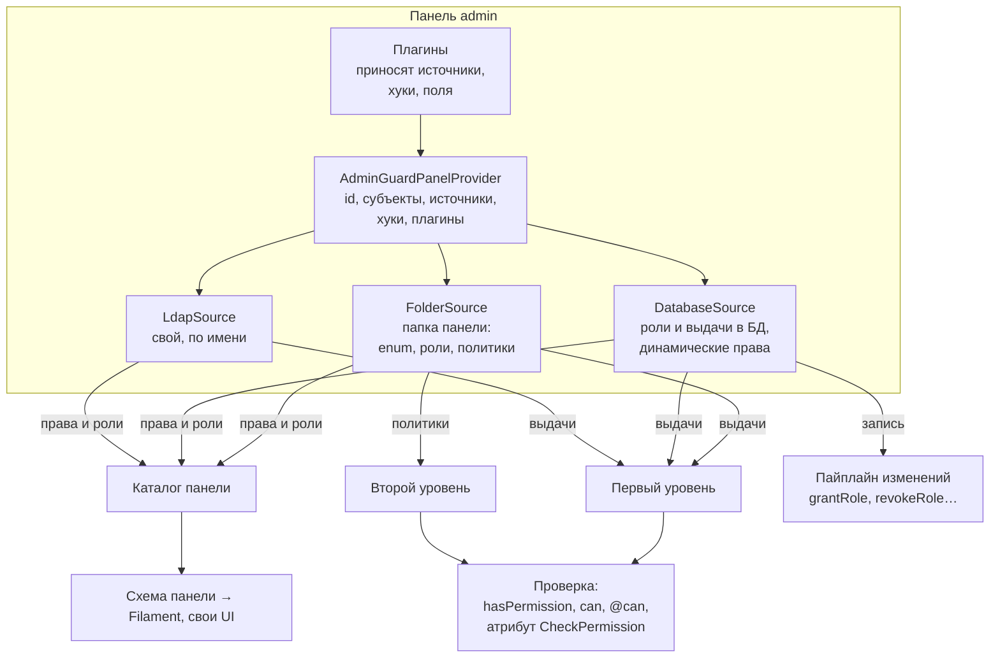
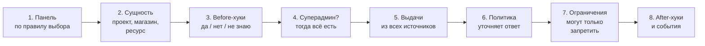
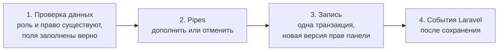

# 00 — AzGuard простыми словами

Этот файл объясняет целевую архитектуру без технических деталей. Точные решения — в [02](02-decisions.md), API — в
[05](05-php-api.md). Если что-то здесь расходится с 02, прав 02.

## 1. Что такое AzGuard в одном абзаце

AzGuard отвечает на вопрос «может ли этот субъект сделать это действие здесь». Главная идея — **панели**. Панель — это
**конструктор прав** для одной части приложения: админки, личного кабинета, кабинета продавца, API, модуля. Панель —
это папка в приложении, а детали конструктора — **источники**: папка панели с enum прав, ролями и политиками, база
данных, связи сущностей, Laravel Gate и любые свои источники. Источники сочетаются, и их можно менять, не трогая код
проверок. Проверка — одна короткая строка: `$user->hasPermission('orders.view')`.

### Что остаётся из сегодняшнего AzGuard

Идеи текущего репозитория — основа. Новая версия их сохраняет, развивает и исправляет найденные дефекты.

| Сегодня | В новой версии |
|---|---|
| Панели — отдельные пространства прав, `…GuardPanelProvider`, список панелей в конфиге | остаются; панель становится конструктором из источников |
| Панель — папка: провайдер, `Roles/`, домены `{Domain}/Permissions`, `Policies`, `Abilities` | остаётся нормой; папку читает `FolderSource`, как сейчас читает автопоиск |
| Enum прав с короткими именами; панель добавляет свой id (`scopedByPanelId`) | остаётся: префикс по умолчанию — id панели; можно свой или без префикса |
| Политики с `#[GateAbility]` и `#[GuardPolicy(model)]`, `AuthorizesPermission` | остаются как второй уровень проверки: `#[Decides]`, `#[PolicyFor]`, `#[Domain(model:)]`, `ConsultsGrants` |
| Статичные роли (классы `BaseRole`) и динамические (БД) | остаются; + автоматические роли; признак суперадмина у роли; атрибуты `#[Role]`, `#[SuperAdmin]` |
| Прямые выдачи прав со сроком (direct grants) | остаются как выдачи прав |
| Роли и права внутри сущности (entity scopes, context-пакет) | остаются, объединены в один параметр `on:` и влиты в ядро |
| Роль суперадмина | остаётся ролью; звёздочка `*` убирается |
| Свои источники прав (`GrantSource`), построители каталога | становятся главным механизмом: фабрика источников, как драйверы в Laravel |
| `#[CheckPermission]` на контроллерах, `#[SkipGuardCheck]`, строгий режим | остаются; `#[CheckPermission]` теперь применяет сам роутер Laravel |
| `#[RoleOnly]` для прав без политики | остаётся как `#[GrantsOnly]` |
| Filament: ресурсы ролей и выдач, режимы `database` / `enum` / `policy` | остаются; редакторы строятся по схеме панели |
| Abilities DTO для фронтенда, `explain`, `doctor`, `AzGuardFake` | остаются, работают от той же проверки |

**Добавляется:** фабрика источников (свои источники по имени, как драйверы кэша), связи сущностей и Gate как источники,
одно правило выбора панели, панель по умолчанию, трейт на любой модели, хуки и ограничения в стиле Laravel, схема
панели для интерфейсов, хранилища и свои поля, динамические права, папка `Shared/`, модули, контракт интеграций.

**Исправляется:** 24 дефекта из [01](01-review.md) — межпанельная звёздочка, запись класса роли из Filament,
расхождение Gate и остальных проверок, утечки между сущностями и другие.

## 2. Панели — отдельные части приложения со своими правами

В одном приложении может быть сколько угодно панелей. Они не мешают друг другу:

| Панель | Кто в ней | Откуда права | Меняются ли из админки |
|---|---|---|---|
| `cabinet` (по умолчанию) | покупатели | папка панели: права «всем» («каждый видит свой профиль»), политики («заказ — только свой») | нет |
| `seller` | продавцы | роль «Продавец» автоматически всем, у кого есть магазин; доступ к конкретным магазинам через связь `store.staff` | частично: доступ к магазину даёт владелец магазина |
| `admin` | сотрудники | роли и права в БД, редактируются в Filament; группы LDAP | да |
| `api` | API-клиенты | способности токена Sanctum (свой источник) | нет |
| `features` | проекты (не люди) | тарифный план проекта (свой источник) | через оплату |
| `blog` (из модуля) | авторы | принёс Laravel-модуль Blog | как решил модуль |

У каждой панели **своё**: список прав, роли, кто может быть субъектом, какие источники подключены, как работают
сущности (проект, магазин), префикс имён прав, хранилище и свои поля, кэш, хуки, middleware входа.

**Общее** у всех панелей: движок проверки, формат имён прав, события, команды, тестовый набор.

## 3. Панель — конструктор из источников

**Источник** — класс, который целиком отвечает за один способ получить права. Панель берёт из источников четыре
вещи: какие права существуют, какие роли есть, что выдано человеку (первый уровень) и какой код уточняет ответ
(второй уровень).

| Источник | Что даёт | Пример |
|---|---|---|
| `FolderSource` — папка панели (есть всегда) | enum прав, роли-классы, автоматические роли, права «всем», политики доменов | «Менеджер»; «Продавец» — всем с магазином; «свой заказ — всегда» |
| `DatabaseSource` — вся работа с БД | роли, созданные в админке; выдачи ролей и прав с сущностью и сроком; по флагу — права, созданные в админке | Анне выдана роль «редактор» в проекте 7 до конца месяца |
| `RelationSource` — связи сущностей | права из данных приложения | участник проекта с ролью `editor` в pivot-таблице |
| `GateSource` — Laravel Gate | существующая ability Laravel как второй уровень | фича-флаг «бета-доступ» |
| свой источник | всё, что можно написать классом | LDAP-группы, способности токена, тарифный план |

Свой источник регистрируется так же, как свой драйвер кэша в Laravel: атрибутом `#[AsSource('ldap')]` на классе или
`AzGuard::sources()->extend('ldap', …)`. После этого любая панель подключает его по имени: `->sources(['ldap'])`.



Как это сочетается на примере пользователя Анны в панели `cabinet`:

- право «всем» (`#[GrantedToAll]` на кейсе enum) даёт ей `profile.view` и `orders.list`;
- политика домена решает `orders.view` для каждого заказа: свои заказы — да;
- через связь `project.members` она редактор в проекте 7, поэтому у неё есть `projects.edit` именно там;
- если к кабинету подключить `DatabaseSource`, администратор сможет выдать ей роль «Бета-тестер» на месяц.

Для кода, который проверяет права, всё это выглядит одинаково: `$anna->hasPermission('projects.edit', on: $project)`.
Если завтра право «всем» переедет в БД, чтобы его можно было выключать из админки, проверки не изменятся.

## 4. Панель — это папка

Всё, что относится к панели, лежит в её папке: провайдер, роли, домены, свои источники, ограничения, модели. Так
устроено и сейчас, и эта структура остаётся нормой. Панель сама находит в своей папке enum прав, политики и роли —
перечислять их вручную не нужно. Общее для нескольких панелей лежит в `Shared/`.

```
app/Guards/
├── Admin/
│   ├── AdminGuardPanelProvider.php       описание панели: из чего она собрана
│   ├── Roles/ManagerRole.php             роли из кода (и роль суперадмина)
│   ├── Orders/                           домен «Заказы»
│   │   ├── Permissions/OrderPermission.php   права домена: orders.view, orders.view_any, orders.refund
│   │   ├── Policies/OrderPolicy.php          код, который выполняется перед доступом
│   │   └── Abilities/OrderAbilities.php      (необязательно) права для фронтенда
│   ├── Users/Permissions/UserPermission.php
│   ├── Sources/                          свои источники этой панели
│   ├── Restrictions/                     «нельзя, даже если есть право»
│   ├── Changes/                          pipes изменений: «без причины не выдавать»
│   └── Models/                           свои модели выдач со своими полями
└── Shared/                               общее: RootRole, LdapSource, плагины
```

```php
#[Domain(label: 'Заказы', model: Order::class)]
enum OrderPermission: string
{
    #[Describe('Смотреть заказ')]      case View = 'orders.view';
    #[Describe('Смотреть все заказы')] case ViewAny = 'orders.view_any';
    #[Describe('Вернуть деньги')]      case Refund = 'orders.refund';
}

// лежит в Orders/Policies — привязан к OrderPermission сам; метод = кейс
final class OrderPolicy
{
    public function view(User $user, Order $order): ?bool
    {
        return $order->user_id === $user->id ? true : null;        // своё — всегда; чужое — как выдано
    }

    public function refund(User $user, Order $order): ?bool
    {
        return now()->between('09:00', '18:00') ? null : false;    // вне 9–18 — нет, даже если выдано
    }
}
```

**Два уровня проверки одного права.** Первый уровень — **выдачи**: есть ли у человека право (из БД, из роли в
коде, из связи, из своего источника). Второй — **политика** того же права: код, который выполняется перед доступом.
Политика отвечает: `null` — «как решили выдачи», `false` — «нет, даже если выдано», `true` — «да, даже если не
выдано». Так редактируемые в админке права и жёсткие правила в коде живут вместе.

**Статичные и динамические права.** Права из enum — статичная схема: они в коде, на них опираются политики. Если
панели нужно добавлять права прямо в админке, у `DatabaseSource` есть флаг: `DatabaseSource::make()->dynamicPermissions()`.
Такие права хранятся в таблице, выдаются и проверяются как обычные.

## 5. Как это выглядит в коде

```php
// app/Guards/Admin/AdminGuardPanelProvider.php
return $panel
    ->id('admin')
    ->subjects([User::class], guard: 'web')
    ->sources([
        DatabaseSource::make()->dynamicPermissions(),       // роли и права из админки
        'ldap',                                             // свой источник по имени
    ])
    ->restrictions([AccountLocked::class])
    ->plugins([AuditTrailPlugin::make()]);
    // enum, роли и политики из app/Guards/Admin/ найдутся сами
```

Имена методов — своя система (D57): проверки — короткие вопросы, изменения — одна пара «выдать / забрать» (`grant` /
`revoke`) для ролей и прав.

```php
// Проверки — панель по умолчанию не пишем
$user->hasPermission(OrderPermission::View, on: $order);
$user->hasRole('seller');
$user->can('orders.view', $order);                    // обычный Laravel Gate тоже работает
@can('projects.edit', $project) … @endcan

// Другая панель — явно
$user->inPanel('admin')->hasPermission('orders.refund');
$user->hasPermission('admin.orders.refund');          // префикс указывает на панель admin
$user->hasPermission('admin:orders.refund');          // полное имя работает всегда

// Изменения — тоже с модели
$user->grantRole('editor', on: $project, until: now()->addMonth());
$user->revokeRole('editor', on: $project);
$user->grantPermission('reports.export');
$user->inPanel('admin')->grantRole('support');

// Суперадмин
$user->isSuperAdmin();

// Контроллер — как сейчас
#[CheckPermission(OrderPermission::Refund, on: 'order')]
public function refund(Order $order) { … }
```

## 6. Одна модель — несколько панелей

У пользователя может быть несколько панелей: личный кабинет, кабинет продавца, админка. При загрузке приложения
панели регистрируются, и для каждого пользователя его права собираются **в один общий набор, разделённый по
панелям**:

```
Анна
├── cabinet  (по умолчанию)  profile.view, orders.list, orders.view (политика), projects.edit в project:7
├── seller                    stores.manage в store:12
└── admin                     — (Анна не сотрудник)
```

Какая панель используется в проверке — одно правило для всех случаев:

1. **Явно указанная:** полное имя `admin:orders.refund`; имя с префиксом панели `admin.orders.refund`; enum, который
   знает свою панель; `->inPanel('admin')`.
2. **Панель по умолчанию для запроса.** Группа маршрутов привязана к панели middleware `azguard.panel:seller`. Внутри
   неё короткие имена относятся к `seller`. Это как `auth:web` в Laravel, который меняет guard по умолчанию. Задачи
   в очереди, поставленные из этого запроса, помнят панель.
3. **Панель по умолчанию для модели** (`cabinet`).
4. Иначе — понятная ошибка «не удалось определить панель», а не тихий отказ.

**Префикс имён.** Как и сейчас, панель добавляет к именам своих прав свой id: `admin.orders.refund`. Такое имя само
указывает на панель, поэтому его удобно писать в Blade, в общем коде и на фронтенде. Префикс можно заменить своим
(`->prefixed('backoffice')` → `backoffice.orders.refund`) или выключить (`->prefixed(false)`). В БД и в enum
хранится имя без префикса, так что префикс можно поменять в любой момент.

Сейчас в коде четыре разных правила выбора панели, и часть проверок отвечает не про ту панель. Одно правило убирает
эту проблему, а синтаксис остаётся коротким.

Права бывают не только у людей. Проект тоже может быть субъектом: `$project->hasPermission('features.export')` в
панели `features`.

## 7. Как проходит проверка



- **Before-хуки** могут сразу сказать «нет» (например, «аккаунт заморожен» — даже для суперадмина) или «да».
- **Суперадмин** получает все права без сбора.
- **Выдачи** — первый уровень: право есть, если его дал хотя бы один источник панели.
- **Политика** — второй уровень: если у права есть политика, она уточняет ответ: `null` — оставить, `false` —
  запретить, `true` — разрешить.
- **Ограничения** — «нельзя, даже если право есть»: пользователь заблокирован, режим «только чтение». Они действуют
  на **любое** «да», в том числе на суперадмина. Ограничение может само освободить суперадмина: так устроено
  «только сотрудники магазина» — суперадмин платформы видит все магазины.
- **Ошибка на любом шаге = «нельзя».** Сломанный источник не превращается в доступ.
- На вопрос «почему нет?» `explain()` покажет весь путь: какая панель, какой источник что дал, кто отказал.

## 8. Как проходит изменение прав

Меняется только то, что хранит источник-писатель панели — обычно `DatabaseSource`: роли, созданные во время работы,
выдачи ролей и прав, динамические права. Права из папки панели и политики меняются в коде.



- Проверка данных ловит опечатки: неизвестная роль или право — ошибка, а не тихая запись.
- Лишних проверок нет: у БД своя схема прав. Если в БД выдано право, у которого есть политика, это не ошибка —
  политика решает, как учесть выдачу.
- **Кто может менять права — решает приложение, а не AzGuard.** Страницу «Роли» в Filament защищает обычное право
  админки, как любую другую страницу. Правила «нельзя выдать то, чего нет у тебя» или «изменение подтверждает второй
  админ» — это pipes на шаге 2, устроенные как middleware в Laravel.

## 9. Суперадмин — это роль

Суперадмином человека делает **роль**: роль из кода помечена атрибутом `#[SuperAdmin]`, у роли из БД для этого есть
флаг (его видно и можно менять в Filament). Сколько суперадминов — не важно.

- Роль выдана глобально — суперадмин всей панели. Выдана в сущности — все права только внутри неё («суперадмин
  магазина 7»).
- «Суперадмин по флагу `is_root`» — автоматическая роль с `#[SuperAdmin]` в `Shared/Roles/`.
- «Суперадмин во всех панелях» — та же роль, подключённая к каждой панели.
- Метод `isSuperAdmin()` отвечает на вопрос прямо.

## 10. Схема панели и редакторы

Панель умеет описать себя: какие права есть и по каким доменам сгруппированы, какие решаются политикой, какие роли
редактируются, какие поля заполнять при выдаче. Каждый источник добавляет в схему своё. По этой **схеме** Filament
строит редакторы ролей и выдач сам. Так же может построить форму любой свой интерфейс (Inertia, Vue, API).

Если у панели нет `DatabaseSource` (например, кабинет на одних политиках), редактировать в ней нечего. Схема всё
равно есть: по ней видно, как устроены права.

## 11. Хуки, события, плагины — на механизмах Laravel

AzGuard не придумывает своё там, где у Laravel уже есть механизм:

| Что | Как в Laravel |
|---|---|
| Свои источники по имени | как драйверы кэша: `Manager` и `extend()` |
| `before` / `after` — сказать «да» или «нет» заранее, наблюдать | как `Gate::before` / `Gate::after` |
| Pipes изменений — дополнить или отменить | как middleware и `Pipeline` |
| Реакция на изменения | обычные события и слушатели: `RoleGranted`, `PermissionRevoked`, … — после сохранения |
| Проверка на маршруте | `#[CheckPermission]` — наследник атрибута `#[Middleware]` Laravel |
| Плагин с миграциями и конфигом | обычный Laravel-пакет со своим `ServiceProvider` |
| Кэш каталога | `php artisan optimize` |

**Ограничения** — единственный свой вид хуков: они умеют только запрещать, поэтому их безопасно подключать откуда
угодно.

**Плагины** — готовые наборы для панелей: источники, ограничения, pipes, поля, проверки doctor. Плагин не привязан к
одной панели: его подключают к любой, и каждая получает свой экземпляр со своими настройками. Модуль может принести
свою панель или дополнить чужую.

## 12. Хранилище и свои поля

Таблицы нужны только панелям с `DatabaseSource`. По умолчанию такие панели хранят данные в общих таблицах `azg_*` и
различаются колонкой `panel`. Панели можно дать свои таблицы или другую базу — это настройка `DatabaseSource`.
Выдачи ролей и прав расширяются своими полями: настоящими колонками или лёгкими полями в JSON-колонке `meta`. Поля
описываются в модели (тип, подпись, правила), попадают в схему панели и в формы Filament, проверяются при выдаче и
при необходимости участвуют в решении.

## 13. Имена и атрибуты

Имена строятся по нескольким правилам ([D57](02-decisions.md#d57)):

- **методы:** проверки — вопросы (`hasPermission`, `isSuperAdmin`), изменения — `grant` / `revoke` / `sync`,
  записи — `RoleGrant`, `PermissionGrant`, события — `RoleGranted`;
- **атрибуты:** существительное — «что это» (`#[Domain]`, `#[Role]`), глагол — «что делает» (`#[Decides]`,
  `#[CheckPermission]`), признак — «какое» (`#[SuperAdmin]`, `#[GrantsOnly]`, `#[GrantedToAll]`), `As…` —
  регистрация по имени (`#[AsSource]`), как в Laravel и Symfony;
- **классы:** по роду — `…Permission`, `…Policy`, `…Role`, `…Source`, `…Plugin`, `…Restriction`; провайдер —
  `…GuardPanelProvider`;
- **папки:** по роду классов во множественном числе (`Roles/`, `Sources/`), домены — по сущности (`Orders/`).

У большинства атрибутов есть запись без атрибута (метод или соглашение об именах): атрибут — удобство, а не
отдельный механизм.

## 14. Что не так в текущем коде

Пакет ещё не в работе, поэтому старый код не патчится. Новая версия строится так, чтобы эти ошибки были невозможны.
Каждая остаётся автоматическим тестом ([evidence](evidence/README.md)):

1. Роль со звёздочкой в одной панели даёт права во **всех** панелях.
2. В Filament можно вписать роли произвольный PHP-класс и сломать проверки.
3. Gate (`@can`) может отвечать не так, как остальные способы проверки.
4. Фильтр записей по выдачам в фоновых задачах показывает всё, а при двух выдачах — ничего.
5. Право в одной сущности из-за склейки строк срабатывает в другой.
6. Четыре разных правила выбора панели; мост Vaulter из-за этого всегда получает отказ.

## 15. Порядок работ

1. **Основа:** ядро понятий, панели-папки, правило выбора панели и префиксы, хранилище ([13](13-workstreams.md), F1–F3).
2. **Источники и проверка:** фабрика источников, папка панели, БД, связи, Gate, хуки, суперадмин, кэш (F4).
3. **Модель и изменения:** трейт, пайплайн изменений, события, схема панели (F5).
4. **Laravel, Filament, интеграции:** middleware и атрибуты, команды, doctor, редакторы по схеме, контракт для
   пакетов (F6–F8).
5. **Выпуски:** `1.0.0-beta` для обкатки на реальных проектах, затем `1.0.0` с автоматическим контролем
   совместимости.

## 16. AzGuard и другие пакеты (Vaulter и не только)

AzGuard — фундамент для пакетов экосистемы: Vaulter (файлы и документы) и будущих. AzGuard даёт им стабильные точки
опоры и не пишет интеграции за них:

- **спросить** «можно ли?» по одному или пакетом (1000 файлов одним вызовом), с причиной ответа;
- **понять, что изменилось** — версия прав панели для своего кэша и события;
- **встроиться** — плагин пакета приносит в выбранную приложением панель свои права, роли, политики, источники;
- **проверить себя** — готовые тестовые наборы против настоящего AzGuard.

У AzGuard и Vaulter общие инженерные правила (vendor `axiomasoft`, конфиги, команды, события, ошибки, тесты), но свои
предметные слова. Мост к Vaulter делает Vaulter; идея моста описана в [10](10-integrations.md#9-идея-моста-vaulter--azguard).
