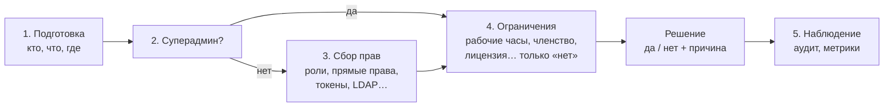
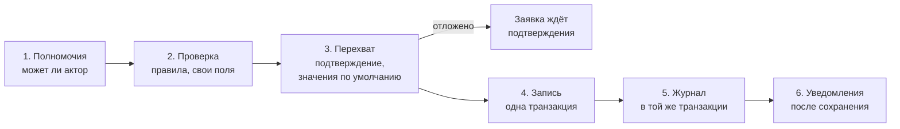

# 00 — Архитектура простыми словами

Этот файл — для владельца и для всех, кто хочет понять замысел без погружения в сигнатуры. Остальные файлы досье
(01–15) — точная спецификация для исполнителей; здесь — «что и зачем» человеческим языком. Если что-то здесь и в
спецификации расходится, это ошибка досье — её нужно поднять.

## 1. Что такое AzGuard в одном абзаце

AzGuard отвечает на вопрос **«можно ли этому человеку (или системе) сделать вот это — здесь и сейчас?»** и даёт
удобный способ **управлять ответом**: выдавать роли и права, забирать их, ограничивать сроком, привязывать к
workspace/проекту, смотреть, почему пришёл тот или иной ответ. Всё это живёт внутри **панелей** — независимых
«пространств прав», которых в одном проекте может быть сколько угодно.

## 2. Панели — сердце философии

Панель AzGuard похожа на панель Filament: это **самостоятельная единица со своими настройками**. В одном
приложении их может быть несколько, и они не мешают друг другу:

| Панель | Кто в ней «живёт» | Какие права | Особенности |
|---|---|---|---|
| `admin` | сотрудники (модель `Admin`, guard `admin`) | управление пользователями, заказами | свои роли, аудит всех изменений, изменение ролей — через подтверждение второго админа |
| `site` | покупатели (модель `Customer`, guard `web`) | заказы, отзывы, избранное | права действуют внутри магазина (`store`), кэш подольше |
| `api` | API-токены | чтение каталога, создание заказов | ролей нет вовсе — права берутся из способностей токена Sanctum |
| `blog` (из модуля) | авторы | посты, комментарии | пришла вместе с Laravel-модулем Blog, ничего не знает о других |

Что у каждой панели **своё**: список прав, роли, кто может быть субъектом (какая модель и какой auth guard),
как работают контексты (workspace/проект), хранилище и модели (можно отдельные таблицы и свои поля), кэш,
поведение Gate, кто суперадмин, кто вправе раздавать права, подключённые плагины и шаги пайплайнов.

Что **общее**: движок, грамматика ключей, формат событий, команды, тестовый набор. Панели можно **сочетать**:
один пользователь может иметь роли в нескольких панелях; одна панель может использовать тот же набор прав
(enum), что и другая; модуль может добавить свои права и роли в чужую панель через плагин.

Ключ права всегда говорит, какой панели он принадлежит: `admin.orders.refund` — это право панели `admin`.
Поэтому проверка никогда не «угадывает» панель — она читает её из ключа. Сейчас в коде четыре разных правила
угадывания, и из-за этого часть проверок отвечает не про ту панель (подробно — [01, N09](01-review.md)).

## 3. Главные понятия — по-человечески

| Понятие | Простыми словами | Пример |
|---|---|---|
| **Панель** (Panel) | Отдельное пространство прав со своими настройками | `admin`, `site` |
| **Право** (Permission) | То, что можно разрешить | `admin.orders.refund` |
| **Роль** (Role) | Именованный набор прав внутри одной панели | `admin:support` |
| **Назначение роли** (RoleAssignment) | «Анне выдана роль support» — возможно, в конкретном магазине и до даты | Анна → `admin:support` до 31.12 |
| **Прямое право** (DirectGrant) | Право выдано человеку напрямую, без роли | Борису `admin.orders.refund` на неделю |
| **Контекст** (Context) | Где действует назначение: везде или внутри конкретной сущности | внутри `store:42` |
| **Субъект** (Subject) | Кому проверяем или выдаём права | пользователь, покупатель, токен |
| **Актор** (Actor) | Кто меняет права (для журнала и проверки полномочий) | админ Вера или «система: импорт» |
| **Суперадмин** (Superadmin) | Тот, кому в панели можно всё, кроме явно запрещённого ограничениями | владелец магазина |
| **Источник прав** (GrantSource) | Откуда берутся права при проверке | роли, прямые права, токен Sanctum, LDAP |
| **Ограничение** (Restriction) | Обязательная проверка, которая может только **запретить** | «только в рабочие часы», «только член магазина» |
| **Плагин** (Plugin) | Пакет возможностей, подключаемый к панели | аудит, подтверждения, права модуля Blog |
| **Хранилище** (Storage) | Где лежат роли и назначения панели | общие таблицы или свои таблицы/БД |

## 4. Как проходит проверка — пайплайн доступа

Когда кто-то спрашивает `can('admin.orders.refund')`, запрос проходит **пайплайн** из пяти шагов. Плагины
встраиваются в шаги, но у каждого шага свои правила — поэтому плагин не может случайно «открыть» доступ:



1. **Подготовка** — понять, кто спрашивает, о каком праве и в каком контексте (например, из маршрута взять
   магазин). Плагины могут дополнить запрос, но не решить его.
2. **Суперадмин** — если субъект суперадмин панели, сбор прав не нужен.
3. **Сбор прав** — все источники складывают, что у субъекта есть. Только здесь права могут **добавляться**.
   Результат кэшируется.
4. **Ограничения** — обязательные проверки. Они могут только **запретить**. Ошибка в ограничении = отказ
   (безопасное поведение), а не «пропустили».
5. **Наблюдение** — записать в журнал, посчитать метрики. Изменить решение уже нельзя.

Ответ всегда один и тот же — через Gate, `@can`, `$user->hasPermission()`, консоль или API пакета-интеграции.
Сейчас это не так: Gate и модельный метод иногда отвечают по-разному ([01, N03](01-review.md)).

## 5. Как проходит изменение прав — пайплайн изменений

Любое изменение (выдать роль, забрать право, изменить роль) идёт **только** через один вход — менеджер доступа
панели — и проходит свой пайплайн:



- **Полномочия**: нельзя выдать то, чего нет у тебя самого; нельзя сделать себя суперадмином. Сейчас таких
  проверок нет нигде, а Filament позволяет вписать роли любой PHP-класс ([01, N02](01-review.md)).
  Если правами одной панели управляют люди из другой (сотрудники админки раздают роли покупателям сайта), панель
  объявляет это явно: `site->administeredBy('admin')`. Тогда полномочия проверяются по специальным правам админки
  вида `admin.azguard.site.roles.manage` ([D23](02-decisions.md#d23)).
- **Проверка**: права существуют в каталоге, контекст подходит панели, свои поля заполнены правильно.
- **Перехват**: здесь живут плагины вроде «изменение ролей админки требует подтверждения второго админа» — операция
  превращается в заявку, а не в запись.
- **Запись**: строки + версия состояния прав панели — атомарно; кэш после этого не может отдать старое.
- **Журнал**: аудит пишется в той же транзакции — если запись откатилась, журнала нет.
- **Уведомления**: события Laravel, письма, вебхуки — только после успешного сохранения.

## 6. Плагины — как расширять, не трогая ядро

Плагин — это класс, который подключают к панели (как плагины Filament):

```php
$panel->plugins([
    AuditPlugin::make(),
    ApprovalPlugin::make()->forRoles('admin:*'),
    BlogAccessPlugin::make(),          // из Laravel-модуля Blog
]);
```

Что плагин может принести в панель: права и роли, источники прав, ограничения, шаги пайплайна изменений,
свои поля в моделях, проверки для `azguard:doctor`, расширения Filament-форм. Встроенные возможности AzGuard —
роли, прямые права, контексты, суперадмин, аудит — тоже оформлены как **встроенные плагины**: так мы доказываем,
что API плагинов достаточно для настоящих функций, а панель может выключить ненужное (например, у панели `api`
нет ролей).

**Модули и сторонние пакеты.** Модуль может принести свою панель целиком (свой `PanelProvider`) или дополнить
чужую: `AzGuard::configurePanel('admin', fn ($panel) => $panel->plugin(BlogAccessPlugin::make()))`. Пакет не решает
сам, в какую панель встать, — это решает хост-приложение. Конфликты ключей прав между модулями обнаруживаются при
загрузке, а не молча.

## 7. Хранилище, свои модели и свои поля

- По умолчанию все панели хранят роли и назначения в **общих таблицах** (`azg_*`), различаясь колонкой `panel`.
- Панель может получить **своё хранилище**: свой префикс таблиц и/или своё соединение с БД
  (`Storage::own(prefix: 'admin_', connection: 'backoffice')`). Миграцию для него генерирует команда — и хост может
  дописать в неё свои колонки.
- Каждая панель может использовать **свои классы моделей** (наследники базовых): добавить поля, касты, связи,
  scopes. Например, у назначения в админке — `department_id` и `approved_by`.
- Лёгкие поля без миграций — в колонке `meta` (JSON) у ролей и назначений.
- Свои поля проходят через пайплайн изменений (их можно валидировать) и, если нужно, участвуют в решении:
  ограничение «только по будням» читает поле `weekdays` назначения.

Почему это теперь надёжно: в Vaulter похожий режим «своих таблиц» пришлось удалить, потому что при работе код
всё равно обращался к общим моделям. Здесь правило с первого дня: **любой доступ к данным — только через
хранилище панели**, и это проверяет автоматический архитектурный тест.

## 8. Что меняется для разработчика — коротко

```php
// Было (0.3)                                          // Станет (0.4)
$user->hasPermission('orders.refund');                 $user->hasPermission('admin.orders.refund');
$user->hasPermission(OrderPermission::Refund, 'admin'); $user->hasPermission(OrderPermission::Refund); // панель из enum,
                                                                                                      // если он в одной панели
$user->hasScopedPermission('app.x', $project);         $user->hasPermission('app.x', context: $project);
$user->assignRole('editor');                           AzGuard::panel('app')->manage()->actingAs($admin)
                                                           ->assignRole($user, 'app:editor');
AzGuard::forUser($u)->on('app')->grant('app.x');       …->manage()->asSystem('import')->grantPermission($u, 'app.x');
Gate::before(fn ($u) => $u->isSuperAdmin() ?: null);   // не нужно: суперадмин — настройка панели
```

Проверки стали строже и однозначнее; изменения прав — всегда «от имени кого-то» и через один вход.

## 9. Что сломано сейчас (без технических деталей)

1. Роль-суперадмин, объявленная в одной панели, действует во **всех** панелях (документация обещает обратное).
2. В админке Filament можно вписать роли произвольный PHP-класс — и стать суперадмином или сломать проверки
   целой группе пользователей. Кто кому что может выдавать — не проверяется.
3. Если подменить в конфиге механизм вычисления прав, Gate (`@can`) его не использует — ответы расходятся.
4. «Изоляция» записей по назначениям (`HasScopedRoles`) в фоновых задачах и у пользователей без назначений
   показывает всё, а при двух назначениях — ничего.
5. Грант в контексте `workspace` с id `a:7` из-за склейки строк срабатывает в другом контексте — через кэш,
   между запросами.

Все пять воспроизведены автоматическими тестами ([evidence](evidence/README.md)). Их предлагается закрыть
**сразу патчем 0.3.x**, не дожидаясь новой архитектуры.

## 10. Порядок работ

1. **Патч 0.3.x** — пять проблем выше и мелкие исправления безопасности.
2. **0.4.0** — новая архитектура: панели как независимые единицы, пайплайны, плагины, хранилища, единый вход для
   изменений, переименования. Один раз, без промежуточных совместимых слоёв; для данных — автоматическая миграция.
3. **0.9.0** — заморозка API, обкатка на реальных проектах (несколько панелей, Octane, очереди, Redis,
   PostgreSQL/MySQL).
4. **1.0.0** — стабильный релиз с автоматическим контролем обратной совместимости.

## 11. AzGuard и другие пакеты (Vaulter и не только)

AzGuard — фундамент, над которым строятся другие пакеты экосистемы: Vaulter (файлы и документы) и будущие.
Задача AzGuard — **дать им стабильные и удобные точки опоры**, а не писать интеграции за них:

- **спросить** — «можно ли?» по одному или пакетом (список из 1000 файлов — одним вызовом), с причиной ответа;
- **понять, что изменилось** — версия состояния прав для своего кэша и события об изменениях;
- **встроиться** — плагин пакета приносит в выбранную хостом панель свои права, роли и ограничения;
- **проверить себя** — готовые тестовые наборы, которые пакет прогоняет против настоящего AzGuard.

Vaulter и AzGuard — разные продукты: хранилище и авторизация. Поэтому у них **общие инженерные правила**
(формат конфигов, команд, событий, ошибок, тестов), но **свои предметные слова**. «Профиль» Vaulter — это
политика для группы файловых пространств; «панель» AzGuard — пространство прав. Совпадать им не нужно. Как
Vaulter переводит свои понятия (владелец диска, уровень доступа) в понятия AzGuard (контекст, права), решает
Vaulter в своём пакете-мосте; AzGuard гарантирует, что для этого есть всё нужное ([10](10-integrations.md)).
