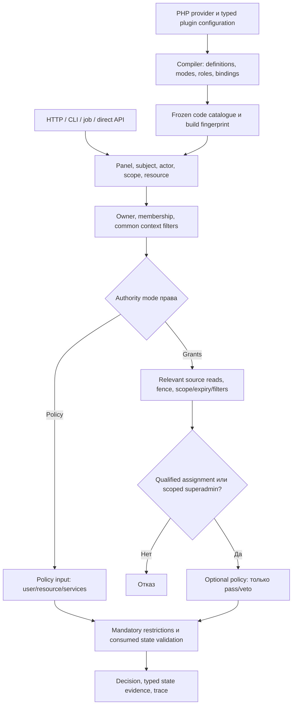

# 20 — Сквозная карта процессов и границы реализации

Целевая спецификация; status всех runtime gates — **future**. Карта задаёт реализуемые шаги и владельцев,
не утверждает, что нынешний пакет уже их выполняет. [19](19-oop-and-permission-authority.md) — OOP/authority,
[09](09-authorization-semantics.md) — алгоритм, [08](08-data-model-and-migration.md) — assignments/storage.

## 1. Основной поток

Policy branch не вызывает grant-store reader/writer/state fence. Host business SQL всё ещё может понадобиться.
Тот же mode-aware semantic plan используется exact visibility; arbitrary PHP не компилируется автоматически.

## 2. Что делает каждый класс

| Ответственность | Владелец | Вход / выход | Чего здесь нет |
|---|---|---|---|
| Сборка | PanelProvider + concrete plugins + compiler | typed config/classes → validated frozen metadata | boot Auth/DB role CRUD |
| Identity | Kernel codec/refs + Laravel resolver | trusted resolved class/model или validated id → exact refs | tenant из произвольного meta |
| Role definitions | BaseRole classes/RoleCatalog | permissions/contexts/flags → read-only role schema | roleModel/JSON filter profiles |
| Context owner | AssignmentScopeDefinition + host resolver | AssignmentScopeRef → ResolvedAssignmentScope через query/resolve | фильтр current user вместо owner |
| Eligibility | AssignmentScopeFilter + Eloquent adapter | fresh Builder + AssignmentScopeRuntime → extra predicate group | выдача права/query sandbox |
| Authority | mode dispatcher + grants/policy step | compiled mode + scoped inputs → candidate/reason | policy OR DB fallback |
| Visibility | exact adapters/coordinator | same supported predicate plan → constrained query | filter-after-page/general PHP-to-SQL compiler |
| Read state | source-specific fence + dependency contracts | consumed sources/build → typed evidence | один token всех host/external данных |
| Change | Laravel Pipeline + one writer | validated Change → transactional ChangeResult/events | прямые model writes из UI |
| Actor delegation | host pipe/policy | actor + requested assignment + target → permitted mutation | управление правами как право escalates всё |
| Editor | schema + scoped GrantManager | metadata/options/authorised target → validated command | изменение PHP definitions |
| Delivery | root commit event/audit/host optional outbox | committed refs/payload → effects | exactly-once при best-effort event |

## 3. Сквозные цепочки

| # | Процесс и последовательность | Критическая ошибка / граница | Owning items / приёмка |
|---|---|---|---|
| F01 | Создать панель: generator → typed provider → discover exact classes → validate owner/modes/keys → freeze | duplicate key/writer/identity/missing mode rejects до serving | P2.1/P2.5/P2.8/P6.8; R56/R67 |
| F02 | Подключить plugin: concrete named factory → validate DTO/contracts → register contributions → compile → boot | base не навязывает factory; conflict/requires/errors; build services не request state | P2.4; R45–R49/R67 |
| F03 | Переподключить plugin в другой panel: fresh config → independent metadata/runtime capabilities | shared config не мутируется; no model/options/user leakage | P2.4/P6.8; R45/R46/R54 |
| F04 | PolicyOnly authorize: lookup static mode → owner/common → preliminary checks → policy → restrictions → code state | assignment DB недоступна/отсутствует: не вызывается; policy host service error deny | P4.1/P4.3; R61/R64 |
| F05 | RequiresGrant authorize: mode → scope/common → source frame/fence → qualify each witness → expand PHP roles → optional veto → final | отсутствует grant: policy true не помогает; source error/expired grant не masked | P4.1/P4.4/P4.8; R11/R17/R44/R62 |
| F06 | Автоматическая/relationship роль: host resolver → known role class → scoped RoleContribution → общий qualification | unknown pivot role не создаёт definition; host revision/lease явен | P4.2/P4.5; R14/R41/R50 |
| F07 | Exact list/count/page/export: mode-aware query adapter → grouped owner/common + authority + veto/restrictions → terminal query | unsupported component/connection throws; exact требует whole semantics | P4.12; R31–R35/R58/R64 |
| F08 | Назначить кодовую роль через DB: class/key → known catalogue → actor → target eligibility → lock → pipes → final validate → upsert/version | class definition не копируется; target и actor не взаимозаменяемы | P5.2/P5.3; R23/R26/R27/R65 |
| F09 | Назначить enum permission напрямую: resolve compiled Grants mode → scoped mutation | PolicyOnly exact grant rejected до записи; enum definition не materialize в DB | P4.4/P5.3; R63/R65 |
| F10 | Создать dynamic action: opt-in + scoped actor → reject shadow → lock → create Grants-only definition/version | нет code class/method/profile из payload; только tenant catalogue | P4.4/P5.3; R23/R65 |
| F11 | Обновить assignment: authorised scoped row → typed permitted values → final Assignment revalidation/fingerprint → write | immutable identity/role/scope/origin не patchable; stale form rejected | P5.2/P5.3; R24/R30 |
| F12 | Отозвать expired/inactive/orphan: inspect authorised stored row → actor scope/delegation → lock → delete/version | текущая active/city/existence не prerequisite revoke; no cross-origin delete | P5.2/P5.3; R28/R52/R66 |
| F13 | Bulk/sync: enumerate exact tenant/context/origin → all targets validate → one writer transaction | one invalid/cross-tenant id rolls back entire mutation; no global tenants expansion | P5.2; R27/R30/R37 |
| F14 | Удалить dynamic action: exact scoped row → lock → remove exact direct grants/action/version | wildcard остаётся, unknown key не становится valid action; enum delete rejected | P5.3; R23/R59 |
| F15 | Изменить PHP роль/filter/policy/mode: review → new build → validate catalogue → active build/cache/worker lifecycle | old definitions/grants не смешиваются; no fake DB RoleUpdated; in-flight rollback не обещан | P2.5/P4.8/P6.8; R29/R57/R66 |
| F16 | Переименовать/удалить роль: stable key unchanged либо FormerKeys dry-run + explicit scoped migration → bump assignments | removed key zero authority, cleanup доступен; unknown FQCN/pseudo alias не trusted | P5.3/P6.8; R66 |
| F17 | Mode switch Grants ↔ Policy: compile explicit mode → active build → inspect old assignments | старые grants inactive у Policy; переход к Grants не порождает grants от прошлого Allow | P2.5/P5.3; R63/R66 |
| F18 | Job execute: refs/ids deserialize → fresh build/now/target/scope → mode authorize → host protected write | enqueue-time decision не authority; package fence не atomic с любым domain write | P6.2/P6.10; R53/R54/R59 |
| F19 | Editor autocomplete: actor authorised → target role/subject/tenant selected → Assignment filters → LIMIT | admin city не подменяет target; forged options/fingerprint не проходят write validation | P5.5/P7.4; R26/R36/R37 |
| F20 | UI role/permission schema: code roles read-only → show mode → grant editor only Grants → authoritative endpoint | hidden checkbox не защита; raw definition/profile request rejected | P7.3/P7.4; R25/R38/R63 |
| F21 | External import: installation mapping → canonical host refs → configured origin → validated sync | partial page/retry/old webhook не превращается в complete revoke или grant resurrection | P8.1; R08/R42/R44 |
| F22 | Commit/audit/delivery: write audit same DB transaction → root commit event → host transport/outbox | rollback не публикуется; after-commit delivery best effort и no retry mutation от listener error | P5.4; R30/R42/R52 |
| F23 | Cache/restore: metadata restore via providers → current build+storage incarnation/revisions → expiry every check | closure/model serialization нет; code token не верифицирует Project/city/remote state | P4.8/P4.9; R51/R57 |
| F24 | Mixed batch: partition by panel/mode/consumed sources → one now → stable result order/state map | PolicyOnly не втягивает DB; Grants branch errors не скрыты соседним successful action | P4.8; R58/R68 |

## 4. Блокировки и deployment

Package transaction сериализует **assignments и dynamic actions** на собственном connection. Он не сериализует PHP
class deployment, host Project transfer или внешний LDAP. Для protected Client/Call write приложение задаёт
единый protocol: capture build/host revision → проверить текущую authority → common host locks/revision compare →
commit domain write. Если assignments и host data на одном connection, возможна общая transaction/lock ordering;
если connections разные, строгая atomicity требует host command/revision protocol, не обещание пакета.

Build activation ownership — host deployment lifecycle. Production reader/writer сообщает свой buildId и проверяет
current active build перед strict protected write; old worker must restart/reject, а coordinated rollout gate
квалифицируется consumer. Code-only access evidence не берётся из assignment DB. Внесение новой schema сначала
expand/migrate/qualify, затем compatible reader/writer rollout и contract cleanup. Никакого безусловного обещания
«PHP class rename атомарен с БД». FormerKeys migration/old namespace alias window планируется явно.

## 5. Что означает «реализуемо»

У каждой строки есть API/SPI owner, данные, exception/denial behavior и реальный будущий acceptance case.
Это проверяемая спецификация. Implementation может уточнить unsupported query shapes, engine capabilities и
cost budgets, но не менять authority ownership/tenant boundary/definition-vs-assignment separation скрыто.
Каждый vertical slice должен проходить свой real consumer case. Количество классов/DTO или положительный
research review не заменяет R01–R68. Не нужны новые generic serializer/policy DSL/model registries.
