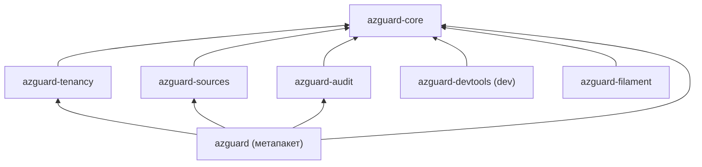
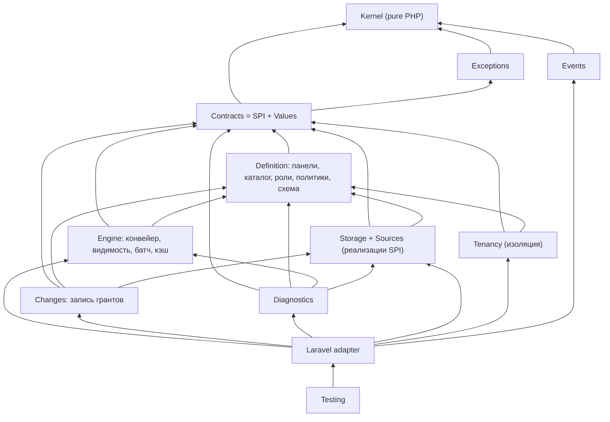
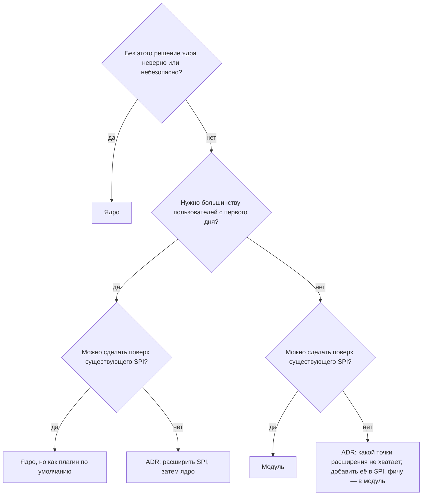

# Архитектура: минимальное ядро и подключаемые модули (обсуждение)

Дата: 2026-10-09. Ветка: `review/v1-architecture` от `review/v1-hardening` (`c04529e8`). Документ —
предложения для обсуждения, **код не менялся**. Ссылки на код — относительно `packages/core/src`, если не указано
иное. Цифры сняты скриптом по дереву ветки (строки — `wc -l` с комментариями, связи — по `use AzGuard\…`).

## 0. Контекст

Обсуждали с владельцем по итогам оценки пакета (архитектура 8/10, API и удобство 7,5/10). Позиция владельца:
функционала много и не всем он нужен; при этом пакет не «переусложнён целиком», но часть можно отделить. Цели:

1. **Понятность.** Новичок должен освоить малое ядро, а не 25 зон и 246 публичных классов.
2. **Гибкость.** Возможности, которые нужны не всем, подключаются явно.
3. **Свобода будущих решений.** Если понадобится вынести модуль в пакет или распространять часть иначе, это
   должно быть переносом файлов без смены публичного API. Платные версии не решены (раздел 3).

Ограничение: кардинальные изменения в 1.0 сейчас не делаем. Ниже — что я поменял бы, если бы было можно, и что
дёшево сделать уже в 1.0, чтобы эту дверь не закрыть.

**Короткий вывод.** Делить надо не «по фичам из README», а по зависимостям. Ядро у пакета уже есть и хорошее
(`Kernel` + конвейер решений + `DatabaseSource`), но три вещи мешают выделить модули: (1) `Contracts` зависит от
14 зон реализации, то есть стабильного SPI для внешних модулей пока нет; (2) тенанты и области пронизывают 141 из 421
файла — это измерение модели, а не плагин; (3) первый же шаг квик-старта — панель. Отсюда план: в 1.0 — границы
и арх-тесты без смены API; в 1.x — вынести то, что слабо связано (аудит, справочники для UI, генераторы); в 2.0 —
чистый SPI. Корректность и безопасность не бывают опциональными.

## 1. Что есть сейчас: инвентаризация

### 1.1. Размер

| Пакет | Файлов | Строк | Публичный API (`api-manifest.json`) |
|:--|--:|--:|:--|
| `packages/core` (`axiomasoft/azguard`) | 421 | 41 475 | 246 типов (179 классов, 42 интерфейса, 16 enum, 9 трейтов), 1 079 методов |
| `packages/filament` (`axiomasoft/azguard-filament`) | 42 | 5 264 | использует 52 типа ядра, только из манифеста (`tests/Arch/ApiManifestTest.php`) |
| `tests/` | 869 | ~55 800 | из них Feature 251 файл / 27,9 тыс. строк, Fixtures 470 / 14,8 тыс. |
| `docs/` | 26 стр. | ~19,7 тыс. слов | `advanced/` — 4 тыс. слов, из них `consistency.md` 1,4 тыс. |

Конфиг `config/azguard.php`: 221 строка, 11 верхних секций. `PanelBuilder` (`Panels/PanelBuilder.php`): 31
публичный метод DSL. Исключений — 51 класс (`Exceptions/`), причин решения — 21 (`Kernel/Decision/DecisionReason.php`).

### 1.2. Возможности по областям

Строки — суммарно по перечисленным файлам; одна возможность часто размазана по нескольким зонам.

| Возможность | Где (основное) | Строк | Кому нужна |
|:--|:--|--:|:--|
| Ядро значений: идентичности, ключи, шаблоны, `Decision`, `PermissionSet`, токены | `Kernel/` (29 файлов) | 2 336 | всем |
| Конвейер решения: Prepare → Boundary → Before → Authority → Restriction → After | `Authorization/Pipeline/*`, `Authorizer.php`, `EvaluationFrame.php` | ~1 700 | всем |
| Панели: DSL, рецепт слоями, компиляция, реестр, резолвер, отпечаток | `Panels/` (14) | 3 938 | всем, но многопанельность — не всем |
| Каталог прав и ролей из кода (enum + классы ролей, атрибуты) | `Catalog/`, `Roles/`, `Permissions/`, `Attributes/` | ~1 620 | всем |
| Политики (вето) и мост в Laravel Gate | `Policies/`, `Laravel/Gate/GateBridge.php` | 573 | всем |
| Хранилище и `DatabaseSource`: гранты, записи, блокировка панели | `Storage/` (18), `Sources/Database/` (7) | 4 741 | всем, кто хранит гранты в БД |
| Прочие источники: папка (discovery), Gate, Relation, менеджер | `Sources/Folder`, `Gate`, `Relation`, `SourceManager.php` | ~2 160 | discovery — многим; Relation/внешние — немногим |
| Согласованность: снимок, токены, ревизии, эпоха, забор внешних источников, `Reads`/`StateRefresh` | `Authorization/ReadAttempt.php`, `Storage/StorageReadSession.php`, `AuthorityReadBaseline.php`, `Kernel/Decision/*StateToken.php`, `Contracts/Sources/FencesReads.php`, `Panels/Reads.php`, `StateRefresh.php` и др. | ~1 820 + часть `DatabaseSource` | корректность нужна всем; ручки — немногим |
| Тенанты и области назначения (наследование, членство, резолверы) | `Scopes/` (19), `Contracts/Scopes/` (17), `Authorization/ScopeEligibility.php`, `Kernel/Identity/AccessScope.php` | ~1 910 ядра + упоминания в 141 файле | SaaS/мультитенант |
| Видимость списков `visibleTo()` (предикаты в SQL) | `Authorization/Visibility.php`, `Authorization/Query/*`, `Scopes/Query/*`, `Sources/Relation/*` | ~2 150 | многим |
| Батч решений `DecisionSet` одним снимком | `Authorization/BatchEvaluation.php`, `BatchInputs.php`, `Kernel/Decision/DecisionSet.php` | 751 | таблицам/Filament |
| Хуки, ограничения, условия грантов | `Contracts/Authorization/{Restriction,GrantCondition}.php`, `Pipeline/Stages/{Before,Restriction,After}Stage.php` | ~370 | продвинутым |
| Супер-админ | `Roles/SuperAdminRole.php`, `Roles/Attributes/SuperAdmin.php` (+ 27 файлов упоминаний) | 38 | многим |
| Конвейер изменений: pipes, валидаторы, журнал, менеджеры, миграция ключей ролей | `Changes/` (24) | 2 965 | запись нужна всем; pipes/валидаторы — продвинутым |
| События (после commit, с актором) | `Events/` (15) | 899 | многим |
| Плагины и аудит | `Plugins/` (`BasePlugin`, `PluginContext`, `Audit/*`) | 247 (аудит 172) | аудит — компаниям с compliance |
| Кэш наборов прав и каталога (array/redis через Laravel cache) | `Authorization/Cache/PermissionSetCache.php`, `Catalog/CatalogCache.php` | 293 | производительность |
| Схемы: поля грантов (`Field`, `FieldTarget`) и описание панели/ролей/прав для интерфейсов | `Schema/` (11) | 1 107 | поля — хранилищу и всем; описания — CLI и Filament |
| Справочники для выбора субъекта/тенанта/области в UI | `Directories/` (11) | 758 | в основном Filament |
| Диагностика: `doctor` (25 проверок), `explain`, обзор панели | `Diagnostics/` (30), `Laravel/Console/Commands/{Doctor,Explain}Command.php` | 2 234 + | всем в CI; глубина — продвинутым |
| Консоль: 32 команды, из них 9 `make:*`, и скаффолдинг | `Laravel/Console/` | 3 279 (make 921, scaffold 507) | частично |
| HTTP: middleware, `DecisionResponder`, эталонный маппинг 403/503 | `Laravel/Http/` | 624 | всем |
| Тестовый набор: `AzGuardFake`, `actingAsWithRoles`, контрактные сьюты для авторов расширений | `Testing/` (24) | 2 135 | всем; контракты — авторам расширений |
| Filament: авторизация ресурсов, фильтрация, редакторы грантов, экспорт | `packages/filament/src` | 5 264 | пользователям Filament |

### 1.3. Связность (кто от кого зависит)

Исходящие связи зон (число других зон, которые зона импортирует):

| Зона | → зон | Комментарий |
|:--|--:|:--|
| `Kernel` | 1 (`Exceptions`) | чистое PHP-ядро, закреплено `tests/Arch/ZonesArchTest.php` («kernel depends on nothing but PHP») |
| `Exceptions` | 1 (`Kernel`) | закреплено арх-тестом |
| `Events` | 1 | хорошо |
| `Storage` | 5 | приемлемо (`Panels\Reads` — enum настройки) |
| `Policies`, `Roles`, `Scopes`, `Directories` | 3–6 | приемлемо |
| `Panels`, `Catalog`, `Schema` | 9–11 | сборка; взаимные связи `Panels ↔ Catalog ↔ Scopes ↔ Sources` |
| `Authorization`, `Changes` | 12 | ожидаемо для оркестраторов |
| `Diagnostics` | 13 | ожидаемо |
| **`Contracts`** | **14** | **проблема для SPI**: контракты ссылаются на реализации |
| **`Sources`** | **14** | `DatabaseSource` импортирует 4 doctor-проверки и 6 классов `Changes` |
| `Laravel` | 20 | слой интеграции, ожидаемо |

Входящие (fan-in): `Kernel` и `Exceptions` — 20 зон, `Panels` и `Contracts` — 17, `Scopes` и `Sources` — 13. То есть
тенанты/области и источники — такая же опора, как панели.

Конкретные связи, которые мешают модульности:

- **Контракты на реализации.** `Contracts/PanelAccess.php` → `Concerns\SubjectAccess`, `Directories\PanelDirectories`,
  `Authorization\Visibility`, `Panels\Panel`; `Contracts/AzGuardSubject.php` → `Concerns\SubjectAccess`,
  `Concerns\SubjectPanels`; `Contracts/Sources/StoresGrants.php` → `Changes\Change`, `Changes\ChangeResult`;
  `Contracts/Plugins/Plugin.php` → `Panels\PanelBuilder`, `Plugins\PluginContext`; `Contracts/Diagnostics/DoctorCheck.php`
  → `Diagnostics\DoctorContext`. Часть этого — значения (DTO), которые просто живут не в той зоне; часть —
  конкретные классы (`PanelBuilder`, `SubjectAccess`), которые фактически стали API.
- **Источник знает про диагностику.** `Sources/Database/DatabaseSource.php:28-31` импортирует
  `Diagnostics\Checks\{DecisionFieldsInMeta,GrantsDead,ModelColumns,RolesOrphaned}`; `Sources/Folder/FolderSource.php:20`
  — `DiscoveryCached`. Правильнее, чтобы источник поставлял свои проверки через `doctorChecks()`, не зная классов зоны.
- **Фасад знает про тестовый набор.** `AzGuardManager.php:31` → `Testing\AzGuardFake` (для `AzGuard::fake()`).
  Для Laravel это норма (`Bus::fake()`), но это мешает вынести `Testing` в dev-пакет.
- **Тенанты в ядре значений.** `Kernel/Identity/AccessScope.php` — пара `TenantRef` + `AssignmentScopeRef`; 7 файлов
  `Kernel`, 13 из 20 файлов `Authorization`, 6 причин решения (`tenant_*`, `context_*`) завязаны на них. Это
  осознанное решение (изоляция тенантов в типах), и именно поэтому тенанты нельзя «просто вынести в плагин».

### 1.4. Что спроектировано хорошо и должно остаться

- **`Kernel` без фреймворка**, закреплённый арх-тестом и проверкой хелперов. Это готовая основа «ядра ядра».
- **Один конвейер для всех входов** (`hasPermission`, `@can`, middleware, атрибуты, Filament, `visibleTo`). Деление
  на модули не должно порождать второй путь решения.
- **Fail closed с различимым отказом** (`Decision::failed()`, `FailureKind`). Это свойство безопасности, не фича.
- **Плагины уже есть и работают.** `Contracts/Plugins/Plugin.php` (`register(PanelBuilder)`, `boot(Panel)`),
  зависимости между плагинами (`Contracts/Plugins/DependsOnPlugins.php`), отключение по id (`withoutPlugins`).
  `Plugins/Audit/AuditPlugin.php` (`azguard/audit`) — живой пример модуля поверх SPI.
- **Источники как контракты-способности** (`Contracts/Sources/Provides*`, `StoresGrants`, `FiltersQueries`,
  `FencesReads`, `ChecksHealth`): источник реализует только то, что умеет.
- **Контрактные тест-сьюты для авторов расширений** (`Testing/Contracts/*ContractTests.php`) — то, что нужно
  экосистеме и любым будущим модулям.
- **Манифест публичного API** (`packages/core/api-manifest.json`, `bin/api-manifest.php --check`) и арх-тест,
  что Filament пользуется только им. Это механизм, на котором держится будущий стабильный SPI.
- **Монорепо со split** (`.github/workflows/split.yml`) и `self.version` между пакетами — выделение новых пакетов
  технически дёшево.

Вывод по разделу: архитектура не «плохая», она **плотная**. Много правильных механизмов, но их границы видны
только по коду, а не по пакетам, документации и SPI.

## 2. Как делить: критерии и решение по каждой области

### 2.1. Три категории и критерии

Граница проводится по **ответственности**: за какой вопрос отвечает код, кто им пользуется, по каким причинам он
меняется и куда направлены его зависимости. Размер, удобство и монетизация — не критерии.

| Категория | Что это | Критерии (достаточно одного) | Обязательные свойства |
|:--|:--|:--|:--|
| **Ядро** | всегда активно, часть `axiomasoft/azguard` | **К1** без этого решение или запись неверны либо небезопасны; **К2** общий язык или SPI, которым пользуются ≥ 2 компонента; **К3** нужно большинству приложений с первого дня и ничего не стоит, когда не используется | меняется по тем же причинам, что и движок; не знает о плагинах и пакетах |
| **Встроенный плагин** | опциональная возможность в том же пакете, включается на панели через `Plugin` / SPI | **П1** нужна части приложений; **П2** подключается к конвейеру решения или записи только через точки расширения; **П3** имеет свои причины изменений (своя предметная область) | свой корневой namespace; свои таблицы, миграции, конфиг, doctor-проверки; выключенный — ноль запросов, таблиц и понятий; может сузить доступ или добавить гранты через источник, но не обойти конвейер |
| **Отдельный пакет** | отдельный Composer-пакет | **Р1** требует зависимость, которую ядро не должно навязывать (Filament, LDAP, SDK внешней системы); **Р2** свой цикл релизов, привязанный к чужому продукту; **Р3** другая лицензия или канал распространения | пользуется только `@api`/`@spi`; во время работы — плагин или чистый потребитель API |

Следствия: пакет — это способ **поставки**, плагин — способ **подключения**. Любой пакет подключается как
плагин; встроенный плагин становится пакетом переносом файлов, когда появляется Р1–Р3. «Нужно только
разработчикам» само по себе не причина для пакета: генераторы `make:*` в Laravel живут в основном пакете
(Spatie, Filament), и их стоимость при неиспользовании — ноль.

### 2.2. Решение по каждой области

| Область | Категория | Обоснование | Что не так сейчас |
|:--|:--|:--|:--|
| `Kernel`: идентичности, ключи, `Decision`, `StateToken` | ядро (К2) | язык всех компонентов, без фреймворка | `StateToken` раскрывает внутренние поля хранилища (раздел 4) |
| `Contracts` / SPI | ядро (К2) | договор с расширениями | зависит от 14 зон реализации (1.3) |
| Конвейер решения, стадии, хуки, `Restriction`, `GrantCondition` | ядро (К1, К2) | единственный путь `allow`; хуки — точки расширения, а не функции | `Engine` знает конкретные источники: 26 `instanceof` (7.3) |
| Панели и DSL, реестр, резолвер | ядро (К1, К3) | панель — область видимости каталога и грантов; без неё нет решения | первый шаг квик-старта; нет неявной панели (раздел 4) |
| Каталог из кода, роли, права, атрибуты, политики-вето, мост Gate | ядро (К1, К3) | суть пакета, нужна всем | `Attributes/CheckPermission.php` → `Laravel\Http\Middleware` |
| Супер-админ | ядро (К1, К3) | меняет решение, 38 строк, нужен почти всем | — |
| `DatabaseSource`, хранилище, снимок чтения, ревизии, блокировка панели | ядро (К1) | корректность чтения и записи | импортирует 4 doctor-проверки; пишет в `audit_log` |
| `FolderSource` (discovery), `GateSource` | ядро (К3) | стандартный способ описать роли и права; мост к существующим abilities Laravel | `FolderSource` → `Diagnostics\Checks\DiscoveryCached` |
| Запись грантов: `ChangePipeline`, `ChangeValidator`, менеджеры, `RoleKeyMigration`; change pipes как SPI | ядро (К1) | блокировка панели и валидация — корректность записи | `ChangePipeline.php:323` чистит `audit_log` |
| Тенант как граница изоляции, членство, текущий контекст | ядро (К1) | изоляция — безопасность, выражена в типах (`AccessScope`) | смешан в `AzGuard\Scopes` с областями назначения |
| Области назначения: иерархия, наследование ролей, резолверы ресурсов, eligibility | **встроенный плагин** (П1–П3) | нужны SaaS с командами/проектами; своя предметная область; должны влиять на решение только через стадию Boundary и фильтры `visibleTo` | вплетены в движок (10 из 20 файлов `Authorization`), DSL — методы `PanelBuilder` |
| `visibleTo()` и `DecisionSet` | ядро (К1, К3) | фильтр списка обязан совпадать с решением; батч читает один снимок | `Visibility.php` знает `FolderSource`, `PanelSources` |
| `RelationSource` (права из таблиц хоста) | **встроенный плагин** (П1, П2) | нужен части приложений, подключается как источник; зависимостей нет | `instanceof RelationSource` в `PanelSources.php:130`, `PanelRegistry.php:208` |
| Аудит-журнал | **встроенный плагин** (П1–П3) | compliance нужен не всем; своя предметная область (хранение, ретеншн) | плагин только по названию: таблица в `Storage/Schema/StorageSchema.php:63`, запись в `DatabaseSource.php:669`, чистка в `ChangePipeline.php:323`, `ChangeJournal` в `AzGuard\Changes` |
| Кэш наборов прав (array / любой store Laravel) | ядро (К3) | производительность без новых понятий; Redis — через Laravel cache, без зависимостей | — |
| События после commit | ядро (К2) | точка расширения для интеграций и плагинов | `panel.touched` раскрывает внутреннее состояние (раздел 4) |
| Схемы (`Schema/`): поля грантов и описания панели/ролей/прав | ядро (К1, К2) | `Field`/`FieldTarget` использует хранилище; описания — CLI и любой UI | — |
| Справочники для UI (`Directories/`) | ядро, отдельный сервис (К2) | нужны **любому** административному UI (Filament, Nova, свой Livewire), а не только Filament | отдаются через `Contracts/PanelAccess.php::directories()` — UI-забота в контракте доступа |
| `doctor`, `explain` | ядро (К3) | эксплуатация и CI; каждая область/плагин приносит свои проверки | проверки источников импортируются источниками, а не регистрируются |
| Консоль: эксплуатационные команды и `make:*` | ядро (К3) | конвенция Laravel; ноль стоимости | — |
| HTTP: middleware, `DecisionResponder`, маппинг 403/503; очередь | ядро (К3) | интеграция с Laravel | — |
| Тестовый набор: `AzGuardFake`, `InteractsWithAzGuard`, контрактные сьюты | ядро (К2, К3) | тесты приложений и расширений; PHPUnit нужен только в тестах | фасад импортирует `Testing\AzGuardFake` (`AzGuardManager.php:31`) |
| Filament-интеграция | **отдельный пакет** (Р1, Р2) | зависимость `filament/filament`, цикл релизов Filament | — (уже так) |
| Будущие коннекторы (LDAP, SCIM, внешние PDP), экспорт аудита во внешние системы | **отдельный пакет** при появлении (Р1) | внешние SDK и протоколы | — |

### 2.3. Где прежнее предложение не прошло критерии (исправлено)

| Было | Почему неверно | Стало |
|:--|:--|:--|
| пакет `azguard-tenancy` | нет Р1–Р3: зависимостей нет, цикл релизов и лицензия те же | области назначения — встроенный плагин; изоляция тенанта — ядро |
| пакет `azguard-sources` | нет Р1–Р3 | `RelationSource` — встроенный плагин-источник |
| пакет `azguard-audit` | нет Р1–Р3; зато не выполнено свойство плагина (хранилище журнала в ядре) | встроенный плагин, который владеет своей таблицей, миграцией, записью и чисткой |
| пакет `azguard-devtools` | «только для разработки» — не критерий; конвенция Laravel | генераторы и контрактные сьюты остаются в ядре |
| `Directories/` → в Filament | справочники нужны любому UI, не только Filament | остаются в ядре отдельным сервисом, уходят из контракта доступа |
| метапакет `axiomasoft/azguard` | нужен только при нескольких пакетах ядра | не нужен: пакет один, плюс Filament |
| пакет `azguard-kernel` | нет второго адаптера фреймворка | нет |

### 2.4. Минимальное ядро для новичка

**Что должен выучить новичок:** enum прав, класс роли, трейт `HasAzGuard` + morph alias, `grantRole()` /
`revokeRole()`, `hasPermission()` / `@can` / middleware, политика-вето, `azguard:doctor` и `azguard:explain`.
Панели, источники, области, решения как объекты, токены и ручки согласованности — «расширенное использование».
Сейчас квик-старт (`docs/getting-started/quick-start.md`) начинается с «1. The panel».

Корректность при этом не прячется: снимок чтения, fail closed, сроки и изоляция тенанта работают всегда; в
«расширенное» уходят только **ручки** (`Reads`, `StateRefresh`, `cache(generation:)`) и **объяснения**
(`docs/advanced/consistency.md`).

### 2.5. Тенанты и области назначения

Тенанты — главный кандидат «на вынос» по ощущению и самый дорогой по факту. Решение по критериям:

- **Изоляция тенанта — ядро (К1).** `TenantRef` в `AccessScope`, проверка членства, причины `tenant_*`. Без
  тенантов работает `TenantRef::global()`; стоимость для приложения без тенантов — ноль.
- **Области назначения — встроенный плагин (П1–П3).** Иерархия, наследование ролей, резолверы области и ресурса,
  eligibility-запросы. В движок — только через SPI стадии Boundary и фильтров видимости.
- **Не делать:** вынос тенантов целиком (нужны generic «измерения» в `Kernel`, меняется формат грантов и ключей
  кэша, ослабляется гарантия изоляции в типах) и слияние тенанта и области в одно понятие (тенант — граница
  безопасности, область — граница применимости гранта; это разные ответственности).

### 2.6. Физическая раскладка

Сейчас и в 1.0: **один пакет ядра + `azguard-filament`**. Границы внутри ядра — namespace и арх-тесты, так что
встроенный плагин становится пакетом переносом каталога (PSR-4 позволяет одному namespace жить в другом пакете).
Новый пакет появляется только по Р1–Р3 через существующий `split.yml`.

## 3. Возможное будущее: распространение (не решено)

Платные версии **не решены** и не являются целью этого документа. Цель — разделить функциональность по
ответственности так, чтобы любое будущее решение (вынос модуля в пакет, другая лицензия для части кода, что-то
ещё) делалось переносом файлов без смены публичного API. Если когда-нибудь до этого дойдёт, ограничения такие:
корректность и безопасность (снимок чтения, fail closed, изоляция тенанта, сроки, валидация записи) не могут
быть платными; уже выпущенное под MIT не переезжает; ядро не проверяет лицензии и не ходит в сеть; закрытый код
не может жить в этом публичном монорепо. Прецеденты такой модели в экосистеме Laravel: Spatie Media Library Pro
([spatie.be](https://spatie.be/products/media-library-pro)), Flux Pro ([fluxui.dev](https://fluxui.dev/pricing)),
платные плагины Filament через Anystack/Privato
([filamentphp.com](https://filamentphp.com/insights/alexandersix-welcoming-privato-as-a-premium-plugin-distribution-partner)).

## 4. Радикальные идеи (что поменял бы, если бы было можно)

Каждая идея — для обсуждения; ни одна не делается в 1.0 без решения владельца.

| # | Идея | Плюсы | Минусы | Когда |
|:--|:--|:--|:--|:--|
| 4.1 | **Неявная панель по умолчанию.** Без провайдера панели работает одна панель `default`; `azguard:install` без `--panel`. Многопанельность — расширенный гайд | квик-старт без первого абстрактного понятия; как Spatie «из коробки» | ещё один путь регистрации; doctor должен ловить смесь неявной и явных панелей | 1.x (аддитивно) |
| 4.2 | **Убрать ручки с одним значением.** `Panels/GateMode.php` содержит один case `Authoritative`, а в конфиге есть `defaults.gate.mode` | меньше конфигурации и документации | правка публичного API — только до заморозки 1.0 или в 2.0 | **до 1.0** или 2.0 |
| 4.3 | **Свернуть ручки согласованности в профили.** Вместо `Reads` × `StateRefresh` × `cache(generation)` — `strict` (по умолчанию) и `replica` | понятный выбор вместо матрицы; меньше способов ошибиться | теряется тонкая настройка; нужна миграция значений | 2.0 |
| 4.4 | **Иерархия исключений по кодам.** 51 класс → ~10 базовых (`ConfigurationException`, `StorageException`, `ChangeException`…) с `code` | меньше публичных типов; ловить проще | ломает `catch` по узким классам; уже в предложениях аудита (№ 10) | **до 1.0** или 2.0 |
| 4.5 | **Контракты без реализаций.** `Contracts` → только `Kernel`, `Exceptions`, `Contracts`; DTO в `Contracts\Values`; `PanelBuilder`, `SubjectAccess` за интерфейсами | настоящий SPI; основа для модулей | много переносов; `class_alias` на переходный период | 1.x (алиасы) → 2.0 |
| 4.6 | **Тенант и область — одно понятие «scope» с иерархией.** Сейчас два уровня (`TenantRef` + `AssignmentScopeRef`) и 6 причин отказа | одно понятие вместо двух; меньше причин | тенант как граница изоляции — сильная гарантия, при слиянии её надо выразить иначе; миграция данных | 2.0, только с вариантом B из 2.4 |
| 4.7 | **Запись в ядре, процессы поверх pipes.** `ChangePipeline` (блокировка панели) и `ChangeValidator` — корректность, остаются в ядре; `ChangeJournal` уходит в `azguard-audit`; процессы (заявки, подтверждения) — только как pipes в модулях | ядро не растёт процессами; pipes — готовая точка расширения | pipes должны стать `@spi` с гарантией BC | 1.x |
| 4.8 | **Справочники UI вон из ядра.** `Directories/` (758 строк) обслуживает выпадающие списки редакторов → в `azguard-filament`. `Schema/` остаётся: `Field`/`FieldTarget` использует хранилище (`Storage/GrantFields.php`, модели грантов) | ядро не знает про выбор записей в формах | `Contracts/PanelAccess.php` отдаёт `directories()` — нужна замена | 1.x |
| 4.9 | **Doctor-проверки принадлежат своим модулям.** Источник регистрирует проверки через `doctorChecks()`, а не импортирует `Diagnostics\Checks\*` | убирает `Sources → Diagnostics`; модуль приносит свою диагностику | мелкая переделка регистрации | 1.x |
| 4.10 | **Компиляция панелей в неизменяемый артефакт** (есть в `ROADMAP.md`). DSL, discovery и атрибуты работают только при сборке; рантайм читает скомпилированный каталог | чёткая граница «сборка ↔ рантайм», быстрее boot, рантайм-ядро меньше | новый публичный DSL; кэш каталога уже частично это делает | 2.0 |
| 4.11 | **`Kernel` отдельным pure-PHP пакетом.** Уже изолирован арх-тестом | адаптеры под Symfony/другие фреймворки | аудитория мала, а стоимость релизов растёт; ценность — только если будет второй адаптер | не сейчас |
| 4.12 | **Короткий фасад для частых сценариев.** `$user->visible(Post::query(), PostPermission::View)` вместо `AzGuard::panel()->visibility()->visibleTo(...)` (предложение № 3 аудита) | API и удобство 7,5 → 8,5 без смены модели | ещё один метод в трейте | 1.x (аддитивно) |

Чего я бы **не** делал даже при полной свободе: не выносил бы снимок чтения, fail closed и изоляцию тенанта в
модули; не заменял бы единый конвейер на «лёгкий» второй для простых случаев; не менял бы лицензию ядра.

## 5. Поэтапный путь, который не трогает стабильность 1.0

### 5.1. Сейчас, в 1.0 (дёшево, без смены поведения)

1. **Карта «зона → будущий модуль»** — раздел 2.3 этого документа; закрепить в `DEVELOPMENT.md` после решения.
2. **Арх-тесты-«храповик»** в `tests/Arch/ZonesArchTest.php`: зафиксировать текущие исходящие связи `Contracts` и
   `Sources` списком и запретить новые (`Contracts` не получает новых зависимостей от реализаций; `Sources` не
   получает новых импортов `Diagnostics`). Существующие связи не ломаем, только не даём расти.
3. **Пометить SPI.** Помимо `@api` ввести `@spi` для контрактов, которые реализуют расширения
   (`Contracts/Sources/*`, `Plugin`, `Restriction`, `GrantCondition`, `DoctorCheck`, резолверы), и выводить это в
   `api-manifest.json`. Публично пообещать: SPI ломается только в мажорных версиях.
4. **Решить до заморозки API** то, что потом станет BC-break: 4.2 (`GateMode`), 4.4 (исключения), место DTO для 4.5.
   Остальное — аддитивно и может ждать.
5. **Документация в два уровня.** Квик-старт и гайды — только 7 понятий ядра (раздел 2.2); всё остальное — в
   `docs/advanced/` с пометкой «нужно, если…». Раздел `advanced/` уже есть, ему не хватает явного «когда это нужно».
6. **Плагины вместо флагов.** Новые необязательные возможности подключать как `Plugin` (как `AuditPlugin`), а не
   ключами конфига: выключенный плагин ничего не стоит, а флаг размножает ветки в ядре.
7. **Зарезервировать имена**: Packagist `axiomasoft/azguard-{core,audit,tenancy,sources,devtools}` , id
   плагинов с префиксом `azguard/` (сейчас им пользуется только `azguard/audit`, но префикс в коде не защищён — сторонний плагин может его занять).

Трудозатраты пунктов 2–3, 5–7: 2–4 дня. Пункт 4 — по решению, 1–3 дня на каждую идею.

### 5.2. 1.x: выносим слабо связанное, не ломая импорты

| Версия | Что | Как без BC-break |
|:--|:--|:--|
| 1.1 | `azguard-audit` отдельным пакетом | namespace `AzGuard\Plugins\Audit` не меняется; `axiomasoft/azguard` в 1.x `require`-ит пакет |
| 1.1 | неявная панель (4.1), короткий фасад (4.12) | аддитивно |
| 1.2 | `azguard-devtools`: `make:*`, scaffold, stubs | ядро `require`-ит до 2.0; `AzGuard::fake()` остаётся в ядре |
| 1.2 | doctor-проверки у своих модулей (4.9) | внутреннее |
| 1.3 | контракты: DTO в `Contracts\Values` + `class_alias` со старых имён (4.5) | алиасы с `@deprecated` |
| 1.3 | справочники `Directories/` к Filament (4.8) | алиасы; Filament и так `self.version` |
| 1.x | `axiomasoft/azguard` → метапакет над `azguard-core` + стандартные модули (вариант 3 из 2.5) | пользователи не замечают |

### 5.3. 2.0: чистое ядро

- удалить алиасы, `Contracts` зависит только от `Kernel`/`Exceptions`, SPI отдельно от API;
- тенанты по варианту B (изоляция в ядре, иерархии и резолверы — модуль), если 1.x покажет спрос;
- профили согласованности (4.3), иерархия исключений (если не сделана в 1.0), компиляция панелей (4.10);
- метапакет перестаёт тянуть необязательные модули;

Оценка 1.x+2.0 целиком: 35–55 рабочих дней, из них тенанты 10–15. Порядок можно остановить на любом шаге: каждый
шаг полезен сам по себе.

## 6. Целевое размещение кода

### 6.1. Единицы

| Единица | Категория | Namespace | Отвечает за |
|:--|:--|:--|:--|
| `axiomasoft/azguard` | ядро | `AzGuard\` | решение, хранение и запись грантов, изоляция тенанта, интеграция с Laravel |
| области назначения | встроенный плагин | `AzGuard\Scopes\` | где внутри тенанта действует грант |
| `RelationSource` | встроенный плагин | `AzGuard\Sources\Relation\` | права из существующих таблиц хоста |
| аудит | встроенный плагин | `AzGuard\Plugins\Audit\` | журнал изменений, ретеншн |
| справочники UI | ядро, отдельный сервис | `AzGuard\Directories\` | поиск субъектов, тенантов, областей для форм |
| `axiomasoft/azguard-filament` | отдельный пакет | `AzGuard\Filament\` | Filament: авторизация ресурсов, редакторы грантов |

### 6.2. Карточки

**Ядро.** Отвечает на вопрос «можно ли субъекту S действие P над ресурсом R в тенанте T» и хранит гранты, на
которых строится ответ. **Владеет:** `Kernel`, `Contracts`, конвейером, каталогом, политиками, хранилищем со
снимком чтения, записью грантов, изоляцией тенанта, событиями, `doctor`/`explain`, адаптером Laravel, тестовым
набором. **Не должен:** знать о плагинах (`instanceof`, их таблицы, имена), рисовать UI, ходить в сеть, иметь
второй путь решения. **Точки расширения:** источники (`Contracts/Sources/*`), стадии Before/Restriction/After,
`GrantCondition`, change pipes, `Plugin`, `DoctorCheck`, резолверы тенанта, события.

**Области назначения.** **Владеет:** определениями и политикой областей, наследованием ролей, резолверами области
и ресурса, eligibility-запросами, своими причинами отказа (`context_*`). **Не должен:** решать изоляцию тенанта и
выдавать `allow` сам — только сужать применимость грантов. **Подключается:** `Plugin` + SPI стадии Boundary +
фильтр `visibleTo`; DSL — у плагина, а не у `PanelBuilder`.

**`RelationSource`.** **Владеет:** источником и SQL-предикатами отношений, проверкой `PanelsRelations`. **Не
должен:** писать гранты и держать своё хранилище. **Подключается:** как источник (`Provides*`, `FiltersQueries`).

**Аудит.** **Владеет:** `AuditPlugin`, `RecordChange`, `ChangeJournal`, таблицей `audit_log` и её миграцией,
записью и чисткой, `azguard:audit:prune`, `AuditTableExists`. **Не должен:** менять результат изменения (кроме
отказа при сбое записи журнала). **Подключается:** change pipe в транзакции записи (`StorageMutation` как `@spi`).

**Справочники UI.** **Владеет:** поиском и пагинацией кандидатов для форм. **Не должен:** участвовать в решении.
**Подключается:** отдельный сервис (`AzGuard::directories($panel)` или через контейнер), не метод `PanelAccess`.

**`azguard-filament`.** **Владеет:** авторизацией ресурсов/страниц/виджетов/экспорта, редакторами грантов,
страницами doctor и панелей. **Не должен:** решать сам (только `Decision` ядра), писать мимо `GrantManager`
(закреплено `tests/Arch/FilamentWritesArchTest.php`). **Зависит:** только от манифеста ядра.

### 6.3. Перенос: текущий код → целевое место

Пути — от `packages/core/src`. Переносы внутри одного пакета; пакетов, кроме Filament, не появляется.

| Сейчас | Куда | Примечание |
|:--|:--|:--|
| `Kernel/**` | без изменений | `StateToken` — непрозрачный (раздел 4) |
| `Exceptions/**` (51) | иерархия по кодам | исключения плагинов — в namespace плагина |
| `Contracts/**` | `Contracts/` (`@spi`) + `Contracts/Values/` | DTO из `Changes`, `Catalog`, `Directories`, `Schema\Field*`, `Panels\Reads` |
| `Contracts/Scopes/{TenantResolver,TenantMembership}.php` | `Contracts/Tenancy/` | изоляция — ядро |
| `Contracts/Scopes/{AssignmentScope*,QueryableAssignmentScopeDefinition,ConfigurableAssignmentScopeDefinition,ResolvedAssignmentScope,ResourceScopeResolver,ProvidesAccessScope,ProvidesAssignmentScope}.php` | `Scopes/Contracts/` | SPI плагина |
| `Contracts/Subjects/SubjectDirectory.php`, `Contracts/Scopes/{TenantDirectory,AssignmentScopeDirectory}.php` | `Directories/Contracts/` | |
| `Scopes/{TenantPolicy,ModelTenantDefinition,MembershipRestriction,CurrentContext,WithinContext}.php` | `Tenancy/` | ядро |
| `Scopes/{AssignmentScope*,BaseAssignmentScope,ModelAssignmentScopeDefinition,ScopeConfiguration,RoleBindings,ContextAware,ModelIdentity}.php`, `Scopes/Query/*`, `Authorization/ScopeEligibility.php` | `Scopes/` | плагин |
| `Authorization/**` | без изменений | 26 `instanceof` → способности SPI |
| `Sources/Relation/**`, `Diagnostics/Checks/PanelsRelations.php` | `Sources/Relation/` | плагин; `instanceof` в `PanelSources`/`PanelRegistry` → контракт |
| `Changes/ChangeJournal.php`, `Plugins/Audit/**`, `Laravel/Console/Commands/AuditPruneCommand.php`, `audit_log` из `StorageSchema.php:63`, запись `DatabaseSource.php:669`, чистка `ChangePipeline.php:323`, `StorageHealth.php:20` | `Plugins/Audit/` | плагин владеет таблицей и миграцией |
| `Diagnostics/Checks/{DecisionFieldsInMeta,GrantsDead,ModelColumns,RolesOrphaned,DiscoveryCached}.php` | без изменений | регистрируются областью через `doctorChecks`, а не импортом из источника |
| `AzGuardManager.php:31` → `Testing\AzGuardFake` | без изменений | `fake()` через подмену в контейнере |
| `Attributes/CheckPermission.php` → `Laravel\Http\Middleware` | без изменений | развернуть зависимость: middleware читает атрибут |
| `Concerns/ScopedPanelAccess.php`, `Contracts/PanelAccess.php` `directories()` | сервис `Directories` | |
| остальное | без изменений | |

## 7. Целевая структура

### 7.1. Монорепо

```text
packages/
├── core/                      axiomasoft/azguard-core
│   ├── config/  database/migrations/  resources/
│   └── src/
│       ├── Kernel/            Identity/ Grammar/ Permissions/ Decision/ Support/
│       ├── Exceptions/
│       ├── Contracts/         Sources/ Authorization/ Plugins/ Diagnostics/ Tenancy/ Changes/ Values/
│       ├── Definition/        Panels/ Catalog/ Roles/ Permissions/ Attributes/ Policies/ Schema/
│       ├── Engine/            Pipeline/ Query/ Cache/ Batch/ Read/
│       ├── Storage/           Database/ Models/ Schema/
│       ├── Sources/           Folder/ Gate/
│       ├── Tenancy/           изоляция, текущий контекст, членство
│       ├── Changes/           pipeline, validator, managers
│       ├── Events/
│       ├── Diagnostics/       Doctor, Explain, Checks/
│       ├── Laravel/           Gate/ Http/ Queue/ Console/ Concerns/ Facades/ ServiceProvider
│       └── Testing/           Fake, InteractsWithAzGuard
├── azguard/                   axiomasoft/azguard (метапакет, только composer.json)
├── tenancy/src/               Contracts/ Definitions/ Query/ Resolvers/ TenancyPlugin.php
├── sources/src/Relation/      RelationSource, предикаты
├── audit/                     src/ (AuditPlugin, RecordChange, ChangeJournal, Console/) + database/migrations/
├── devtools/src/              Console/Make/ Console/Scaffold/ Testing/Contracts/ + stubs/
└── filament/src/              как сейчас + Directories/
```


### 7.2. Направление зависимостей между пакетами



Правило: стрелки только вниз, к ядру; модули не зависят друг от друга.
Filament может знать о `tenancy` только через `@spi` ядра (опциональная интеграция через `suggest`).

### 7.3. Слои внутри ядра



| Слой | Может зависеть от | Не может | Сейчас нарушено |
|:--|:--|:--|:--|
| `Kernel` | PHP, `Exceptions` | всё остальное, `Illuminate` | нет (арх-тест есть) |
| `Contracts` | `Kernel`, `Exceptions` | реализации | 14 зон (1.3) |
| `Definition` | `Contracts`, `Kernel` | `Engine`, `Storage`, `Laravel` | `Attributes/CheckPermission.php` → `Laravel\Http\Middleware`; `Policies/PolicyDecider.php` → `Authorization\EvaluationFrame` |
| `Engine` | `Contracts`, `Definition`, `Kernel` | `Storage`, `Sources`, `Changes`, `Laravel` | 14 импортов: `Authorizer`, `ReadAttempt`, `Visibility`, `BatchInputs`, `EvaluationFrame`, стадии Prepare/Authority → `DatabaseSource`, `FolderSource`, `PanelSources`, `Storage\{AuthorityTransaction,StorageReadSession}` |
| `Storage`, `Sources` | `Contracts`, `Definition` | `Engine`, `Laravel`, `Diagnostics` | `DatabaseSource` → 4 doctor-проверки; `FolderSource` → `DiscoveryCached` |
| `Changes` | `Contracts`, `Definition`, `Storage` | `Engine` (кроме чтения через SPI) | запрет `Authorization → Changes` уже есть |
| `Laravel` | всё ниже | — | — |

Главное нарушение — `Engine` знает конкретные источники: снимок и забор чтения сейчас реализованы через
`instanceof DatabaseSource`/`FolderSource` (26 проверок в `Authorization/`, например `ReadAttempt.php:104-386`,
`Authorizer.php:72`). Целевой вид — способность в SPI (например, «источник умеет открыть
снимок чтения»), которую реализует `DatabaseSource`. Тогда снимок остаётся в ядре, а внешние источники (в том
числе будущие коннекторы) получают ту же гарантию через контракт, а не через особый случай.

## 8. Философия и правила, которые не дают архитектуре деградировать

### 8.1. Принципы

1. **Минимальное ядро.** В ядре только то, без чего решение неверно или небезопасно, и то, что нужно почти всем.
   Всё остальное доказывает своё место в ядре, а не наоборот.
2. **Зависимости — только к ядру.** Модуль знает ядро; ядро не знает модулей (ни `instanceof`, ни таблиц, ни имён).
3. **Корректность не опциональна.** Снимок чтения, fail closed, изоляция тенанта, сроки, валидация
   записи не выключаются флагом и не продаются.
4. **Один конвейер решения.** Любое расширение — стадия, источник, условие или pipe; второго `allow` нет.
5. **Плагины вместо флагов.** Необязательное подключается `Plugin`-ом; ключ конфига — только для параметра уже
   включённой возможности.
6. **Явный SPI с обещанием BC.** Расширения пишутся против `@spi`, а не против того, что «случайно публично».
7. **Без магии.** Нет глобального состояния вне `CurrentContext`, нет автообнаружения без кэша и `doctor`-проверки,
   нет скрытых запросов; всё, что влияет на решение, видно в `explain`.
8. **Строгая типизация.** `strict_types`, PHPStan max без baseline, закрытые enum, неизменяемые значения — как сейчас.

### 8.2. Маркеры API

| Маркер | Кому | Обещание | Что можно в минорной версии |
|:--|:--|:--|:--|
| `@api` | пользователям пакета | semver | добавлять методы в классы, новые классы; не менять сигнатуры |
| `@spi` | авторам расширений (интерфейсы и значения, которые они реализуют или получают) | semver, строже `@api` | **не** добавлять абстрактные методы в интерфейсы; новая способность — новый интерфейс (как `Provides*`) |
| `@internal` | никому | нет | что угодно; исключено из `api-manifest.json` |

Без маркера класс считается `@internal` (по умолчанию закрыто). Манифест отдельно перечисляет `@spi`; арх-тест
проверяет, что каждый тип из сигнатур `@spi` сам `@spi` или из `Kernel`.

### 8.3. Правила, проверяемые автоматически

Инструмент — Pest `arch()` и `SourceScan`, как в `tests/Arch/ZonesArchTest.php` (новый инструмент вроде deptrac не
нужен, пока хватает Pest). Для существующих нарушений — «храповик»: список разрешённых сегодня связей, который
может только уменьшаться.

| # | Правило | Где |
|:--|:--|:--|
| A1 | `Kernel` → только PHP и `Exceptions` | есть |
| A2 | `Contracts` → только `Kernel`, `Exceptions`, `Contracts` (+ список-храповик) | новое |
| A3 | `Engine` (`Authorization`) → не `Storage`, `Sources`, `Changes`, `Laravel` (+ храповик на 14 импортов) | частично есть (`Changes`, `Auth`, `Gate`) |
| A4 | `Storage`, `Sources` → не `Diagnostics`, не `Engine` | частично есть (`Sources ↛ Authorization`) |
| A5 | `Definition` → не `Laravel`, не `Engine` | новое |
| A6 | Ядро не ссылается на namespace модулей (`AzGuard\Scopes\AssignmentScope*`, `AzGuard\Plugins\Audit`, `AzGuard\Sources\Relation`, `AzGuard\Filament`) | новое, включается по мере выноса |
| A7 | Модуль использует из ядра только типы манифеста | есть для Filament (`ApiManifestTest.php`), распространить на все пакеты |
| A8 | Модули не зависят друг от друга | `composer.json` + арх-тест |
| A9 | Нет `config('azguard…')` вне `Configuration\`, нет фасадов `Auth`/`Gate` в `Engine` | есть (`SourceConventionsTest.php`, `AuthorizationArchTest.php`) |
| A10 | Бюджет публичного API: `bin/api-manifest.php --check` падает, если число `@api`+`@spi` типов ядра выросло без строки в `CHANGELOG.md` | новое |

### 8.4. «В ядро или в модуль?»



### 8.5. Процесс

- **ADR обязателен** для изменений `Kernel`, `Contracts`/`@spi`, стадий конвейера, `DecisionReason`/`FailureKind`,
  схемы хранилища, гарантий согласованности и для нового пакета. ADR — в `docs/adr/` на английском (проверка
  `docs:language`), по образцу `docs/adr/0001-ecosystem-conventions.md`.
- **Политика устаревания.** `@deprecated` с заменой в минорной версии + запись в `UPGRADING.md` и `CHANGELOG.md`
  (`Deprecated`); удаление только в следующей мажорной; минимум одна минорная версия перекрытия. Перенос класса
  между пакетами — через `class_alias` на всё время мажорной версии.
- **Бюджет API.** Рост числа публичных типов ядра — осознанное решение в PR, а не побочный эффект.
- **Новый модуль** появляется только с: карточкой (как 6.2), арх-тестами A6–A8, контрактными тестами, своим
  разделом документации с пометкой «нужно, если…».

### 8.6. Чек-лист ревью PR (дополнение к `.github/pull_request_template.md`)

- [ ] Новая возможность прошла дерево 8.4; если это ядро — почему не модуль?
- [ ] Нет новых зависимостей против направлений 7.3 (арх-тесты зелёные, храповик не вырос).
- [ ] Новые публичные типы помечены `@api`/`@spi`/`@internal`; diff `api-manifest.json` объяснён.
- [ ] В `@spi`-интерфейс не добавлен абстрактный метод в минорной версии.
- [ ] Нет нового ключа конфига там, где хватит плагина.
- [ ] Решение по-прежнему проходит через один конвейер; `explain` показывает новую причину.
- [ ] Отказ инфраструктуры даёт `Decision::failed()`, не `allow` и не обычный `deny`.
- [ ] Для изменений из 8.5 есть ADR.
- [ ] Документация: ядро — в базовых гайдах; модуль — в `advanced/` с «когда это нужно».

## 9. Нужно обсудить

1. **Тенанты:** оставляем в ядре (вариант A) или идём к разделению «изоляция в ядре, иерархии в модуле»
   (вариант B) в 2.0?
2. **До заморозки 1.0:** убираем `GateMode` с одним значением и сворачиваем 51 исключение в иерархию — или
   откладываем до 2.0?
3. **Раскладка пакетов:** один пакет со слоями (1) или метапакет + модули в монорепо (3+2) в 1.x?
4. **Неявная панель по умолчанию** — согласен ли, что многопанельность это «расширенное использование»?
5. **SPI-обещание:** готов ли поддерживать отдельную гарантию BC для `@spi` (ломается только в мажорных)?
6. **Правила 8.3:** включаем арх-тесты A2–A5 с храповиком уже в 1.0 (нулевой риск для поведения)?
7. **ADR для изменений ядра (8.5):** вводим как обязательное правило для всех, включая мейнтейнера?
