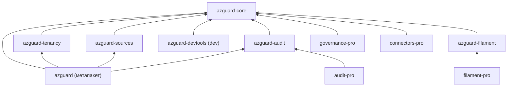
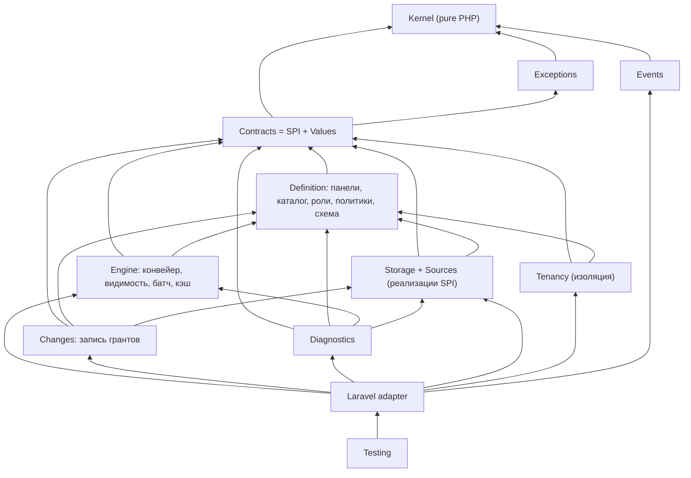

# Архитектура: минимальное ядро и подключаемые модули (обсуждение)

Дата: 2026-10-09. Ветка: `review/v1-architecture` от `review/v1-hardening` (`c04529e8`). Документ —
предложения для обсуждения, **код не менялся**. Ссылки на код — относительно `packages/core/src`, если не указано
иное. Цифры сняты скриптом по дереву ветки (строки — `wc -l` с комментариями, связи — по `use AzGuard\…`).

## 0. Контекст

Обсуждали с владельцем по итогам оценки пакета (архитектура 8/10, API и удобство 7,5/10). Позиция владельца:
функционала много и не всем он нужен; при этом пакет не «переусложнён целиком», но часть можно отделить. Цели:

1. **Понятность.** Новичок должен освоить малое ядро, а не 25 зон и 246 публичных классов.
2. **Гибкость.** Возможности, которые нужны не всем, подключаются явно.
3. **Open-core как вариант.** База бесплатная (open source), сложная механика — потенциально платная.

Ограничение: кардинальные изменения в 1.0 сейчас не делаем. Ниже — что я поменял бы, если бы было можно, и что
дёшево сделать уже в 1.0, чтобы эту дверь не закрыть.

**Короткий вывод.** Делить надо не «по фичам из README», а по зависимостям. Ядро у пакета уже есть и хорошее
(`Kernel` + конвейер решений + `DatabaseSource`), но три вещи мешают выделить модули: (1) `Contracts` зависит от
14 зон реализации, то есть стабильного SPI для внешних модулей пока нет; (2) тенанты и области пронизывают 141 из 421
файла — это измерение модели, а не плагин; (3) первый же шаг квик-старта — панель. Отсюда план: в 1.0 — границы
и арх-тесты без смены API; в 1.x — вынести то, что слабо связано (аудит, справочники для UI, генераторы); в 2.0 —
чистый SPI и, если захотим, платный слой поверх него. Корректность и безопасность платными быть не должны.

## 1. Что есть сейчас: инвентаризация

### 1.1. Размер

| Пакет | Файлов | Строк | Публичный API (`api-manifest.json`) |
|:--|--:|--:|:--|
| `packages/core` (`axiomasoft/azguard`) | 421 | 41 475 | 246 типов (179 классов, 42 интерфейса, 16 enum, 9 трейтов), 1 079 методов |
| `packages/filament` (`axiomasoft/azguard-filament`) | 42 | 5 264 | использует 52 типа ядра, только из манифеста (`tests/Arch/ApiManifestTest.php`) |
| `tests/` | 869 | ~55 800 | из них Feature 251 файл / 27,9 тыс. строк, Fixtures 470 / 14,8 тыс. |
| `docs/` | 26 стр. | ~19,7 тыс. слов | `advanced/` — 4 тыс. слов, из них `consistency.md` 1,4 тыс. |

Конфиг `config/azguard.php`: 221 строка, 11 верхних секций. `PanelBuilder` (`Panels/PanelBuilder.php`): 31
публичный метод DSL. Исключений — 51 класс (`Exceptions/`), причин решения — 21 (`Kernel/Decision/DecisionReason.php`).

### 1.2. Возможности по областям

Строки — суммарно по перечисленным файлам; одна возможность часто размазана по нескольким зонам.

| Возможность | Где (основное) | Строк | Кому нужна |
|:--|:--|--:|:--|
| Ядро значений: идентичности, ключи, шаблоны, `Decision`, `PermissionSet`, токены | `Kernel/` (29 файлов) | 2 336 | всем |
| Конвейер решения: Prepare → Boundary → Before → Authority → Restriction → After | `Authorization/Pipeline/*`, `Authorizer.php`, `EvaluationFrame.php` | ~1 700 | всем |
| Панели: DSL, рецепт слоями, компиляция, реестр, резолвер, отпечаток | `Panels/` (14) | 3 938 | всем, но многопанельность — не всем |
| Каталог прав и ролей из кода (enum + классы ролей, атрибуты) | `Catalog/`, `Roles/`, `Permissions/`, `Attributes/` | ~1 620 | всем |
| Политики (вето) и мост в Laravel Gate | `Policies/`, `Laravel/Gate/GateBridge.php` | 573 | всем |
| Хранилище и `DatabaseSource`: гранты, записи, блокировка панели | `Storage/` (18), `Sources/Database/` (7) | 4 741 | всем, кто хранит гранты в БД |
| Прочие источники: папка (discovery), Gate, Relation, менеджер | `Sources/Folder`, `Gate`, `Relation`, `SourceManager.php` | ~2 160 | discovery — многим; Relation/внешние — немногим |
| Согласованность: снимок, токены, ревизии, эпоха, забор внешних источников, `Reads`/`StateRefresh` | `Authorization/ReadAttempt.php`, `Storage/StorageReadSession.php`, `AuthorityReadBaseline.php`, `Kernel/Decision/*StateToken.php`, `Contracts/Sources/FencesReads.php`, `Panels/Reads.php`, `StateRefresh.php` и др. | ~1 820 + часть `DatabaseSource` | корректность нужна всем; ручки — немногим |
| Тенанты и области назначения (наследование, членство, резолверы) | `Scopes/` (19), `Contracts/Scopes/` (17), `Authorization/ScopeEligibility.php`, `Kernel/Identity/AccessScope.php` | ~1 910 ядра + упоминания в 141 файле | SaaS/мультитенант |
| Видимость списков `visibleTo()` (предикаты в SQL) | `Authorization/Visibility.php`, `Authorization/Query/*`, `Scopes/Query/*`, `Sources/Relation/*` | ~2 150 | многим |
| Батч решений `DecisionSet` одним снимком | `Authorization/BatchEvaluation.php`, `BatchInputs.php`, `Kernel/Decision/DecisionSet.php` | 751 | таблицам/Filament |
| Хуки, ограничения, условия грантов | `Contracts/Authorization/{Restriction,GrantCondition}.php`, `Pipeline/Stages/{Before,Restriction,After}Stage.php` | ~370 | продвинутым |
| Супер-админ | `Roles/SuperAdminRole.php`, `Roles/Attributes/SuperAdmin.php` (+ 27 файлов упоминаний) | 38 | многим |
| Конвейер изменений: pipes, валидаторы, журнал, менеджеры, миграция ключей ролей | `Changes/` (24) | 2 965 | запись нужна всем; pipes/валидаторы — продвинутым |
| События (после commit, с актором) | `Events/` (15) | 899 | многим |
| Плагины и аудит | `Plugins/` (`BasePlugin`, `PluginContext`, `Audit/*`) | 247 (аудит 172) | аудит — компаниям с compliance |
| Кэш наборов прав и каталога (array/redis через Laravel cache) | `Authorization/Cache/PermissionSetCache.php`, `Catalog/CatalogCache.php` | 293 | производительность |
| Схемы: поля грантов (`Field`, `FieldTarget`) и описание панели/ролей/прав для интерфейсов | `Schema/` (11) | 1 107 | поля — хранилищу и всем; описания — CLI и Filament |
| Справочники для выбора субъекта/тенанта/области в UI | `Directories/` (11) | 758 | в основном Filament |
| Диагностика: `doctor` (25 проверок), `explain`, обзор панели | `Diagnostics/` (30), `Laravel/Console/Commands/{Doctor,Explain}Command.php` | 2 234 + | всем в CI; глубина — продвинутым |
| Консоль: 32 команды, из них 9 `make:*`, и скаффолдинг | `Laravel/Console/` | 3 279 (make 921, scaffold 507) | частично |
| HTTP: middleware, `DecisionResponder`, эталонный маппинг 403/503 | `Laravel/Http/` | 624 | всем |
| Тестовый набор: `AzGuardFake`, `actingAsWithRoles`, контрактные сьюты для авторов расширений | `Testing/` (24) | 2 135 | всем; контракты — авторам расширений |
| Filament: авторизация ресурсов, фильтрация, редакторы грантов, экспорт | `packages/filament/src` | 5 264 | пользователям Filament |

### 1.3. Связность (кто от кого зависит)

Исходящие связи зон (число других зон, которые зона импортирует):

| Зона | → зон | Комментарий |
|:--|--:|:--|
| `Kernel` | 1 (`Exceptions`) | чистое PHP-ядро, закреплено `tests/Arch/ZonesArchTest.php` («kernel depends on nothing but PHP») |
| `Exceptions` | 1 (`Kernel`) | закреплено арх-тестом |
| `Events` | 1 | хорошо |
| `Storage` | 5 | приемлемо (`Panels\Reads` — enum настройки) |
| `Policies`, `Roles`, `Scopes`, `Directories` | 3–6 | приемлемо |
| `Panels`, `Catalog`, `Schema` | 9–11 | сборка; взаимные связи `Panels ↔ Catalog ↔ Scopes ↔ Sources` |
| `Authorization`, `Changes` | 12 | ожидаемо для оркестраторов |
| `Diagnostics` | 13 | ожидаемо |
| **`Contracts`** | **14** | **проблема для SPI**: контракты ссылаются на реализации |
| **`Sources`** | **14** | `DatabaseSource` импортирует 4 doctor-проверки и 6 классов `Changes` |
| `Laravel` | 20 | слой интеграции, ожидаемо |

Входящие (fan-in): `Kernel` и `Exceptions` — 20 зон, `Panels` и `Contracts` — 17, `Scopes` и `Sources` — 13. То есть
тенанты/области и источники — такая же опора, как панели.

Конкретные связи, которые мешают модульности:

- **Контракты на реализации.** `Contracts/PanelAccess.php` → `Concerns\SubjectAccess`, `Directories\PanelDirectories`,
  `Authorization\Visibility`, `Panels\Panel`; `Contracts/AzGuardSubject.php` → `Concerns\SubjectAccess`,
  `Concerns\SubjectPanels`; `Contracts/Sources/StoresGrants.php` → `Changes\Change`, `Changes\ChangeResult`;
  `Contracts/Plugins/Plugin.php` → `Panels\PanelBuilder`, `Plugins\PluginContext`; `Contracts/Diagnostics/DoctorCheck.php`
  → `Diagnostics\DoctorContext`. Часть этого — значения (DTO), которые просто живут не в той зоне; часть —
  конкретные классы (`PanelBuilder`, `SubjectAccess`), которые фактически стали API.
- **Источник знает про диагностику.** `Sources/Database/DatabaseSource.php:28-31` импортирует
  `Diagnostics\Checks\{DecisionFieldsInMeta,GrantsDead,ModelColumns,RolesOrphaned}`; `Sources/Folder/FolderSource.php:20`
  — `DiscoveryCached`. Правильнее, чтобы источник поставлял свои проверки через `doctorChecks()`, не зная классов зоны.
- **Фасад знает про тестовый набор.** `AzGuardManager.php:31` → `Testing\AzGuardFake` (для `AzGuard::fake()`).
  Для Laravel это норма (`Bus::fake()`), но это мешает вынести `Testing` в dev-пакет.
- **Тенанты в ядре значений.** `Kernel/Identity/AccessScope.php` — пара `TenantRef` + `AssignmentScopeRef`; 7 файлов
  `Kernel`, 13 из 20 файлов `Authorization`, 6 причин решения (`tenant_*`, `context_*`) завязаны на них. Это
  осознанное решение (изоляция тенантов в типах), и именно поэтому тенанты нельзя «просто вынести в плагин».

### 1.4. Что спроектировано хорошо и должно остаться

- **`Kernel` без фреймворка**, закреплённый арх-тестом и проверкой хелперов. Это готовая основа «ядра ядра».
- **Один конвейер для всех входов** (`hasPermission`, `@can`, middleware, атрибуты, Filament, `visibleTo`). Деление
  на модули не должно порождать второй путь решения.
- **Fail closed с различимым отказом** (`Decision::failed()`, `FailureKind`). Это свойство безопасности, не фича.
- **Плагины уже есть и работают.** `Contracts/Plugins/Plugin.php` (`register(PanelBuilder)`, `boot(Panel)`),
  зависимости между плагинами (`Contracts/Plugins/DependsOnPlugins.php`), отключение по id (`withoutPlugins`).
  `Plugins/Audit/AuditPlugin.php` (`azguard/audit`) — живой пример модуля поверх SPI.
- **Источники как контракты-способности** (`Contracts/Sources/Provides*`, `StoresGrants`, `FiltersQueries`,
  `FencesReads`, `ChecksHealth`): источник реализует только то, что умеет.
- **Контрактные тест-сьюты для авторов расширений** (`Testing/Contracts/*ContractTests.php`) — то, что нужно
  экосистеме и будущему pro-слою.
- **Манифест публичного API** (`packages/core/api-manifest.json`, `bin/api-manifest.php --check`) и арх-тест,
  что Filament пользуется только им. Это механизм, на котором держится будущий стабильный SPI.
- **Монорепо со split** (`.github/workflows/split.yml`) и `self.version` между пакетами — выделение новых пакетов
  технически дёшево.

Вывод по разделу: архитектура не «плохая», она **плотная**. Много правильных механизмов, но их границы видны
только по коду, а не по пакетам, документации и SPI.

## 2. Предлагаемое деление: ядро и модули

### 2.1. Принципы

1. **Делим по направлению зависимостей, а не по маркетинговым фичам.** Модуль зависит от ядра через контракты и
   значения `Kernel`; ядро о модуле не знает (кроме точки расширения).
2. **Один конвейер решения.** Модуль добавляет стадию, источник или хук; второго пути `allow/deny` не появляется.
3. **Корректность не опциональна.** Снимок чтения, fail closed, изоляция тенанта, сроки грантов — свойства ядра,
   даже если их ручки спрятаны в «продвинутый» раздел.
4. **Выключенный модуль ничего не стоит**: нет таблиц, запросов, конфигурации и понятий в документации.
5. **Сначала граница, потом пакет.** Пакет выделяем только когда граница закреплена арх-тестом и прожила минорную
   версию.

### 2.2. Минимальное ядро: что входит

| В ядре | Почему |
|:--|:--|
| `Kernel` целиком (идентичности, `Decision`, `PermissionSet`, `StateToken`) | язык всех модулей, уже без фреймворка |
| Конвейер решения со всеми стадиями (стадии без хуков — пустые) | один путь решения |
| Панели, но с **неявной панелью по умолчанию** (см. 4.1) | многопанельность — расширенное использование, не первый шаг |
| Каталог из кода: enum прав, классы ролей, атрибуты `RequiresGrant`/`PolicyOnly`/`GrantedToAll`, wildcard | суть пакета |
| Политики-вето и мост Gate (`@can`, `can()`, middleware, `DecisionResponder`) | интеграция с Laravel |
| `DatabaseSource` + `Storage` со **снимком чтения и блокировкой панели** | корректность записи и чтения |
| Сроки грантов и `azguard:grants:prune` | безопасность (отзыв по времени) |
| Супер-админ | 38 строк, нужен почти всем |
| Тенант как **обязательное измерение идентичности** (без резолверов и областей) | изоляция — безопасность; см. 2.4 |
| Кэш наборов прав на запрос + опциональный Laravel store | производительность без новых понятий |
| События после commit | точка расширения для аудита и интеграций |
| `doctor` (базовые проверки), `explain`, `install`, `grant/revoke/list` | эксплуатация и обучение |
| `AzGuardFake`, `actingAsWithRoles()` | тесты приложения |

**Что должен выучить новичок (цель):** enum прав, класс роли, трейт `HasAzGuard` + morph alias, `grantRole()` /
`revokeRole()`, `hasPermission()` / `@can` / middleware, политика-вето, `azguard:doctor` и `azguard:explain`.
Это 7 понятий вместо нынешних «панели, источники, контексты, решения, токены…» в первом же гайде
(`docs/getting-started/quick-start.md` начинается с «1. The panel»).

**Целевая поверхность API ядра** (оценка): ~60–80 публичных типов против 246 сейчас. Основной выигрыш не в
удалении кода, а в переносе в модули/`@internal` того, что новичку не нужно видеть: 51 исключение (свести к
иерархии по кодам), справочники и схемы UI, контракты источников и областей, ручки согласованности.

### 2.3. Модули

Оценка трудозатрат — для вынесения в отдельный пакет с сохранением BC в 1.x (см. раздел 5), в рабочих днях.

| Модуль (пакет) | Назначение | Что берёт из ядра | Нужно в ядре (точки расширения) | Трудозатраты | Риск |
|:--|:--|:--|:--|:--|:--|
| **`azguard-audit`** | журнал изменений, ретеншн, `azguard:audit:prune`; позже outbox | `Plugin`, события изменений, `ChangeJournal` | уже есть (`AuditPlugin`, `azguard/audit`) | 1–2 | низкий: уже плагин |
| **`azguard-filament`** | UI (уже отдельный пакет) + справочники `Directories/` | манифест API, `Schema` (описания) | заменить `directories()` в `Contracts/PanelAccess.php` | 3–5 | средний: `Contracts/PanelAccess.php` и `Concerns/ScopedPanelAccess.php` ссылаются на `Directories` |
| **`azguard-tenancy`** (резолверы, области, наследование, членство) | мультитенант и иерархии областей | `AccessScope`, `TenantRef` из `Kernel` | стадия Boundary/Prepare с SPI резолверов; причины `context_*` из ядра в модуль | 10–15 | **высокий**: 141 файл, 6 причин решения, `visibleTo` и батч знают про области |
| **`azguard-sources`** (Relation, внешние источники с `FencesReads`, Gate-источник) | права из существующих таблиц, LDAP, внешние системы | контракты `Provides*`, `FencesReads`, `FiltersQueries` | контракты уже в ядре; убрать `Sources → Diagnostics` | 3–5 | средний: `visibleTo` использует `Relation*` |
| **`azguard-devtools`** (require-dev) | `make:*`, скаффолдинг, stubs, контрактные сьюты | всё публичное | ничего | 2–3 | низкий; но `AzGuard::fake()` должен остаться в ядре |
| **`azguard-kernel`** (pure PHP) | значения без Laravel | — | уже изолирован | 2–3 | низкий технически, но мало пользы (см. 4.4) |

Что **не** выносится: согласованность (снимок, ревизии, эпоха), fail closed, сроки, `visibleTo` для
`DatabaseSource`, батч. Это не «навороты», а то, на чём держится правильность. Прятать надо **ручки**
(`Reads`, `StateRefresh`, `cache(generation:)`) и **объяснения** (`docs/advanced/consistency.md`), а не механизм.

### 2.4. Тенанты: отдельный разговор

Тенанты — главный кандидат «на вынос» по ощущению и самый дорогой по факту. Варианты:

- **A. Оставить в ядре, сделать бесплатными по нулю.** Без тенантов работает `TenantRef::global()` и пустые резолверы (так и сейчас);
  документация упоминает тенанты только в гайде. Стоимость — только документация и doctor. **Рекомендую для 1.x.**
- **B. Разделить «изоляцию» и «иерархии».** Тенант как измерение идентичности — в ядре (безопасность);
  области назначения с наследованием, резолверы ресурсов, членство — модуль. Стоимость 10–15 дней, риск средний.
  **Кандидат на 2.0.**
- **C. Вынести целиком.** Ядро без тенантов, модуль добавляет измерение. Требует generic «измерений» в `Kernel`
  (`AccessScope` → набор ключей), меняет формат грантов и ключей кэша. **Не рекомендую**: дорого и ослабляет
  гарантию изоляции, которая сейчас выражена в типах.

### 2.5. Раскладка пакетов: варианты

| Вариант | Как | Плюсы | Минусы |
|:--|:--|:--|:--|
| **1. Один пакет, слои внутри** | namespace-границы + арх-тесты + `@internal`; модули включаются плагинами; документация «ядро / расширенное» | ноль churn для пользователей; один релиз; уже почти так | `composer require` тянет всё; open-core невозможен без отдельного репо |
| **2. Монорепо, несколько пакетов** | `packages/{core,audit,tenancy,sources,devtools,filament}` через существующий `split.yml` (матрица `package`), `self.version` | видимые границы; можно не ставить лишнее; так делают Symfony, Illuminate, Filament | больше релизной механики; надо договориться о BC пакетов; пользователь выбирает из N пакетов |
| **3. Метапакет** | `axiomasoft/azguard` становится метапакетом, требующим `azguard-core` + стандартные модули (как `laravel/framework` → `illuminate/*`) | пользователи 1.x ничего не замечают; продвинутые ставят только `core` | ещё один уровень; Packagist-имена надо зарезервировать заранее |
| **4. Отдельный приватный репозиторий pro** | `axiomasoft/azguard-pro` вне публичного монорепо | обязательно для платного кода: этот монорепо публичный, `split.yml` пушит в публичные репо | CI ядра должен прогонять контрактные тесты pro (секрет в CI), иначе pro узнаёт о поломке последним |

**Рекомендация:** 1 → 3 (+2 внутри монорепо) → 4 только когда будет что продавать. Пространства имён при выносе
**не меняются** (`AzGuard\Plugins\Audit\…` может жить в пакете `azguard-audit`, PSR-4 это позволяет), поэтому
вынос в 1.x не ломает импорты пользователей, если `axiomasoft/azguard` в 1.x продолжает `require` вынесенный пакет.

## 3. Open-core: что можно сделать платным, а что нет

### 3.1. Граница

**Правило, которое я бы зафиксировал публично:** платным может быть удобство, масштаб, UI, интеграции и
compliance-отчётность. **Никогда** — корректность решения, безопасность, изоляция тенантов, исправления
уязвимостей и всё, без чего бесплатная версия даёт неверный ответ. Для пакета авторизации это вопрос доверия:
если пользователь заподозрит, что «правильная» версия платная, он не возьмёт и бесплатную.

| Всегда бесплатно (ядро, MIT) | Кандидаты в pro | Почему pro допустим |
|:--|:--|:--|
| конвейер, fail closed, `Decision::failed()` | **Filament pro**: матрица ролей × прав, массовые операции, импорт/экспорт, история изменений гранта, сравнение окружений | UI-удобство; прецедент — Flux Pro, Media Library Pro |
| снимок чтения, ревизии, блокировка, `consistency_error = 0` | **Аудит pro**: outbox с гарантированной доставкой, выгрузка в SIEM, отчёты «кто имел доступ к X на дату», подпись журнала | compliance (SOC 2, ISO 27001), нужен компаниям, не хобби-проектам |
| изоляция тенантов, проверка членства | **Access reviews**: периодическая пересертификация прав, напоминания, отчёт для аудитора | процесс поверх данных, не меняет решение |
| сроки грантов, `grants:prune` | **Just-in-time / break-glass**: выдача по заявке с подтверждением и автоматическим отзывом (поверх change pipes) | workflow; механизм сроков остаётся бесплатным |
| `visibleTo`, батч | **Симуляция «что если»**: как изменятся решения после смены роли, diff каталога между релизами | инструмент анализа; `explain` остаётся бесплатным |
| `doctor`, `explain`, `AzGuardFake`, контрактные сьюты | **Коннекторы источников**: LDAP/Entra ID/Okta (SCIM), мост в SpiceDB/OpenFGA | интеграции — классический платный слой |
| события, плагины, хуки (SPI) | **Квитанция свежести для реплик**, прогрев кэша, read-model для очень больших каталогов | масштаб; по умолчанию primary уже даёт строгую свежесть |
| security-фиксы для всех поддерживаемых версий | приоритетная поддержка, SLA | услуга, а не код |

Честная оценка рынка: бесплатные `spatie/laravel-permission` и (для Filament) `bezhansalleh/filament-shield`
задают ожидание «авторизация бесплатна». Платят скорее за **UI в Filament и compliance**, чем за движок. Поэтому
первым платным продуктом разумнее делать Filament pro и аудит pro, а не «продвинутую согласованность».

### 3.2. Прецеденты (проверено 2026-10-09)

| Проект | Модель | Источник |
|:--|:--|:--|
| Spatie Media Library Pro | бесплатный MIT-пакет `laravel-medialibrary` + платный add-on с UI-компонентами; приватный Composer `satis.spatie.be`, `auth.json` с ключом лицензии; год обновлений, после истечения версия остаётся у покупателя | [spatie.be/products/media-library-pro](https://spatie.be/products/media-library-pro), [установка](https://spatie.be/docs/laravel-medialibrary-pro/v6/livewire/installation) |
| Livewire Flux / Flux Pro | бесплатный `livewire/flux` с базовыми компонентами + платный `livewire/flux-pro` с `composer.fluxui.dev`, активация `php artisan flux:activate`; $149 за проект / $299 без ограничений | [fluxui.dev/pricing](https://fluxui.dev/pricing), [github.com/livewire/flux](https://github.com/livewire/flux) |
| Statamic Core / Pro | одна кодовая база; Core бесплатный, Pro — коммерческий, включается конфигом; **роли и права — в Pro** | [statamic.dev/getting-started/licensing](https://statamic.dev/getting-started/licensing), [statamic.com/pricing](https://statamic.com/pricing) |
| Filament premium plugins | плагины продаются через партнёров дистрибуции Anystack и Privato (приватный Composer, лицензии, Stripe) | [filamentphp.com: Privato](https://filamentphp.com/insights/alexandersix-welcoming-privato-as-a-premium-plugin-distribution-partner), [anystack.sh: PHP packages](https://anystack.sh/docs/guides/private-php-packages) |
| Laravel Nova, Spark | полностью коммерческие пакеты первого лица | [nova.laravel.com](https://nova.laravel.com), [spark.laravel.com](https://spark.laravel.com) |
| Sidekiq / Pro / Enterprise | ядро LGPL-3.0, Pro и Enterprise под коммерческой лицензией (`COMM-LICENSE.txt` в том же репо) | [LICENSE.txt](https://github.com/sidekiq/sidekiq/blob/main/LICENSE.txt), [Commercial FAQ](https://sidekiq.org/wiki/Commercial-FAQ) |
| SpiceDB / AuthZed, Cerbos / Cerbos Hub | авторизация: движок Apache-2.0, платные — облако, enterprise-сборка, управление политиками | [authzed.com/spicedb](https://authzed.com/spicedb), [github.com/cerbos/cerbos](https://github.com/cerbos/cerbos) |

Контрпример для нас: Statamic держит роли в Pro, а Sidekiq Pro продаёт надёжность доставки (`super_fetch`).
Для пакета авторизации я бы **не** повторял ни то, ни другое: роли и надёжность — это и есть продукт.

### 3.3. Лицензии

| Вариант | Суть | Для AzGuard |
|:--|:--|:--|
| **MIT ядро + коммерческая EULA для pro** | как Spatie, Flux, Filament-плагины | **рекомендую**: привычно Laravel-сообществу, ядро уже MIT |
| FSL (Functional Source License) для pro | исходники открыты, запрещено конкурирующее коммерческое использование, каждая версия через 2 года становится MIT/Apache-2.0 ([fsl.software](https://fsl.software/)) | рассмотреть, если pro-код хотим держать публичным ради доверия; рассчитан на SaaS, для библиотеки непривычен |
| BSL | как FSL, но срок и целевая лицензия задаются (часто 4 года) | то же, менее предсказуемо для пользователей |
| Сменить лицензию ядра | — | **нельзя по сути**: выпущенные под MIT версии остаются MIT, смена вызовет форк и потерю доверия |

Обязательные правила, если пойдём в open-core:

- **Нет rug-pull.** Возможность, выпущенная в MIT-ядре, не переезжает в pro. Pro — только новое.
- **Нет проверки лицензии в рантайме ядра** и сетевых обращений. Доступ к pro контролируется только приватным
  Composer-репозиторием (как Spatie и Flux). Ядро не знает, установлен ли pro.
- **CLA или DCO** до первого внешнего PR, если хоть часть pro может вырасти из кода контрибьюторов. Проще — не
  переносить чужой код в pro вообще.

### 3.4. Дистрибуция

- **Anystack** — приватный Composer + лицензии + Stripe-чекаут, партнёр Filament; комиссия только при продаже
  через их чекаут ([anystack.sh/pricing](https://anystack.sh/pricing)).
- **Privato** — второй партнёр Filament, похожая модель.
- **Private Packagist** — хостинг приватных пакетов с лицензиями для клиентов ([packagist.com](https://packagist.com)).
- **Satis** (self-hosted, как `satis.spatie.be`) + свой биллинг. Максимум контроля, больше работы.
- **Lemon Squeezy** даёт оплату и ключи лицензий, но Composer-репозиторий придётся держать самим (по моей
  информации; проверить перед выбором).

Для старта я бы взял Anystack: Filament-аудитория уже там, интеграция с GitHub-релизами из коробки.

### 3.5. Как pro подключается без форка

Pro — обычные пакеты поверх публичного SPI. Ядру нужны:

1. **Стабильный SPI с отдельным обещанием BC.** Отметить `@api` (пользователи) и, например, `@spi` (авторы
   расширений) в манифесте; ломать SPI только в мажорных версиях. Сейчас `@internal` — у 119 файлов, `@api` — у 108.
2. **Контракты без реализаций.** `Contracts` должен зависеть только от `Kernel`, `Exceptions` и самих
   `Contracts` (раздел 1.3). Значения вроде `ChangeResult`, `GrantRecord`, `PermissionDefinition`, `LookupContext`
   переехать в `Kernel` или `Contracts\Values`; `PanelBuilder` и `SubjectAccess` в контрактах заменить
   интерфейсами.
3. **Точки расширения, которых не хватает pro:** стадия «после решения» с доступом к `Decision` для отчётов
   (есть `AfterStage`), подписка на изменения с гарантией доставки (outbox), регистрация страниц/действий Filament
   из стороннего плагина, источник, который поставляет свои doctor-проверки без импорта `Diagnostics\Checks`.
4. **Контрактные тесты как договор.** `Testing/Contracts/*` уже есть; pro прогоняет их в своём CI против
   `dev-main` ядра, а ядро — смоук pro (через секрет), чтобы поломка SPI ловилась до релиза.

### 3.6. Риски open-core

| Риск | Как снизить |
|:--|:--|
| Фрагментация: «а это в pro или нет?» | одна документация с пометкой Pro; таблица 3.1 публично |
| Доверие контрибьюторов | правило «нет rug-pull», CLA/DCO, security-фиксы для всех |
| Цена поддержки SPI BC | SPI меньше API; манифест и контрактные тесты в CI |
| Мало покупателей | начать с Filament pro (понятная ценность), измерить спрос до инвестиций в остальное |
| Раздвоение внимания одного мейнтейнера | pro только после стабильного 1.x и реальных пользователей ядра |
| Публичный монорепо | pro только в отдельном приватном репо; в публичном — ни строчки pro и ни секретов |

## 4. Радикальные идеи (что поменял бы, если бы было можно)

Каждая идея — для обсуждения; ни одна не делается в 1.0 без решения владельца.

| # | Идея | Плюсы | Минусы | Когда |
|:--|:--|:--|:--|:--|
| 4.1 | **Неявная панель по умолчанию.** Без провайдера панели работает одна панель `default`; `azguard:install` без `--panel`. Многопанельность — расширенный гайд | квик-старт без первого абстрактного понятия; как Spatie «из коробки» | ещё один путь регистрации; doctor должен ловить смесь неявной и явных панелей | 1.x (аддитивно) |
| 4.2 | **Убрать ручки с одним значением.** `Panels/GateMode.php` содержит один case `Authoritative`, а в конфиге есть `defaults.gate.mode` | меньше конфигурации и документации | правка публичного API — только до заморозки 1.0 или в 2.0 | **до 1.0** или 2.0 |
| 4.3 | **Свернуть ручки согласованности в профили.** Вместо `Reads` × `StateRefresh` × `cache(generation)` — `strict` (по умолчанию) и `replica` | понятный выбор вместо матрицы; меньше способов ошибиться | теряется тонкая настройка; нужна миграция значений | 2.0 |
| 4.4 | **Иерархия исключений по кодам.** 51 класс → ~10 базовых (`ConfigurationException`, `StorageException`, `ChangeException`…) с `code` | меньше публичных типов; ловить проще | ломает `catch` по узким классам; уже в предложениях аудита (№ 10) | **до 1.0** или 2.0 |
| 4.5 | **Контракты без реализаций.** `Contracts` → только `Kernel`, `Exceptions`, `Contracts`; DTO в `Contracts\Values`; `PanelBuilder`, `SubjectAccess` за интерфейсами | настоящий SPI; основа для модулей и pro | много переносов; `class_alias` на переходный период | 1.x (алиасы) → 2.0 |
| 4.6 | **Тенант и область — одно понятие «scope» с иерархией.** Сейчас два уровня (`TenantRef` + `AssignmentScopeRef`) и 6 причин отказа | одно понятие вместо двух; меньше причин | тенант как граница изоляции — сильная гарантия, при слиянии её надо выразить иначе; миграция данных | 2.0, только с вариантом B из 2.4 |
| 4.7 | **Запись в ядре, процессы поверх pipes.** `ChangePipeline` (блокировка панели) и `ChangeValidator` — корректность, остаются в ядре; `ChangeJournal` уходит в `azguard-audit`; процессы (заявки, подтверждения) — только как pipes в модулях | ядро не растёт процессами; pipes — готовая точка расширения | pipes должны стать `@spi` с гарантией BC | 1.x |
| 4.8 | **Справочники UI вон из ядра.** `Directories/` (758 строк) обслуживает выпадающие списки редакторов → в `azguard-filament`. `Schema/` остаётся: `Field`/`FieldTarget` использует хранилище (`Storage/GrantFields.php`, модели грантов) | ядро не знает про выбор записей в формах | `Contracts/PanelAccess.php` отдаёт `directories()` — нужна замена | 1.x |
| 4.9 | **Doctor-проверки принадлежат своим модулям.** Источник регистрирует проверки через `doctorChecks()`, а не импортирует `Diagnostics\Checks\*` | убирает `Sources → Diagnostics`; модуль приносит свою диагностику | мелкая переделка регистрации | 1.x |
| 4.10 | **Компиляция панелей в неизменяемый артефакт** (есть в `ROADMAP.md`). DSL, discovery и атрибуты работают только при сборке; рантайм читает скомпилированный каталог | чёткая граница «сборка ↔ рантайм», быстрее boot, рантайм-ядро меньше | новый публичный DSL; кэш каталога уже частично это делает | 2.0 |
| 4.11 | **`Kernel` отдельным pure-PHP пакетом.** Уже изолирован арх-тестом | адаптеры под Symfony/другие фреймворки | аудитория мала, а стоимость релизов растёт; ценность — только если будет второй адаптер | не сейчас |
| 4.12 | **Короткий фасад для частых сценариев.** `$user->visible(Post::query(), PostPermission::View)` вместо `AzGuard::panel()->visibility()->visibleTo(...)` (предложение № 3 аудита) | API и удобство 7,5 → 8,5 без смены модели | ещё один метод в трейте | 1.x (аддитивно) |

Чего я бы **не** делал даже при полной свободе: не выносил бы снимок чтения, fail closed и изоляцию тенанта в
модули; не заменял бы единый конвейер на «лёгкий» второй для простых случаев; не менял бы лицензию ядра.

## 5. Поэтапный путь, который не трогает стабильность 1.0

### 5.1. Сейчас, в 1.0 (дёшево, без смены поведения)

1. **Карта «зона → будущий модуль»** — раздел 2.3 этого документа; закрепить в `DEVELOPMENT.md` после решения.
2. **Арх-тесты-«храповик»** в `tests/Arch/ZonesArchTest.php`: зафиксировать текущие исходящие связи `Contracts` и
   `Sources` списком и запретить новые (`Contracts` не получает новых зависимостей от реализаций; `Sources` не
   получает новых импортов `Diagnostics`). Существующие связи не ломаем, только не даём расти.
3. **Пометить SPI.** Помимо `@api` ввести `@spi` для контрактов, которые реализуют расширения
   (`Contracts/Sources/*`, `Plugin`, `Restriction`, `GrantCondition`, `DoctorCheck`, резолверы), и выводить это в
   `api-manifest.json`. Публично пообещать: SPI ломается только в мажорных версиях.
4. **Решить до заморозки API** то, что потом станет BC-break: 4.2 (`GateMode`), 4.4 (исключения), место DTO для 4.5.
   Остальное — аддитивно и может ждать.
5. **Документация в два уровня.** Квик-старт и гайды — только 7 понятий ядра (раздел 2.2); всё остальное — в
   `docs/advanced/` с пометкой «нужно, если…». Раздел `advanced/` уже есть, ему не хватает явного «когда это нужно».
6. **Плагины вместо флагов.** Новые необязательные возможности подключать как `Plugin` (как `AuditPlugin`), а не
   ключами конфига: выключенный плагин ничего не стоит, а флаг размножает ветки в ядре.
7. **Зарезервировать имена**: Packagist `axiomasoft/azguard-{core,audit,tenancy,sources,devtools}` и pro-имена из раздела 6, id
   плагинов с префиксом `azguard/` (сейчас им пользуется только `azguard/audit`, но префикс в коде не защищён — сторонний плагин может его занять).

Трудозатраты пунктов 2–3, 5–7: 2–4 дня. Пункт 4 — по решению, 1–3 дня на каждую идею.

### 5.2. 1.x: выносим слабо связанное, не ломая импорты

| Версия | Что | Как без BC-break |
|:--|:--|:--|
| 1.1 | `azguard-audit` отдельным пакетом | namespace `AzGuard\Plugins\Audit` не меняется; `axiomasoft/azguard` в 1.x `require`-ит пакет |
| 1.1 | неявная панель (4.1), короткий фасад (4.12) | аддитивно |
| 1.2 | `azguard-devtools`: `make:*`, scaffold, stubs | ядро `require`-ит до 2.0; `AzGuard::fake()` остаётся в ядре |
| 1.2 | doctor-проверки у своих модулей (4.9) | внутреннее |
| 1.3 | контракты: DTO в `Contracts\Values` + `class_alias` со старых имён (4.5) | алиасы с `@deprecated` |
| 1.3 | справочники `Directories/` к Filament (4.8) | алиасы; Filament и так `self.version` |
| 1.x | `axiomasoft/azguard` → метапакет над `azguard-core` + стандартные модули (вариант 3 из 2.5) | пользователи не замечают |

### 5.3. 2.0: чистое ядро

- удалить алиасы, `Contracts` зависит только от `Kernel`/`Exceptions`, SPI отдельно от API;
- тенанты по варианту B (изоляция в ядре, иерархии и резолверы — модуль), если 1.x покажет спрос;
- профили согласованности (4.3), иерархия исключений (если не сделана в 1.0), компиляция панелей (4.10);
- метапакет перестаёт тянуть необязательные модули;
- при спросе — первый pro-пакет в отдельном приватном репо, начиная с Filament pro.

Оценка 1.x+2.0 целиком: 35–55 рабочих дней, из них тенанты 10–15. Порядок можно остановить на любом шаге: каждый
шаг полезен сам по себе.

## 6. Целевые пакеты

Целевое состояние после 2.0 (раздел 5). В 1.x пакеты появляются по одному, а `axiomasoft/azguard` остаётся
метапакетом, поэтому у пользователей ничего не ломается. Namespace при переносе не меняется, если не сказано иное.

### 6.1. Список

| Пакет (Composer) | Namespace | Лицензия | Одной строкой |
|:--|:--|:--|:--|
| `axiomasoft/azguard-core` | `AzGuard\` | MIT | решение, хранение и запись грантов, интеграция с Laravel |
| `axiomasoft/azguard` | — (метапакет) | MIT | `core` + стандартные модули; точка входа для `composer require` |
| `axiomasoft/azguard-tenancy` | `AzGuard\Scopes\` | MIT | области назначения, наследование, резолверы ресурсов |
| `axiomasoft/azguard-sources` | `AzGuard\Sources\Relation\` | MIT | права из существующих таблиц хоста (`RelationSource`) |
| `axiomasoft/azguard-audit` | `AzGuard\Plugins\Audit\` | MIT | журнал изменений в той же транзакции, ретеншн |
| `axiomasoft/azguard-devtools` | `AzGuard\Laravel\Console\…`, `AzGuard\Testing\Contracts\` | MIT, `require-dev` | генераторы, stubs, контрактные сьюты |
| `axiomasoft/azguard-filament` | `AzGuard\Filament\`, `AzGuard\Directories\` | MIT | авторизация Filament, редакторы грантов, справочники |
| `axiomasoft/azguard-filament-pro` | `AzGuard\Pro\Filament\` | коммерческая | матрица ролей, массовые операции, импорт/экспорт, история |
| `axiomasoft/azguard-audit-pro` | `AzGuard\Pro\Audit\` | коммерческая | outbox, выгрузка в SIEM, отчёты «кто имел доступ на дату» |
| `axiomasoft/azguard-governance-pro` | `AzGuard\Pro\Governance\` | коммерческая | пересертификация прав, JIT/break-glass, симуляция «что если» |
| `axiomasoft/azguard-connectors-pro` | `AzGuard\Pro\Connectors\` | коммерческая | LDAP/Entra ID/Okta (SCIM), мост в SpiceDB/OpenFGA |

Свободные пакеты живут в публичном монорепо (`packages/*`, `split.yml`); pro — в отдельном приватном репозитории
с тем же устройством. Pro зависит только от свободных пакетов и только через `@api`/`@spi`.

### 6.2. Карточки пакетов

**`azguard-core`.** Отвечает на вопрос «можно ли субъекту S действие P над ресурсом R в тенанте T» и хранит
гранты, на которых строится ответ. Владеет значениями (`Kernel`), SPI (`Contracts`), конвейером решения,
каталогом из кода, политиками, `DatabaseSource` и хранилищем со снимком чтения, записью грантов
(`ChangePipeline`, `ChangeValidator`), тенантом как границей изоляции, событиями, базовой диагностикой и
адаптером Laravel (Gate, middleware, команды эксплуатации, `AzGuard::fake()`). **Не должен:** знать о конкретных
модулях (`instanceof` чужих классов, таблицы модулей), рисовать UI, ходить в сеть, проверять лицензии, иметь
второй путь решения. **Зависит:** PHP, `illuminate/*`. **Точки расширения, которые предоставляет:** источники
(`Contracts/Sources/*`), стадии Before/Restriction/After, `GrantCondition`, change pipes, `Plugin`, `DoctorCheck`,
резолверы тенанта, события.

**`azguard-tenancy`.** Отвечает за то, *где внутри тенанта* действует грант: области назначения (команда, проект),
их иерархию и наследование ролей, определение области по ресурсу. **Владеет:** определениями областей, политикой
областей, eligibility-запросами, резолверами области и ресурса. **Не должен:** решать изоляцию тенантов (это
ядро) и выдавать `allow` сам — только сужать выбор грантов. **Зависит:** `core` (`AccessScope`, `AssignmentScopeRef`
из `Kernel`, SPI стадии Boundary, `FiltersQueries`). **Точки расширения:** стадия Prepare/Boundary, фильтры
`visibleTo`, `PanelBuilder::scopes()`/`scopeResolvers()`/`resourceScopes()` через `Plugin::register()`.

**`azguard-sources`.** Права из таблиц, которые у хоста уже есть (членство в команде, владелец записи), без
дублирования в `azg_*`. **Владеет:** `RelationSource` и SQL-предикатами отношений. **Не должен:** писать гранты,
держать своё хранилище. **Зависит:** `core` (`Provides*`, `FiltersQueries`, `FencesReads`). **Точки расширения:**
регистрация источника панели, doctor-проверка `PanelsRelations`.

**`azguard-audit`.** Долговременный журнал каждого действующего изменения в той же транзакции, что и запись.
**Владеет:** `AuditPlugin`, `RecordChange`, `ChangeJournal`, своей таблицей и миграцией, `azguard:audit:prune`.
**Не должен:** влиять на результат изменения (кроме отказа при сбое записи журнала), читать гранты в обход
`GrantManager`. **Зависит:** `core` (`Plugin`, change pipes, события, `StorageMutation`). **Точки расширения:**
`changing` pipe, `doctorChecks`, расписание.

**`azguard-devtools`.** Ускоряет разработку и не попадает в прод. **Владеет:** `azguard:make:*`, скаффолдингом,
stubs, контрактными тест-сьютами для авторов расширений. **Не должен:** быть нужен в рантайме. **Зависит:** `core`
`@api`/`@spi`.

**`azguard-filament`.** Делает Filament-панель частью того же конвейера и даёт редакторы грантов. **Владеет:**
авторизацией ресурсов/страниц/виджетов/экспорта, редакторами, справочниками выбора субъекта/тенанта/области.
**Не должен:** принимать решения сам (только через `Decision` ядра), писать гранты мимо `GrantManager`
(закреплено `tests/Arch/FilamentWritesArchTest.php`). **Зависит:** `core` (только манифест), `filament/filament`.

**Pro-пакеты.** Каждый — `Plugin` + Filament-страницы + свои таблицы. **Не должны:** менять решение ядра,
кроме явного сужения через `Restriction` (например, JIT-окно), подменять классы ядра, требовать
лицензию в рантайме. **Зависят:** только от `@api`/`@spi` свободных пакетов; CI прогоняет контрактные сьюты.

### 6.3. Перенос: текущий код → целевой пакет

Пути — от `packages/core/src` (если не указано иное). «Ядро» = `azguard-core`.

| Сейчас | Куда | Примечание |
|:--|:--|:--|
| `Kernel/**` | ядро `Kernel/` | без изменений; `AssignmentScopeRef`, `AccessScope` остаются: это формат идентичности |
| `Exceptions/**` (51) | ядро `Exceptions/` | свернуть в иерархию (4.4); исключения модулей — в модули |
| `Contracts/{Sources,Authorization,Plugins,Diagnostics,Catalog,Roles,Panels,Changes}/*` | ядро `Contracts/` (`@spi`) | DTO из `Changes`, `Catalog`, `Directories` → `Contracts/Values/` (4.5) |
| `Contracts/Scopes/{TenantResolver,TenantMembership}.php` | ядро `Contracts/Tenancy/` | изоляция — ядро |
| `Contracts/Scopes/{AssignmentScope*,QueryableAssignmentScopeDefinition,ConfigurableAssignmentScopeDefinition,ResolvedAssignmentScope,ResourceScopeResolver,ProvidesAccessScope,ProvidesAssignmentScope}.php` | `azguard-tenancy` `Contracts/` | SPI модуля |
| `Contracts/Subjects/SubjectDirectory.php`, `Contracts/Scopes/{TenantDirectory,AssignmentScopeDirectory}.php` | `azguard-filament` | справочники UI (выбор записи в форме) |
| `Authorization/**` | ядро `Engine/` | 14 импортов `Sources\Database`, `Sources\Folder`, `PanelSources`, `Storage\*` заменить контрактами (7.3) |
| `Authorization/ScopeEligibility.php`, `Scopes/Query/*` | `azguard-tenancy` | через SPI стадии Boundary |
| `Panels/**`, `Catalog/**`, `Roles/**`, `Permissions/**`, `Attributes/**`, `Policies/**` | ядро `Definition/` | `Attributes/CheckPermission.php` импортирует middleware из `Laravel/` — развернуть зависимость |
| `Schema/{Field,FieldTarget}.php` | ядро `Contracts/Values/` | используются хранилищем |
| `Schema/*Schema.php`, `Schema/SchemaBuilder.php` | ядро `Definition/Schema/` | описания для CLI и UI, read-only |
| `Directories/**` | `azguard-filament` `Directories/` | namespace `AzGuard\Directories\` сохранить |
| `Storage/**`, `Sources/Database/**` | ядро `Storage/` | `Panels\Reads` → `Contracts/Values` |
| `Sources/{Folder,Gate}/**`, `Sources/{SourceManager,PanelSources}.php` | ядро `Sources/` | `instanceof RelationSource` в `PanelSources.php:130`, `PanelRegistry.php:208` → контракт |
| `Sources/Relation/**`, `Diagnostics/Checks/PanelsRelations.php` | `azguard-sources` | |
| `Scopes/{TenantPolicy,ModelTenantDefinition,MembershipRestriction,CurrentContext,WithinContext}.php` | ядро `Tenancy/` | изоляция и состояние области запроса |
| `Scopes/{AssignmentScope*,BaseAssignmentScope,ModelAssignmentScopeDefinition,ScopeConfiguration,RoleBindings,ContextAware,ModelIdentity}.php` | `azguard-tenancy` | |
| `Changes/{ChangePipeline,ChangeValidator,Change*,Grant*,Permission*,EffectKind,OnceTerminal,ActingActor,PanelManagers,Scoped*Manager}.php` | ядро `Changes/` | значения → `Contracts/Values/` |
| `Changes/RoleKeyMigration.php` | ядро `Changes/` | корректность ключей ролей |
| `Changes/ChangeJournal.php`, `Plugins/Audit/**`, `Laravel/Console/Commands/AuditPruneCommand.php`, таблица `audit_log` из `Storage/Schema/StorageSchema.php:63` | `azguard-audit` | модуль владеет своей миграцией |
| `Plugins/{BasePlugin,PluginContext}.php` | ядро `Contracts/Plugins/` + `Definition/` | `PluginContext` — значение SPI |
| `Events/**` | ядро `Events/` | события модулей — в модулях |
| `Diagnostics/{Doctor,DoctorContext,DoctorFinding,Severity,PanelOverview}.php`, проверки ядра | ядро `Diagnostics/` | |
| `Diagnostics/Checks/{DecisionFieldsInMeta,GrantsDead,ModelColumns,RolesOrphaned}.php` | ядро, но регистрирует их `Storage`, а не `DatabaseSource` импортом | 4.9 |
| `Laravel/{Gate,Http,Queue,About}/**`, `AzGuardServiceProvider.php`, `AzGuardManager.php`, `Facades/**`, `Concerns/**` | ядро `Laravel/` | `directories()` в `Concerns/ScopedPanelAccess.php` → Filament |
| `Laravel/Console/Commands/*` (эксплуатация: doctor, explain, install, grants/roles/permissions/catalog/panels/sources/state/storage) | ядро `Laravel/Console/` | |
| `Laravel/Console/Commands/Make/**`, `Laravel/Console/Scaffold/**`, `StubsCommand.php`, `packages/core/stubs/**` | `azguard-devtools` | `install` остаётся в ядре и использует stubs миграций ядра |
| `Testing/{AzGuardFake,FakeSubject,FakeSubjectBuilder,FakeSource,InteractsWithAzGuard,RecordedChange,RecordedCheck,RefreshDatabaseBaseline}.php` | ядро `Testing/` | `AzGuard::fake()` работает без dev-пакета |
| `Testing/Contracts/**` | `azguard-devtools` | контрактные сьюты |
| `packages/filament/src/**` | `azguard-filament` | без изменений |

## 7. Целевая структура

### 7.1. Монорепо

```text
packages/
├── core/                      axiomasoft/azguard-core
│   ├── config/  database/migrations/  resources/
│   └── src/
│       ├── Kernel/            Identity/ Grammar/ Permissions/ Decision/ Support/
│       ├── Exceptions/
│       ├── Contracts/         Sources/ Authorization/ Plugins/ Diagnostics/ Tenancy/ Changes/ Values/
│       ├── Definition/        Panels/ Catalog/ Roles/ Permissions/ Attributes/ Policies/ Schema/
│       ├── Engine/            Pipeline/ Query/ Cache/ Batch/ Read/
│       ├── Storage/           Database/ Models/ Schema/
│       ├── Sources/           Folder/ Gate/
│       ├── Tenancy/           изоляция, текущий контекст, членство
│       ├── Changes/           pipeline, validator, managers
│       ├── Events/
│       ├── Diagnostics/       Doctor, Explain, Checks/
│       ├── Laravel/           Gate/ Http/ Queue/ Console/ Concerns/ Facades/ ServiceProvider
│       └── Testing/           Fake, InteractsWithAzGuard
├── azguard/                   axiomasoft/azguard (метапакет, только composer.json)
├── tenancy/src/               Contracts/ Definitions/ Query/ Resolvers/ TenancyPlugin.php
├── sources/src/Relation/      RelationSource, предикаты
├── audit/                     src/ (AuditPlugin, RecordChange, ChangeJournal, Console/) + database/migrations/
├── devtools/src/              Console/Make/ Console/Scaffold/ Testing/Contracts/ + stubs/
└── filament/src/              как сейчас + Directories/
```

Pro (отдельный приватный репо, та же схема): `packages/{filament-pro,audit-pro,governance-pro,connectors-pro}/src`.

### 7.2. Направление зависимостей между пакетами



Правило: стрелки только вниз, к ядру; модули не зависят друг от друга, кроме pro → своего свободного пакета.
Filament может знать о `tenancy` только через `@spi` ядра (опциональная интеграция через `suggest`).

### 7.3. Слои внутри ядра



| Слой | Может зависеть от | Не может | Сейчас нарушено |
|:--|:--|:--|:--|
| `Kernel` | PHP, `Exceptions` | всё остальное, `Illuminate` | нет (арх-тест есть) |
| `Contracts` | `Kernel`, `Exceptions` | реализации | 14 зон (1.3) |
| `Definition` | `Contracts`, `Kernel` | `Engine`, `Storage`, `Laravel` | `Attributes/CheckPermission.php` → `Laravel\Http\Middleware`; `Policies/PolicyDecider.php` → `Authorization\EvaluationFrame` |
| `Engine` | `Contracts`, `Definition`, `Kernel` | `Storage`, `Sources`, `Changes`, `Laravel` | 14 импортов: `Authorizer`, `ReadAttempt`, `Visibility`, `BatchInputs`, `EvaluationFrame`, стадии Prepare/Authority → `DatabaseSource`, `FolderSource`, `PanelSources`, `Storage\{AuthorityTransaction,StorageReadSession}` |
| `Storage`, `Sources` | `Contracts`, `Definition` | `Engine`, `Laravel`, `Diagnostics` | `DatabaseSource` → 4 doctor-проверки; `FolderSource` → `DiscoveryCached` |
| `Changes` | `Contracts`, `Definition`, `Storage` | `Engine` (кроме чтения через SPI) | запрет `Authorization → Changes` уже есть |
| `Laravel` | всё ниже | — | — |

Главное нарушение — `Engine` знает конкретные источники: снимок и забор чтения сейчас реализованы через
`instanceof DatabaseSource`/`FolderSource`. Целевой вид — способность в SPI (например, «источник умеет открыть
снимок чтения»), которую реализует `DatabaseSource`. Тогда снимок остаётся в ядре, а внешние источники (в том
числе pro-коннекторы) получают ту же гарантию через контракт, а не через особый случай.

## 6. Нужно обсудить

1. **Тенанты:** оставляем в ядре (вариант A) или идём к разделению «изоляция в ядре, иерархии в модуле»
   (вариант B) в 2.0?
2. **До заморозки 1.0:** убираем `GateMode` с одним значением и сворачиваем 51 исключение в иерархию — или
   откладываем до 2.0?
3. **Раскладка пакетов:** один пакет со слоями (1) или метапакет + модули в монорепо (3+2) в 1.x?
4. **Неявная панель по умолчанию** — согласен ли, что многопанельность это «расширенное использование»?
5. **Open-core:** принимаем правило «корректность и безопасность никогда не платные, нет rug-pull, нет проверки
   лицензии в рантайме»? Нужно ли зафиксировать его публично уже сейчас (README/ROADMAP)?
6. **Первый платный продукт:** Filament pro и аудит/compliance — согласен с приоритетом, или есть другой спрос?
7. **Лицензия pro:** коммерческая EULA (как Spatie/Flux) или FSL с переходом в MIT через 2 года?
8. **Дистрибуция:** Anystack, Privato, Private Packagist или свой Satis?
9. **CLA/DCO:** вводим до первого внешнего PR?
10. **SPI-обещание:** готов ли поддерживать отдельную гарантию BC для `@spi` (ломается только в мажорных)?
