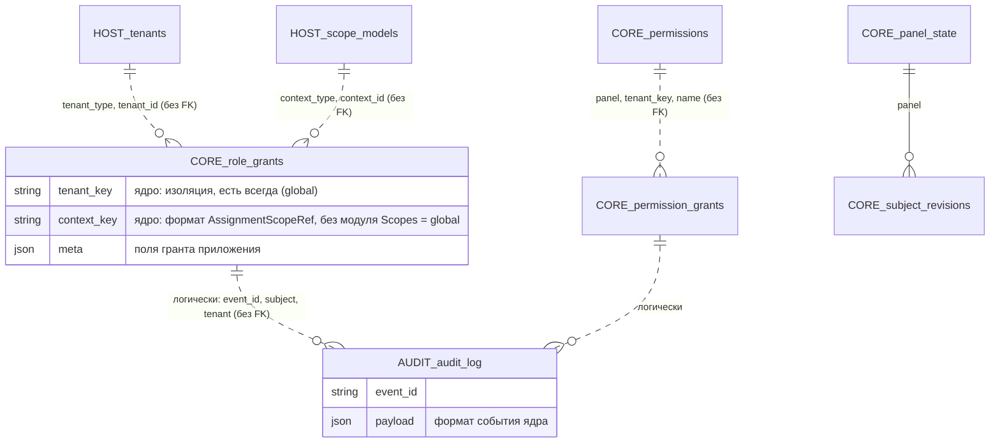
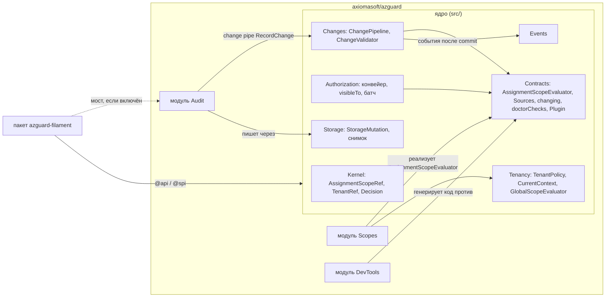
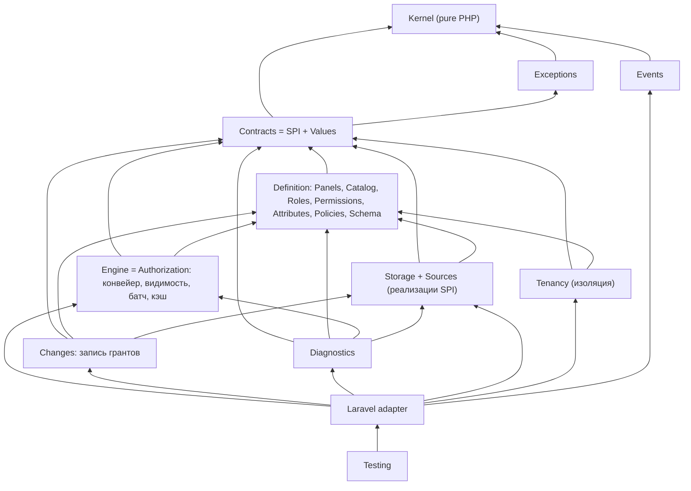
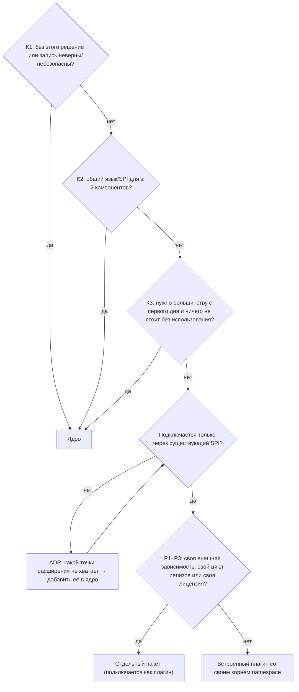

# Архитектура: разделение по ответственности и стабилизация API до 1.0 (обсуждение)

Дата: 2026-10-09. Ветка: `review/v1-architecture` от `review/v1-hardening` (`c04529e8`). Документ —
предложения для обсуждения, **код не менялся**. Ссылки на код — относительно `packages/core/src`, если не указано
иное. Цифры сняты скриптом по дереву ветки (строки — `wc -l` с комментариями, связи — по `use AzGuard\…`).

## 0. Контекст

Обсуждали с владельцем по итогам оценки пакета (архитектура 8/10, API и удобство 7,5/10). Позиция владельца:
функционала много и не всем он нужен; пакет не «переусложнён целиком», но часть стоит отделить. Уточнения
владельца:

1. **Главная цель — правильное разделение функциональности**, а не пакеты ради пакетов: каждая граница
   обоснована ответственностью (цель, кто пользуется, причины изменений, направление зависимостей). Часть
   уходит во встроенные плагины, часть — в отдельные пакеты, часть остаётся в ядре; критерии — раздел 2.
2. **Свобода будущих решений.** Если понадобится вынести модуль или распространять часть иначе, это должно быть
   переносом файлов без смены публичного API.
3. **1.0 не выходит с нестабильным API.** Всё, что после 1.0 стало бы BC-break, решается до него (раздел 3).

**Короткий вывод.** Ядро у пакета хорошее и почти всё должно остаться ядром: снимок чтения, конвейер, хранилище,
изоляция тенанта — это корректность. По критериям из отдельной функциональности получается немного: **три
встроенных плагина** (области назначения, `RelationSource`, аудит) и **один пакет** (Filament; новые — только при
внешней зависимости, своём цикле релизов или лицензии). Прежнее предложение о пакетах `tenancy`, `sources`,
`audit`, `devtools` критериям не прошло (2.3). Главная работа — не вынос, а **стабилизация до 1.0**: разметка
и бюджет API (246 типов, 138 без маркера), контракты без реализаций (14 зон), способности SPI вместо 26
`instanceof` в движке, namespace по будущим границам, формы `StateToken`/`Decision`, словари и хранимые форматы.
Оценка — 34–57 рабочих дней. Порядок: стабилизировать в текущем пакете → 1.0 по критерию 3.1 → физический
вынос потом и только по критериям, без смены API (раздел 4).

## 1. Что есть сейчас: инвентаризация

### 1.1. Размер

| Пакет | Файлов | Строк | Публичный API (`api-manifest.json`) |
|:--|--:|--:|:--|
| `packages/core` (`axiomasoft/azguard`) | 421 | 41 475 | 246 типов (179 классов, 42 интерфейса, 16 enum, 9 трейтов), 1 079 методов |
| `packages/filament` (`axiomasoft/azguard-filament`) | 42 | 5 264 | использует 52 типа ядра, только из манифеста (`tests/Arch/ApiManifestTest.php`) |
| `tests/` | 869 | ~55 800 | из них Feature 251 файл / 27,9 тыс. строк, Fixtures 470 / 14,8 тыс. |
| `docs/` | 26 стр. | ~19,7 тыс. слов | `advanced/` — 4 тыс. слов, из них `consistency.md` 1,4 тыс. |

Конфиг `config/azguard.php`: 221 строка, 11 верхних секций. `PanelBuilder` (`Panels/PanelBuilder.php`): 31
публичный метод DSL. Исключений — 51 класс (`Exceptions/`), причин решения — 21 (`Kernel/Decision/DecisionReason.php`).

### 1.2. Возможности по областям

Строки — суммарно по перечисленным файлам; одна возможность часто размазана по нескольким зонам.

| Возможность | Где (основное) | Строк | Кому нужна |
|:--|:--|--:|:--|
| Ядро значений: идентичности, ключи, шаблоны, `Decision`, `PermissionSet`, токены | `Kernel/` (29 файлов) | 2 336 | всем |
| Конвейер решения: Prepare → Boundary → Before → Authority → Restriction → After | `Authorization/Pipeline/*`, `Authorizer.php`, `EvaluationFrame.php` | ~1 700 | всем |
| Панели: DSL, рецепт слоями, компиляция, реестр, резолвер, отпечаток | `Panels/` (14) | 3 938 | всем, но многопанельность — не всем |
| Каталог прав и ролей из кода (enum + классы ролей, атрибуты) | `Catalog/`, `Roles/`, `Permissions/`, `Attributes/` | ~1 620 | всем |
| Политики (вето) и мост в Laravel Gate | `Policies/`, `Laravel/Gate/GateBridge.php` | 573 | всем |
| Хранилище и `DatabaseSource`: гранты, записи, блокировка панели | `Storage/` (18), `Sources/Database/` (7) | 4 741 | всем, кто хранит гранты в БД |
| Прочие источники: папка (discovery), Gate, Relation, менеджер | `Sources/Folder`, `Gate`, `Relation`, `SourceManager.php` | ~2 160 | discovery — многим; Relation/внешние — немногим |
| Согласованность: снимок, токены, ревизии, эпоха, забор внешних источников, `Reads`/`StateRefresh` | `Authorization/ReadAttempt.php`, `Storage/StorageReadSession.php`, `AuthorityReadBaseline.php`, `Kernel/Decision/*StateToken.php`, `Contracts/Sources/FencesReads.php`, `Panels/Reads.php`, `StateRefresh.php` и др. | ~1 820 + часть `DatabaseSource` | корректность нужна всем; ручки — немногим |
| Тенанты и области назначения (наследование, членство, резолверы) | `Scopes/` (19), `Contracts/Scopes/` (17), `Authorization/ScopeEligibility.php`, `Kernel/Identity/AccessScope.php` | ~1 910 ядра + упоминания в 141 файле | SaaS/мультитенант |
| Видимость списков `visibleTo()` (предикаты в SQL) | `Authorization/Visibility.php`, `Authorization/Query/*`, `Scopes/Query/*`, `Sources/Relation/*` | ~2 150 | многим |
| Батч решений `DecisionSet` одним снимком | `Authorization/BatchEvaluation.php`, `BatchInputs.php`, `Kernel/Decision/DecisionSet.php` | 751 | таблицам/Filament |
| Хуки, ограничения, условия грантов | `Contracts/Authorization/{Restriction,GrantCondition}.php`, `Pipeline/Stages/{Before,Restriction,After}Stage.php` | ~370 | продвинутым |
| Супер-админ | `Roles/SuperAdminRole.php`, `Roles/Attributes/SuperAdmin.php` (+ 27 файлов упоминаний) | 38 | многим |
| Конвейер изменений: pipes, валидаторы, журнал, менеджеры, миграция ключей ролей | `Changes/` (24) | 2 965 | запись нужна всем; pipes/валидаторы — продвинутым |
| События (после commit, с актором) | `Events/` (15) | 899 | многим |
| Плагины и аудит | `Plugins/` (`BasePlugin`, `PluginContext`, `Audit/*`) | 247 (аудит 172) | аудит — компаниям с compliance |
| Кэш наборов прав и каталога (array/redis через Laravel cache) | `Authorization/Cache/PermissionSetCache.php`, `Catalog/CatalogCache.php` | 293 | производительность |
| Схемы: поля грантов (`Field`, `FieldTarget`) и описание панели/ролей/прав для интерфейсов | `Schema/` (11) | 1 107 | поля — хранилищу и всем; описания — CLI и Filament |
| Справочники для выбора субъекта/тенанта/области в UI | `Directories/` (11) | 758 | в основном Filament |
| Диагностика: `doctor` (25 проверок), `explain`, обзор панели | `Diagnostics/` (30), `Laravel/Console/Commands/{Doctor,Explain}Command.php` | 2 234 + | всем в CI; глубина — продвинутым |
| Консоль: 32 команды, из них 9 `make:*`, и скаффолдинг | `Laravel/Console/` | 3 279 (make 921, scaffold 507) | частично |
| HTTP: middleware, `DecisionResponder`, эталонный маппинг 403/503 | `Laravel/Http/` | 624 | всем |
| Тестовый набор: `AzGuardFake`, `actingAsWithRoles`, контрактные сьюты для авторов расширений | `Testing/` (24) | 2 135 | всем; контракты — авторам расширений |
| Filament: авторизация ресурсов, фильтрация, редакторы грантов, экспорт | `packages/filament/src` | 5 264 | пользователям Filament |

### 1.3. Связность (кто от кого зависит)

Исходящие связи зон (число других зон, которые зона импортирует):

| Зона | → зон | Комментарий |
|:--|--:|:--|
| `Kernel` | 1 (`Exceptions`) | чистое PHP-ядро, закреплено `tests/Arch/ZonesArchTest.php` («kernel depends on nothing but PHP») |
| `Exceptions` | 1 (`Kernel`) | закреплено арх-тестом |
| `Events` | 1 | хорошо |
| `Storage` | 5 | приемлемо (`Panels\Reads` — enum настройки) |
| `Policies`, `Roles`, `Scopes`, `Directories` | 3–6 | приемлемо |
| `Panels`, `Catalog`, `Schema` | 9–11 | сборка; взаимные связи `Panels ↔ Catalog ↔ Scopes ↔ Sources` |
| `Authorization`, `Changes` | 12 | ожидаемо для оркестраторов |
| `Diagnostics` | 13 | ожидаемо |
| **`Contracts`** | **14** | **проблема для SPI**: контракты ссылаются на реализации |
| **`Sources`** | **14** | `DatabaseSource` импортирует 4 doctor-проверки и 6 классов `Changes` |
| `Laravel` | 20 | слой интеграции, ожидаемо |

Входящие (fan-in): `Kernel` и `Exceptions` — 20 зон, `Panels` и `Contracts` — 17, `Scopes` и `Sources` — 13. То есть
тенанты/области и источники — такая же опора, как панели.

Конкретные связи, которые мешают модульности:

- **Контракты на реализации.** `Contracts/PanelAccess.php` → `Concerns\SubjectAccess`, `Directories\PanelDirectories`,
  `Authorization\Visibility`, `Panels\Panel`; `Contracts/AzGuardSubject.php` → `Concerns\SubjectAccess`,
  `Concerns\SubjectPanels`; `Contracts/Sources/StoresGrants.php` → `Changes\Change`, `Changes\ChangeResult`;
  `Contracts/Plugins/Plugin.php` → `Panels\PanelBuilder`, `Plugins\PluginContext`; `Contracts/Diagnostics/DoctorCheck.php`
  → `Diagnostics\DoctorContext`. Часть этого — значения (DTO), которые просто живут не в той зоне; часть —
  конкретные классы (`PanelBuilder`, `SubjectAccess`), которые фактически стали API.
- **Источник знает про диагностику.** `Sources/Database/DatabaseSource.php:28-31` импортирует
  `Diagnostics\Checks\{DecisionFieldsInMeta,GrantsDead,ModelColumns,RolesOrphaned}`; `Sources/Folder/FolderSource.php:20`
  — `DiscoveryCached`. Правильнее, чтобы источник поставлял свои проверки через `doctorChecks()`, не зная классов зоны.
- **Фасад знает про тестовый набор.** `AzGuardManager.php:31` → `Testing\AzGuardFake` (для `AzGuard::fake()`).
  Для Laravel это норма (`Bus::fake()`), но это мешает вынести `Testing` в dev-пакет.
- **Тенанты в ядре значений.** `Kernel/Identity/AccessScope.php` — пара `TenantRef` + `AssignmentScopeRef`; 7 файлов
  `Kernel`, 13 из 20 файлов `Authorization`, 6 причин решения (`tenant_*`, `context_*`) завязаны на них. Это
  осознанное решение (изоляция тенантов в типах), и именно поэтому тенанты нельзя «просто вынести в плагин».

### 1.4. Что спроектировано хорошо и должно остаться

- **`Kernel` без фреймворка**, закреплённый арх-тестом и проверкой хелперов. Это готовая основа «ядра ядра».
- **Один конвейер для всех входов** (`hasPermission`, `@can`, middleware, атрибуты, Filament, `visibleTo`). Деление
  на модули не должно порождать второй путь решения.
- **Fail closed с различимым отказом** (`Decision::failed()`, `FailureKind`). Это свойство безопасности, не фича.
- **Плагины уже есть и работают.** `Contracts/Plugins/Plugin.php` (`register(PanelBuilder)`, `boot(Panel)`),
  зависимости между плагинами (`Contracts/Plugins/DependsOnPlugins.php`), отключение по id (`withoutPlugins`).
  `Plugins/Audit/AuditPlugin.php` (`azguard/audit`) — живой пример модуля поверх SPI.
- **Источники как контракты-способности** (`Contracts/Sources/Provides*`, `StoresGrants`, `FiltersQueries`,
  `FencesReads`, `ChecksHealth`): источник реализует только то, что умеет.
- **Контрактные тест-сьюты для авторов расширений** (`Testing/Contracts/*ContractTests.php`) — то, что нужно
  экосистеме и любым будущим модулям.
- **Манифест публичного API** (`packages/core/api-manifest.json`, `bin/api-manifest.php --check`) и арх-тест,
  что Filament пользуется только им. Это механизм, на котором держится будущий стабильный SPI.
- **Монорепо со split** (`.github/workflows/split.yml`) и `self.version` между пакетами — выделение новых пакетов
  технически дёшево.

Вывод по разделу: архитектура не «плохая», она **плотная**. Много правильных механизмов, но их границы видны
только по коду, а не по пакетам, документации и SPI.

## 2. Как делить: критерии и решение по каждой области

### 2.1. Три категории и критерии

Граница проводится по **ответственности**: за какой вопрос отвечает код, кто им пользуется, по каким причинам он
меняется и куда направлены его зависимости. Размер и удобство — не критерии.

| Категория | Где живёт | Критерии | Обязательные свойства |
|:--|:--|:--|:--|
| **Ядро** | `packages/core/src`, namespace `AzGuard\<Зона>` | достаточно одного: **К1** без этого решение или запись неверны либо небезопасны; **К2** общий язык или SPI для ≥ 2 компонентов; **К3** нужно большинству приложений с первого дня и ничего не стоит без использования | не знает о модулях и пакетах |
| **Модуль внутри пакета** | `packages/core/modules/<name>/src`, отдельный корневой namespace `AzGuard\<Модуль>` | все сразу: **М1** нужен части приложений и включается явно; **М2** у него есть свои артефакты — DSL или конфиг, таблицы, команды, словарь, раздел документации; **М3** вне AzGuard смысла не имеет | говорит с ядром только через SPI, события и точки конвейера; не импортирует другие модули; выключенный — ноль таблиц, запросов и понятий |
| **Отдельный пакет** | `packages/<name>`, свой Composer-пакет | **П1** самодостаточен и имеет назначение вне внутренностей AzGuard: интеграция с другим продуктом для пользователей этого продукта | пользуется только `@api`/`@spi` ядра; к модулям — только через ядро или свой явный мост |

Защита от переусложнения: если у кандидата нет своих артефактов (М2), а он лишь реализует понятие ядра (ещё один
источник, ещё одна проверка), он остаётся в ядре рядом с соседями. Модуль ради одного класса — лишний механизм.
«Нужно не всем» без М2 и «нужно только разработчикам» без П1 — не повод для пакета.

### 2.2. Решение по каждой области

| Область | Категория | Обоснование | Что не так сейчас |
|:--|:--|:--|:--|
| `Kernel`: идентичности, ключи, `Decision`, `StateToken` | ядро (К2) | язык всех компонентов, без фреймворка | `StateToken` раскрывает внутренние поля хранилища |
| `Contracts` / SPI | ядро (К2) | договор с модулями, пакетами и расширениями | зависит от 14 зон реализации (1.3) |
| Конвейер решения, стадии, хуки, `Restriction`, `GrantCondition` | ядро (К1, К2) | единственный путь `allow`; хуки — точки расширения | движок знает конкретные источники: 26 `instanceof` |
| Панели и DSL, реестр, резолвер | ядро (К1, К3) | панель — область каталога и грантов | первый шаг квик-старта; нет неявной панели |
| Каталог из кода, роли, права, атрибуты, политики-вето, мост Gate | ядро (К1, К3) | суть пакета | `Attributes/CheckPermission.php` → `Laravel\Http\Middleware` |
| Супер-админ | ядро (К1, К3) | меняет решение, 38 строк | — |
| `DatabaseSource`, хранилище, снимок чтения, ревизии, блокировка панели | ядро (К1) | корректность чтения и записи | импортирует 4 doctor-проверки; пишет в `audit_log` |
| Источники `FolderSource`, `GateSource`, `RelationSource` | ядро (К3; `RelationSource` — реализация понятия «источник» без своих артефактов) | стандартные способы получить права; отдельный модуль для одного источника — переусложнение | `instanceof RelationSource` в `PanelSources.php:130`, `PanelRegistry.php:208`; `FolderSource` → `DiscoveryCached` |
| Запись грантов: `ChangePipeline`, `ChangeValidator`, менеджеры, `RoleKeyMigration`; change pipes как SPI | ядро (К1) | блокировка панели и валидация — корректность записи | `ChangePipeline.php:323` чистит `audit_log`; валидатор импортирует классы областей |
| Тенант: граница изоляции, членство, текущий контекст запроса | ядро (К1) | безопасность, выражена в типах (`AccessScope`) | смешан с областями в `AzGuard\Scopes` |
| **Области назначения**: типы областей, наследование ролей, резолверы, eligibility-запросы | **модуль `AzGuard\Scopes`** (М1–М3) | нужны приложениям с командами/проектами; свой DSL, резолверы, словарь; вне AzGuard смысла нет | вплетены в 10 из 20 файлов `Authorization`; DSL — методы `PanelBuilder` |
| Контракты областей, на которые ссылаются роли, источники, ресурсы | ядро (К2) | `BaseRole::scopes()`, `RelationBinding`, `GateBridge`, гранты и события ссылаются на них | — (остаются в ядре) |
| `visibleTo()` и `DecisionSet` | ядро (К1, К3) | фильтр списка совпадает с решением; батч — один снимок | — |
| Кэш, события после commit, схемы (`Schema/`) | ядро (К2, К3) | общие механизмы | `panel.touched` раскрывает внутреннее состояние |
| Справочники для UI (`Directories/`) | ядро (К2) | нужны любому административному UI, не только Filament | отдаются методом `Contracts/PanelAccess.php::directories()` |
| `doctor`, `explain`, эксплуатационные команды, HTTP, очередь | ядро (К3) | эксплуатация и интеграция с Laravel | проверки источников импортируются, а не регистрируются |
| Тестовый набор: `AzGuardFake`, `InteractsWithAzGuard`, контрактные сьюты | ядро (К2, К3) | фейк повторяет API ядра и меняется вместе с ним; контрактные сьюты — исполняемая спецификация SPI | фасад импортирует `Testing\AzGuardFake` |
| **Аудит-журнал** | **модуль `AzGuard\Audit`** (М1–М3) | compliance нужен не всем; своя таблица, команда, ретеншн; вне AzGuard смысла нет | плагин только по названию: таблица `StorageSchema.php:63`, запись `DatabaseSource.php:669`, чистка `ChangePipeline.php:323`, `ChangeJournal` в `AzGuard\Changes` |
| **Генераторы** `azguard:make:*`, скаффолдинг, stubs | **модуль `AzGuard\DevTools`** (М1–М3) | нужны при разработке, свои артефакты (команды, stubs), в рантайме не участвуют | лежат в ядре (`Laravel/Console/Commands/Make`, `Laravel/Console/Scaffold`) |
| **Интеграция с Filament** | **пакет `azguard-filament`** (П1) | нужна пользователям Filament, самодостаточна, своя зависимость `filament/filament` | импортирует `AzGuard\Scopes\{AssignmentScopePhase,CurrentContext}` (`Editors/GrantEditor.php`, `Editors/TargetSelector.php`) |

### 2.3. Что изменилось по сравнению с прежними вариантами

| Было | Почему неверно | Стало |
|:--|:--|:--|
| пакеты `azguard-audit`, `azguard-devtools`, `azguard-tenancy`, `azguard-sources` | действуют только внутри AzGuard, П1 не выполнен | аудит, генераторы, области — модули внутри пакета; изоляция тенанта и все источники — ядро |
| аудит и области как «встроенные плагины» в зонах ядра (`AzGuard\Plugins\Audit`, `AzGuard\Scopes` в `src/`) | загромождают ядро, граница видна только по договорённости | отдельные корни `AzGuard\Audit`, `AzGuard\Scopes`, `AzGuard\DevTools` в `modules/` |
| `RelationSource` как плагин | нет своих артефактов (М2) | источник ядра рядом с `DatabaseSource`, `FolderSource`, `GateSource` |
| генераторы в ядре по конвенции Laravel | загромождают ядро; свои артефакты есть | модуль `AzGuard\DevTools`, команды регистрируются только в консоли |
| `Directories/` → Filament | нужны любому UI | ядро, отдельный сервис |
| критерий пакета «своя зависимость, цикл релизов или лицензия» | разрешал пакеты, которые без AzGuard бессмысленны | пакет — только самодостаточная интеграция с другим продуктом |

### 2.4. Минимальное ядро для новичка

**Что должен выучить новичок:** enum прав, класс роли, трейт `HasAzGuard` + morph alias, `grantRole()` /
`revokeRole()`, `hasPermission()` / `@can` / middleware, политика-вето, `azguard:doctor` и `azguard:explain`.
Панели, источники, области, решения как объекты, токены и ручки согласованности — «расширенное использование».
Сейчас квик-старт (`docs/getting-started/quick-start.md`) начинается с «1. The panel».

Корректность при этом не прячется: снимок чтения, fail closed, сроки и изоляция тенанта работают всегда; в
«расширенное» уходят только **ручки** (`Reads`, `StateRefresh`, `cache(generation:)`) и **объяснения**
(`docs/advanced/consistency.md`).

### 2.5. Тенанты и области назначения

- **Изоляция тенанта — ядро (К1).** `TenantRef` в `AccessScope`, `TenantPolicy`, проверка членства
  (`TenantMembership`, `MembershipRestriction`), `CurrentContext`, причины `tenant_*`. Без тенантов работает
  `TenantRef::global()`; стоимость для приложения без тенантов — ноль. Namespace — `AzGuard\Tenancy`.
- **Области назначения — модуль `AzGuard\Scopes`.** Типы областей, их политика и наследование ролей, резолверы
  области и ресурса, eligibility-запросы. В движок — только через SPI (раздел 4).
- **Остаются в ядре как формат идентичности:** `AssignmentScopeRef` и `AccessScope` в `Kernel`, контракты, на которые
  ссылаются роли, источники и ресурсы (`AssignmentScopeDefinition`, `QueryableAssignmentScopeDefinition`,
  `ResolvedAssignmentScope`, `ProvidesAssignmentScope`, `ProvidesAccessScope`, `AssignmentScopeMembership`,
  `ResourceScopeResolver`, `AssignmentScopeResolver`), причины `context_*`. Без модуля работает только глобальная
  область, а грант с неглобальной областью отклоняется при записи.
- **Не делать:** вынос тенантов целиком (ослабляет изоляцию в типах, меняет формат грантов) и слияние тенанта и
  области в одно понятие (тенант — граница безопасности, область — граница применимости гранта).

## 3. Что стабилизировать до 1.0

Позиция владельца: **1.0 не может выйти с нестабильным API.** Пакет ещё не выпущен (последний тег `v0.3.0`,
в `CHANGELOG.md` только `[Unreleased]`, 0.3 не публиковался на Packagist), поэтому сейчас ломать можно, а после
1.0 — только в 2.0. Ниже — всё, что после 1.0 стало бы BC-break, по приоритету. Трудозатраты — рабочие дни.

**P0 — границы и SPI.** Без них непонятно, что вообще обещает 1.0.

| # | Что | Сейчас | Почему блокирует | Предложение | Дни | Риск | Ломает |
|:--|:--|:--|:--|:--|:--|:--|:--|
| 1 | Разметка публичных типов | 246 типов в манифесте: 108 `@api`, 138 без маркера, `@spi` нет; манифест публикует всё, что не `@internal` | после 1.0 каждый неразмеченный тип — де-факто API навсегда | закрыто по умолчанию: в манифест попадает только `@api`/`@spi`; разметить все 246; манифест с отдельным списком `@spi` | 3–4 | низкий | да (что станет `@internal`) |
| 2 | Бюджет API | 246 типов (51 исключение, 45 контрактов) | чем больше поверхность, тем дороже каждая будущая правка | ≤ 140 типов: `@api` ≤ 90, `@spi` ≤ 50 (оценка; основной выигрыш — исключения и внутренние помощники) | в п. 1, 10 | низкий | да |
| 3 | Контракты зависят от реализаций | `Contracts` → 14 зон (1.3), 37 контрактов без маркера | SPI нельзя заморозить, пока сигнатуры тянут внутренние классы | `Contracts/Values/` для DTO (`ChangeResult`, `GrantRecord`, `PermissionDefinition`, `LookupContext`, `Field`, `Reads`…); в сигнатурах SPI — только `@spi`/`Kernel` | 4–6 | средний | да |
| 4 | Движок знает конкретные источники | 26 `instanceof DatabaseSource`/`FolderSource` в `Authorization/` + 14 импортов `Sources`/`Storage`; `instanceof RelationSource` в `PanelSources.php:130`, `PanelRegistry.php:208` | снимок чтения, публикация после commit и «живые» роли доступны только встроенным источникам; новый источник или вынос — смена SPI | способности в SPI (например, «источник открывает снимок чтения», «публикует после commit», «отдаёт фильтр видимости»), которые реализуют `DatabaseSource`, `FolderSource`, `RelationSource` | 4–6 | **высокий** (согласованность); страховка — race-тесты и бенч | SPI |
| 5 | Namespace = границы | тенант и области в одном `AzGuard\Scopes`; `ChangeJournal` в `Changes`; хранилище аудита в ядре (`StorageSchema.php:63`, `DatabaseSource.php:669`, `ChangePipeline.php:323`); справочники в `Contracts/PanelAccess.php` | иначе вынос плагина — переименование публичных классов | `Tenancy\` (ядро) отдельно от `Scopes\` (плагин); плагины владеют своим хранилищем, миграцией, командами; справочники — отдельный сервис (раздел 5.2) | 4–6 | средний | да |
| 6 | Области назначения как плагин | DSL `PanelBuilder::scopes()`/`scopeResolvers()`/`resourceScopes()`; логика в 10 из 20 файлов `Authorization` | если DSL останется в `PanelBuilder`, ядро навсегда знает о плагине; перенос DSL после 1.0 — BC-break | **минимум до 1.0:** DSL у плагина (`ScopesPlugin::make()->…`) и SPI стадии Boundary/фильтра видимости (2–3 дня). **Полностью:** логика за SPI (ещё 4–7 дней, можно и после 1.0, если SPI заморожен) | 2–3 / 6–10 | высокий | да (DSL) |
| 7 | Тенант в идентичности ядра | `AccessScope(TenantRef, AssignmentScopeRef)` в `Kernel`, в `Decision::$scope`, в событиях | поменять форму после 1.0 нельзя | ADR: тенант и ссылка на область остаются в `Kernel` как формат идентичности; логика областей — плагин | 0,5 | низкий | нет |
| 8 | Фасад знает тестовый набор | `AzGuardManager.php:31` → `Testing\AzGuardFake` | направление зависимостей; мешает границе `Testing` | `AzGuard::fake()` сохраняется, подмена через контейнер | 0,5 | низкий | нет |
| 9 | Источник знает диагностику | `DatabaseSource.php:28-31`, `FolderSource.php:20` импортируют проверки | форма SPI регистрации проверок замёрзнет в 1.0 | область/плагин регистрирует проверки через `doctorChecks`/способность SPI | 1 | низкий | SPI |

**P1 — формы и имена публичных типов.**

| # | Что | Сейчас | Почему блокирует | Предложение | Дни | Риск | Ломает |
|:--|:--|:--|:--|:--|:--|:--|:--|
| 10 | Исключения | 51 класс; иерархия уже есть (8 баз: `DefinitionException` — 15 потомков, `ChangeException` — 12…), у каждого `code()` | каждый класс — публичный тип и цель `catch` | оставить ~10 базовых классов, листья (~40) — коды; коды — публичный словарь в `docs/reference/exceptions.md` | 2–3 | низкий | да |
| 11 | `GateMode` | enum с одним case `Authoritative`, `PanelBuilder::gate()`, ключ `defaults.gate.mode` | ручка без выбора навсегда в API | удалить (или записать в ADR, какой второй режим планируется) | 0,5 | низкий | да |
| 12 | Форма `StateToken` | 8 публичных полей: `storageId`, `panel`, `incarnation`, `version`, `generation`, `fingerprint`, `epoch`, `subjectRevision` | любая смена хранилища (например, блокировка по субъекту из `ROADMAP.md`) ломает API | непрозрачное значение: `equals()`, `panel()`, сериализация для логов/квитанций; поля `@internal` | 1–2 | средний | да |
| 13 | Форма `Decision` / `DecisionSet` | 9 публичных readonly-полей (`effect`, `reason`, `state`, `scope`, `component`, `grants`, `message`, `status`, `code`) | публичное поле нельзя убрать или сменить тип | ревизия полей; `grants` — `list<Grant>`; решить «поля или методы» один раз | 1 | низкий | да |
| 14 | Словарь причин | `DecisionReason` 21 значение, `FailureKind` 2; case `AssignmentScope*` при значениях `context_*` | строки причин уходят в логи, JSON, HTTP | заморозить; одно слово (`context` или `assignment_scope`) в именах и значениях; причины плагина остаются в закрытом enum ядра (следствие п. 7) | 0,5–1 | низкий | да |
| 15 | Неявная панель | квик-старт начинается с панели; `azguard:install --panel=Admin` | меняет поведение по умолчанию и установку | панель `default` без провайдера; многопанельность — расширенное использование | 2–3 | средний | меняет умолчания |
| 16 | Ручки согласованности | `Reads` × `StateRefresh` × `cache(generation)` в DSL и конфиге | матрица ручек замёрзнет | заморозить как есть **или** свернуть в профили `strict`/`replica` | 1–2 | низкий | если сворачивать |
| 17 | Методы на модели хоста | `HasAzGuard`: ~20 методов (`hasRole`, `hasAnyRole`, `hasAllRoles`, `syncRoles`, `syncPermissions`…, `azguard()`, `azguardRef()`) | имена на чужой модели менять дороже всего; часть совпадает с `spatie/laravel-permission`, обе библиотеки нельзя держать на одной модели при миграции | решить: оставить имена или префикс/доступ через `$user->azguard()`; добавить `visible()` сейчас | 1–2 | средний | да |
| 18 | DSL и фасад | `PanelBuilder`: 31 метод; фасад `AzGuard`: 13 методов | DSL — самый используемый API | ревизия: убрать `gate()`, перенести DSL областей в плагин, пометить остальное `@api` | 1 | низкий | да |
| 19 | API Filament-пакета | 21 публичный тип | тот же вопрос, что п. 1 | разметить; Filament уже пользуется только манифестом ядра | 1 | низкий | да |

**P2 — данные и эксплуатационные контракты.**

| # | Что | Сейчас | Почему блокирует | Предложение | Дни | Риск | Ломает |
|:--|:--|:--|:--|:--|:--|:--|:--|
| 20 | Схема БД | 2 миграции (`create` + `upgrade_to_schema_2`), `Storage::SCHEMA_VERSION = 2`; таблицы `azg_{permissions,role_grants,permission_grants,subject_revisions,panel_state,storage_state,audit_log}` | после 1.0 любая правка — миграция данных у пользователей | одна начальная миграция ядра для 1.0; `audit_log` — миграция плагина; ADR о хранимых форматах: `IdentityCodec::VERSION`, грамматика ключей прав, `resource_prefix` | 1–2 | средний | да (для dev-установок) |
| 21 | Ключи конфига | 11 секций, 221 строка | ключи — API | ревизия: убрать мёртвые (`defaults.gate.mode`), снимок ключей в тесте | 1 | низкий | да |
| 22 | События | 12 типов `noun.verb_past`; конверт `eventId`, `occurredAt`, `panel`, `tenant`, `actor`, `correlationId`, `state` | имена и поля читают подписчики | заморозить; `panel.touched` — внутреннее, сделать `@internal` или убрать; `state` — непрозрачный токен (п. 12) | 0,5–1 | низкий | да |
| 23 | Команды | 32 команды `azguard:<area>:<verb>` | имена в скриптах и CI | ревизия имён (`state:reset`, `storage:migration`, `stubs`); команды плагинов — в их namespace | 0,5 | низкий | да |
| 24 | Машиночитаемый вывод | id находок `doctor` (`consistency.reads`…), `--json`, вывод `explain` | CI пользователей парсит JSON | описать как API, снимок-тест формата | 0,5–1 | низкий | нет |
| 25 | Префикс id плагинов | `azguard/` не защищён в коде | сторонний плагин может занять имя | зарезервировать `azguard/*` для первичных плагинов | 0,25 | низкий | нет |

**Итого:** P0 — 23–34 дня (из них 6–10 — области назначения; минимум до 1.0 — 2–3), P1 — 11–17, P2 — 4–6.
Всего **38–57 дней**, при минимальном варианте п. 6 — **34–50**. Большая часть механическая и параллелится;
рискованные пункты — 4 и 6.

### 3.1. Критерий «1.0 со стабильным API» (release gate)

1.0 выходит, только когда выполнено всё:

- [ ] каждый тип в манифестах ядра и Filament помечен `@api`, `@spi` или `@internal`; манифест закрыт по умолчанию;
      бюджет соблюдён;
- [ ] арх-тесты из раздела 7.3 зелёные **без храповика** для правил A2 (контракты), A3 (движок), A4 (источники),
      A6 (ядро не знает плагинов);
- [ ] каждый встроенный плагин держит всё своё в своём корне; тест: панель без плагина не создаёт его таблиц и не
      делает его запросов;
- [ ] снимок-тесты публичных словарей: значения `DecisionReason`/`FailureKind`, коды исключений, типы событий и
      поля конверта, имена команд, ключи конфига, id находок `doctor`, формат `--json`;
- [ ] одна начальная миграция, версия схемы и формат идентичности записаны в ADR;
- [ ] ADR приняты: политика API/SPI и устаревания; тенант в идентичности; критерии «ядро / плагин / пакет»;
      хранимые форматы данных;
- [ ] справочник в `docs/reference/` полный по всем словарям выше; `UPGRADING.md` с 0.3;
- [ ] в CI после релиза — проверка обратной совместимости против последнего тега: diff манифеста плюс
      [`roave/backward-compatibility-check`](https://github.com/Roave/BackwardCompatibilityCheck).

## 5c. Схема БД: заморозка до 1.0

Требование владельца: **схема замораживается сейчас.** Владелец начинает пользоваться текущей версией; всё, что
делается потом (разметка API, переезд классов в `modules/`, `Tenancy\`), должно двигать классы, а не данные.
Обновление — `composer update` и, в худшем случае, пустая для его данных миграция. Ниже — проверка текущей схемы
по этому требованию. Источник: `Storage/Schema/StorageSchema.php`, `Storage/Schema/HostKeyColumns.php`,
`database/migrations/`, `Sources/Database/StorageHealth.php`.

### Что есть

Префикс таблиц — `storages.<name>.table_prefix` (по умолчанию `azg_`), соединение — `storages.<name>.connection`,
тип ключей хоста — `host_keys` (`string`, `bigint`, `uuid`, `ulid`; по умолчанию `ids.host_keys = string`).
Идентификаторы (`panel`, `role`, `*_type`, `*_key`, `origin`) — `binary` на MySQL/MariaDB, `varchar` с
collation `C` на PostgreSQL; ключи хоста (`*_id`) — по `host_keys` через `HostKeyColumns::hostKey()`. Внешних
ключей нет нигде; целостность пар — CHECK (на SQLite — триггеры) из `StorageSchema::scopeConstraints()`.
Время — `dateTime` в UTC (запись `DatabaseSource.php:684`, `ChangeJournal.php:57`, чтение `GrantRows::utc()`).

| Таблица | Колонки | Ключи и индексы | Кто владеет сейчас → цель |
|:--|:--|:--|:--|
| `azg_permissions` | `id`, `panel`(64), `tenant_key`(200)/`tenant_type`(128)/`tenant_id`, `name`(255), `label`, `group`, `description`, `meta` json, `created_at`, `updated_at` | unique `pm_identity(panel, tenant_key, name)`; CHECK `pm_tenant_pair` | ядро → ядро |
| `azg_role_grants` | `id`, `panel`, `tenant_*`, `role`(64), `subject_type`(128)/`subject_id`, `context_key`(200)/`context_type`/`context_id`, `origin`(128, default `manual`), `expires_at`, `actor_type`/`actor_id`, `actor_reason`, `meta` json, `created_at`, `updated_at` | unique `rg_identity(panel, tenant_key, role, subject_type, subject_id, context_key, origin)`; `rg_subject`, `rg_context`, `rg_origin`, `rg_expiry(expires_at)`; CHECK `rg_tenant_pair`, `rg_context_pair` | ядро → ядро |
| `azg_permission_grants` | как `role_grants`, вместо `role` — `permission`(255) | `pg_*` аналогично | ядро → ядро |
| `azg_panel_state` | `panel` PK, `version`, `incarnation`(26), `updated_at`, `epoch` (схема 2) | `ps_pk` | ядро → ядро |
| `azg_subject_revisions` (схема 2) | `panel`, `subject_type`, `subject_id`, `revision` | PK `sr_pk(panel, subject_type, subject_id)` | ядро → ядро |
| `azg_storage_state` | `id` = 1, `schema` json (`version`, `identity_codec`, `storage_id`, `prefix`, `host_keys`) | `ss_pk`, CHECK `ss_singleton` | ядро → ядро |
| `azg_audit_log` | `id`, `event_id`(26, ULID), `type`(64), `panel`, `tenant_*`, `subject_*` null, `actor_*` null, `actor_reason`, `correlation_id`(26), `payload` json, `occurred_at` | unique `al_event`; `al_time(panel, occurred_at)`, `al_subject`, `al_corr`; CHECK `al_tenant_pair` | **ядро** (`StorageSchema::create()`, `drop()`, `StorageHealth::HOST_KEY_COLUMNS`) → **модуль `Audit`** |

Миграции: `2026_10_01_000000_create_azguard_storage.php` (`StorageSchema::create('default')`) и
`2026_10_09_000000_upgrade_azguard_storage_to_schema_2.php` (`upgrade()`: идемпотентно добавляет `epoch` и
`subject_revisions`). `Storage::SCHEMA_VERSION = 2`; несовпадение `storage_state` с конфигурацией ловит `doctor`.

### Совпадает ли схема с границами модулей

- **Ядро.** Шесть таблиц из семи принадлежат ядру и ни одному модулю не нужно их менять.
- **`Audit`.** Таблица одна и самостоятельная: ни одна таблица ядра на неё не ссылается, у неё нет FK на гранты
  (журнал переживает отзыв и чистку). Расхождение одно — её создаёт и удаляет ядро. Колонки менять не надо.
- **`Scopes`.** Своих таблиц нет и не нужно. Область гранта — тройка `context_key`/`context_type`/`context_id`
  в таблицах грантов; это формат `AssignmentScopeRef` из `Kernel` и часть уникального ключа гранта, поэтому колонки
  принадлежат ядру. Без модуля во всех строках `context_key = 'global'`, `context_type`/`context_id` — `NULL`;
  это гарантирует `*_context_pair`.
- **`DevTools`.** Своих таблиц нет. `stubs/storage-migration.stub` остаётся в ядре (5.4).
- **Filament.** Своих таблиц нет.
- **Хост.** Приложение может добавлять колонки в `*_grants` своей миграцией — это поля гранта (`Schema\Field`;
  `inMeta()` кладёт значение в `meta`). Имена ядра и префиксы `tenant_`, `subject_`, `context_`, `actor_`
  резервирует `Field.php`.

### Тенант: свои таблицы или колонки в таблицах ядра

Владелец спрашивал, может ли тенантность подключать своё хранилище, как модуль. Проверка по коду:

1. **Тенантности нечего хранить в своих таблицах.** Тенанты и членство — модели приложения:
   `ModelTenantDefinition::resolve(TenantRef)` ищет модель хоста, членство отвечает `TenantMembership` хоста. У
   AzGuard нет ни таблицы тенантов, ни таблицы членства, и они не нужны.
2. **Свои данные тенанта в AzGuard — только тройка `tenant_key`/`tenant_type`/`tenant_id` в строке гранта или
   права.** Она входит в уникальные ключи `pm_identity`, `rg_identity`, `pg_identity` и в первые колонки всех
   индексов. Это и есть изоляция: два гранта в разных тенантах — разные строки; запрос без тенанта не находит
   чужие строки по индексу.
3. **Вариант «отдельная таблица тенантности»** (например, `azg_tenancy_grants(grant_kind, grant_id, tenant_type,
   tenant_id)`) хуже по всем пунктам:
   - уникальность «одна роль на субъекта в тенанте» уже не выражается одним индексом;
   - каждое чтение и `visibleTo` получают JOIN;
   - запись должна менять две таблицы атомарно;
   - **отключённый модуль делает гранты тенантов «глобальными»** — это дыра в изоляции;
   - вынос или отключение потребовали бы миграции данных.
   Это ровно то, чего требование заморозки должно не допустить.
4. **Ответ.** Колонки `tenant_*` — часть формата гранта ядра (`AccessScope` в `Kernel`), поэтому изоляция тенанта
   — ядро (2.5). Таблицы грантов **одинаковы** с тенантами и без: без тенантов `tenant_key = 'global'`,
   `tenant_type`/`tenant_id` — `NULL` (`TenantRef::global()`, CHECK `*_tenant_pair`). Цена для приложения без
   тенантов — три колонки и общий префикс индекса, без лишних запросов. Перенос классов в `AzGuard\Tenancy` или
   даже в отдельный пакет — перенос кода, не данных.
5. **Модулям, которым своё хранилище действительно нужно, есть образец — `Audit`.** Своя таблица, своя миграция,
   своя проверка `doctor`; колонки тенанта строятся тем же помощником ядра, что и в таблицах грантов. Так же
   подключились бы будущие модули: например, если `Scopes` когда-нибудь понадобится кэш иерархии областей, это
   будет `azg_scopes_*`, а не новые колонки в `*_grants`.



### Что изменить до заморозки

Владелец уже ставит текущую версию, поэтому изменения ниже либо не трогают данные, либо пустые для существующей
установки. Колонки, типы и индексы таблиц ядра **не меняются**.

| # | Изменение | Зачем | Риск | Дни |
|:--|:--|:--|:--|:--|
| S1 | `azg_audit_log` создаёт миграция модуля (`modules/audit/database/migrations/2026_10_01_000001_create_azguard_audit_log.php`, `AuditSchema::create($storage)`, идемпотентно через `hasTable`); `StorageSchema::create()`/`drop()` и `StorageHealth::HOST_KEY_COLUMNS` её больше не знают; проверка колонок — в `AuditTableExists`. Имя таблицы и колонки те же | граница модуля; без аудита таблицы нет | низкий: на существующей установке таблица уже есть, миграция пропускает её | 1 |
| S2 | Не сжимать миграции в одну (отменяет прежнее «одна начальная миграция» из п. 20): оба файла и `SCHEMA_VERSION = 2` замораживаются; `upgrade()` на свежей установке ничего не делает | владелец уже ставит версию; Laravel отслеживает миграции по имени файла | нет | 0 |
| S3 | `HostKeyColumns` → `@spi`; приватные `StorageSchema::scopeColumns()`/`scopeConstraints()`/`constraint()` → публичный `@spi`-помощник (например, `Storage/Schema/ScopeColumns`) | миграция модуля строит `tenant_*` и CHECK так же, как ядро, на всех драйверах | низкий (только код) | 0,5 |
| S4 | Имена колонок области остаются `context_*`; словарь п. 14 выбирает слово `context` | переименование колонок — миграция данных у всех | нет | 0 |
| S5 | `Field` резервирует ещё префикс `azg_` для будущих колонок ядра | ядро может после 1.0 аддитивно добавить колонку, не столкнувшись с полем гранта приложения | низкий (имя поля с `azg_` вряд ли есть) | 0,25 |
| S6 | Снимок-тест схемы: колонки, типы, индексы, CHECK для `sqlite`, `pgsql`, `mysql` по `StorageSchema::create()` и миграции аудита | любая правка схемы видна в PR и требует bump версии | нет | 1 |
| S7 | ADR «Хранимые форматы»: схема 2, `IdentityCodec::VERSION`, `'global'` как ключ глобального тенанта и области, грамматика ключей прав, UTC, ULID `event_id`, `payload` аудита = конверт события (п. 22) | хранимое — то же API | нет | 0,5 |

Итого **3–3,5 дня**; это п. 20 раздела 3 в новой формулировке. Что **не** нужно менять до заморозки: индекс
`(panel, expires_at)` для `GrantsPruneCommand` (сейчас `rg_expiry(expires_at)` и фильтр по `panel`) и любые новые
индексы — их можно добавить после 1.0 аддитивно.

### Расширяемость для будущих модулей и плагинов

| Вопрос | Правило |
|:--|:--|
| Свои данные | своя таблица. Таблицы ядра модули и плагины **не меняют** (ни колонок, ни индексов, ни CHECK) |
| Имена | модули первой стороны — `{prefix}<модуль>_<сущность>` (`azg_audit_log`, будущие `azg_scopes_*`); сторонние плагины — свой префикс, не `azg_` (как `azguard/` для id плагинов, п. 25) |
| Хранилище | таблица модуля живёт в том же хранилище, что и гранты: `Storage::prefix()` и `Storage::connection()` из `StorageRegistry`, а не `Schema::` по умолчанию; тогда запись идёт в той же транзакции (`StorageMutation`) |
| Ссылки на ядро | логические, без FK: `panel` + `id` гранта или натуральный ключ (`subject_type`, `subject_id`, `tenant_key`). Причина: отдельное соединение, префикс и binary-колонки делают FK хрупкими, а гранты удаляются при отзыве и чистке. `id` гранта стабилен при обновлении (`GrantWriter.php:197`), но при слиянии ключей роли строка-источник удаляется (`GrantWriter.php:101`) — поэтому зависимые строки чистятся change pipe по `ChangeEffect` с `EffectKind::Deleted` в той же транзакции, а не слушателем после commit |
| Колонки хоста | `tenant_*`, `subject_*`, `actor_*` в таблице модуля строятся `@spi`-помощниками (S3), чтобы тип ключа совпадал с `host_keys` и проверкой `StorageHealth::hostKeyMismatches()` |
| `meta` | принадлежит полям гранта приложения (`Schema\Field::inMeta()`); модули и плагины в него не пишут |
| Миграции | ядро — `database/migrations` (`loadMigrationsFrom` + тег `azguard-migrations`, как сейчас). Модуль — свой каталог, **только публикация** по тегу (`azguard-audit-migrations`), без `loadMigrationsFrom`: иначе выключенный модуль создал бы таблицу. Для второго хранилища — `AuditSchema::create('<storage>')` в миграции приложения, как `StorageMigrationCommand` для ядра |
| Версия схемы модуля | своя, в коде модуля; проверка — doctor-проверка модуля (`StorageHealth::missingColumns()`). В `azg_storage_state` модуль не пишет |

### Правила эволюции после 1.0

1. **В минорных версиях — только аддитивно:** новая таблица, новая колонка с `NULL` или default, новый индекс.
   Переименование, удаление, смена типа или длины, смена хранимого формата — только в мажорной версии, с
   миграцией данных и `UPGRADING.md`.
2. **Каждое изменение — новый файл миграции,** идемпотентный (`hasTable`/`hasColumn`), плюс шаг в
   `StorageSchema::upgrade()` и `SCHEMA_VERSION + 1` — по образцу схемы 2. Старые файлы миграций не правятся.
3. **Модуль меняет только свои таблицы** и версионирует их сам; таблицы ядра и других модулей не трогает и не
   читает (к данным ядра — через `@spi`, к другим модулям — никак, правило 4.2).
4. **Новые колонки ядра** — только с зарезервированными префиксами (`tenant_`, `subject_`, `context_`, `actor_`,
   `azg_`) или именами из списка `Field.php`, чтобы не столкнуться с полями грантов приложения.
5. **Снимок-тест схемы (S6) обязателен:** его diff в PR — сигнал «нужна новая миграция и bump версии».
6. **Хранимые форматы (S7) — API:** `IdentityCodec::VERSION`, грамматика ключей, `'global'`, UTC, `payload`
   аудита меняются только в мажорной версии.

## 4. Порядок работ

1. **Стабилизация до 1.0, в текущем пакете (ломать можно).** P0 → P1 → P2 из раздела 3. Внутренние границы
   оформляются namespace и арх-тестами; физически пакетов не прибавляется. Каждый шаг — отдельные коммиты с
   тестами; после п. 4 и 6 — повтор бенча согласованности.
2. **1.0** — только по критерию 3.1.
3. **Физический вынос — потом и только по Р1–Р3**, без смены API: каталог плагина переезжает в
   `packages/<name>`, namespace тот же, `split.yml` получает строку матрицы. Пользователь добавляет
   `composer require`, импорты не меняются. Если вынос не нужен — его не делаем.

Что можно и после 1.0 без смены API: полная развязка логики областей за уже замороженным SPI (вторая часть п. 6),
компиляция панелей в неизменяемый артефакт (`ROADMAP.md`) при сохранении DSL, документация в два уровня,
дополнительные короткие помощники (аддитивно). Не делать: отдельный пакет `Kernel` (нет второго адаптера),
слияние тенанта и области в одно понятие (разные ответственности, раздел 2.5).

## 5. Итоговая раскладка

### 5.1. Пакеты и модули

| Единица | Категория | Namespace / каталог | Отвечает за |
|:--|:--|:--|:--|
| `axiomasoft/azguard` | пакет | — | всё ниже, кроме Filament; один `composer require` |
| ядро | ядро | `AzGuard\<Зона>`, `src/` | решение, хранение и запись грантов, изоляция тенанта, источники, `visibleTo`, батч, события, диагностика, интеграция с Laravel, тестовый набор |
| области назначения | модуль | `AzGuard\Scopes`, `modules/scopes/` | где внутри тенанта действует грант: типы областей, наследование ролей, резолверы, eligibility |
| аудит | модуль | `AzGuard\Audit`, `modules/audit/` | журнал изменений в транзакции записи, ретеншн, чистка |
| инструменты разработчика | модуль | `AzGuard\DevTools`, `modules/devtools/` | генераторы `azguard:make:*`, скаффолдинг, stubs |
| `axiomasoft/azguard-filament` | пакет | `AzGuard\Filament`, `packages/filament/` | интеграция с Filament для пользователей Filament |

Самодостаточный пакет вроде интеграции с Filament при необходимости может распространяться под своей лицензией;
функциональность внутри пакета по такому признаку не делится.

### 5.2. Дерево и автозагрузка

```text
packages/
├── core/                               axiomasoft/azguard
│   ├── composer.json                   psr-4: "AzGuard\\": "src/",
│   │                                          "AzGuard\\Scopes\\": "modules/scopes/src/",
│   │                                          "AzGuard\\Audit\\": "modules/audit/src/",
│   │                                          "AzGuard\\DevTools\\": "modules/devtools/src/"
│   │                                   laravel.providers: AzGuardServiceProvider,
│   │                                          Audit\AuditServiceProvider, DevTools\DevToolsServiceProvider
│   ├── config/ database/migrations/    только таблицы ядра
│   ├── src/
│   │   ├── Kernel/ Exceptions/ Contracts/{Sources,Authorization,Plugins,Diagnostics,Tenancy,Scopes,Changes,Values}/
│   │   ├── Panels/ Catalog/ Roles/ Permissions/ Attributes/ Policies/ Schema/
│   │   ├── Authorization/ Storage/ Sources/{Database,Folder,Gate,Relation}/ Changes/
│   │   ├── Tenancy/                    TenantPolicy, ModelTenantDefinition, MembershipRestriction,
│   │   │                               CurrentContext, WithinContext, GlobalScopeEvaluator
│   │   ├── Events/ Diagnostics/ Directories/ Laravel/ Facades/ Concerns/ Testing/
│   │   └── (нет Scopes/, Audit/, DevTools/, Plugins/Audit/, Laravel/Console/{Make,Scaffold}/)
│   └── modules/
│       ├── scopes/src/                 ScopesPlugin, ScopeEvaluator, Definitions/{BaseAssignmentScope,
│       │                               ModelAssignmentScopeDefinition}, AssignmentScopePolicy, RoleBindings,
│       │                               Query/{EligibilityBuilder,PredicateBuilder,…}, Diagnostics/
│       ├── audit/                      src/{AuditPlugin,RecordChange,AuditJournal,AuditServiceProvider,
│       │                               Console/AuditPruneCommand,Diagnostics/AuditTableExists}, database/migrations/
│       └── devtools/                   src/{DevToolsServiceProvider,Console/Make/*,Console/Scaffold/*,
│                                       Console/StubsCommand}, stubs/
└── filament/                           axiomasoft/azguard-filament (как сейчас)
```

PSR-4 выбирает самый длинный префикс, поэтому `AzGuard\Audit\…` ищется только в `modules/audit/src`. Арх-тест
запрещает каталоги `src/Scopes`, `src/Audit`, `src/DevTools`, чтобы префиксы не пересекались.

### 5.3. Регистрация и включение

| Модуль | Как включается | Что регистрирует | Стоимость, если не включён |
|:--|:--|:--|:--|
| `Scopes` | на панели: `->plugins([ScopesPlugin::make()->types([...])->resolvers([...])->resourceScopes([...])])` | в `Plugin::register()` — `ScopeEvaluator` как реализацию SPI `AssignmentScopeEvaluator` (раздел 4), свои doctor-проверки через `doctorChecks()` | ядро использует `Tenancy\GlobalScopeEvaluator`: только глобальная область; без провайдера и таблиц |
| `Audit` | на панели: `->plugins([AuditPlugin::make()->retention(90)])` | `AuditServiceProvider`: команда `azguard:audit:prune`, публикация миграции (`vendor:publish --tag=azguard-audit-migrations`); плагин — change pipe `RecordChange` и проверка `AuditTableExists` | таблица не создаётся, пока миграция не опубликована; команда есть, но без плагина на панели ничего не делает |
| `DevTools` | автоматически, только в консоли | `DevToolsServiceProvider`: команды `make:*` при `runningInConsole()`, публикация stubs | в HTTP-запросе — ноль |

Все id первичных плагинов — с зарезервированным префиксом `azguard/` (`azguard/scopes`, `azguard/audit`).

### 5.4. Перенос: текущий код → целевое место

Пути — от `packages/core/src`.

| Сейчас | Куда | Примечание |
|:--|:--|:--|
| `Scopes/{TenantPolicy,ModelTenantDefinition,MembershipRestriction,CurrentContext,WithinContext}.php` | `src/Tenancy/` | ядро |
| `Scopes/{AssignmentScope*,BaseAssignmentScope,ModelAssignmentScopeDefinition,ScopeConfiguration,RoleBindings,ContextAware,ModelIdentity}.php`, `Scopes/Query/*`, `Authorization/ScopeEligibility.php` | `modules/scopes/src/` | `AssignmentScopePhase`, `AssignmentScopeRuntime` — в `Contracts/Values/`: их используют `ChangeValidator`, `Directories`, Filament |
| `Contracts/Scopes/{TenantResolver,TenantMembership}.php` | `Contracts/Tenancy/` | |
| `Contracts/Scopes/*` (определения, разрешённая область, ресурсы, членство, резолверы) | остаются в `Contracts/Scopes/` | на них ссылаются роли, источники, ресурсы (2.5) |
| `Contracts/Subjects/SubjectDirectory.php`, `Contracts/Scopes/{TenantDirectory,AssignmentScopeDirectory}.php` | `Directories/Contracts/` | сервис справочников |
| `Plugins/Audit/**`, `Changes/ChangeJournal.php`, `Laravel/Console/Commands/AuditPruneCommand.php`; `audit_log` из `Storage/Schema/StorageSchema.php:63`, запись `Sources/Database/DatabaseSource.php:669`, чистка `Changes/ChangePipeline.php:323`, колонки в `Sources/Database/StorageHealth.php:20` | `modules/audit/` | модуль пишет через `StorageMutation` (`@spi`) |
| `Laravel/Console/Commands/Make/**`, `Laravel/Console/Scaffold/**`, `Laravel/Console/Commands/StubsCommand.php`, `packages/core/stubs/**` кроме `storage-migration.stub` | `modules/devtools/` | `azguard:install` и `azguard:storage:migration` (`StorageMigrationCommand`, его stub) остаются в ядре: это установка ядра, а не генерация кода |
| `Plugins/{BasePlugin,PluginContext}.php` | `Contracts/Plugins/` + `Panels/` | SPI плагинов |
| `Sources/Relation/**` | без изменений | `instanceof RelationSource` → способность SPI |
| `Concerns/ScopedPanelAccess.php`, `Contracts/PanelAccess.php::directories()` | сервис `Directories` | |
| остальное | без изменений | |

## 5b. Взаимодействие модулей

### Правила

1. **Модуль ↔ ядро** — только через `@spi`/`@api`, события ядра и точки конвейера: источники
   (`Contracts/Sources/*`), стадии `before`/`restrictions`/`after`, `grantConditions`, change pipes (`changing`),
   `doctorChecks`, `Plugin::register()`/`boot()`.
2. **Модуль ↔ модуль — напрямую никогда.** Общие данные идут значениями `Kernel` (`AssignmentScopeRef`,
   `TenantRef`, `SubjectRef`) внутри объектов ядра (`Change`, `ChangeEffect`, события).
3. **Пакет ↔ модуль** — через ядро. Если без прямой связи не обойтись, мост принадлежит **зависимой стороне**
   (пакету), живёт в `AzGuard\Filament\Bridges\<Модуль>` и включается, только если на панели есть плагин модуля
   (`Panel::pluginIds()` содержит `azguard/<модуль>`).
4. **Ядро не знает модулей**: в `src/` нет `use AzGuard\Scopes|Audit|DevTools`, нет их таблиц и `instanceof`.
   Для каждой нужной ядру способности модуля в ядре есть интерфейс и поведение по умолчанию.

### Что нужно ядру

| Контракт | Статус | Зачем |
|:--|:--|:--|
| `Contracts/Scopes/AssignmentScopeEvaluator` | **новый** | одна точка, через которую движок, запись, видимость и Gate спрашивают об областях; реализация по умолчанию — `Tenancy\GlobalScopeEvaluator`, полная — `Scopes\ScopeEvaluator` |
| `Contracts/Values/{AssignmentScopePhase,AssignmentScopeRuntime}` | перенос из `Scopes/` | значения, которые нужны `ChangeValidator`, `Directories` и Filament |
| `Contracts/Scopes/{AssignmentScopeDefinition,QueryableAssignmentScopeDefinition,ResolvedAssignmentScope,ProvidesAssignmentScope,ProvidesAccessScope,AssignmentScopeMembership,ResourceScopeResolver,AssignmentScopeResolver}` | есть | на них ссылаются роли, источники, ресурсы, валидатор |
| `Storage/StorageMutation` как `@spi` + помощник колонок хоста (`Storage/Schema/HostKeyColumns`) | пометить | модуль аудита пишет в своей таблице в транзакции записи и строит миграцию с теми же типами ключей |
| `Panel::pluginIds()` | есть, пометить `@api` | мосты и команды модулей проверяют, включён ли модуль на панели |
| способности источников вместо `instanceof` | **новые** | `RelationSource`, `DatabaseSource`, `FolderSource` без особых случаев в движке (раздел 3, п. 4) |

Набросок `AssignmentScopeEvaluator` (имена уточняются): `current()` — текущая область запроса через
`AssignmentScopeResolver`; `applicable()` — какие вклады ролей (`Kernel/Decision/RoleContribution`) действуют в
области с учётом наследования, или причина отказа `context_*`; `predicate()` — `Kernel/Decision/AccessPredicate` для
`visibleTo` и батча; `admit()` — допустимость выдачи или отзыва в области при записи; `resourceScope()` — область
ресурса для Gate.

### Пары

| Пара | Сейчас (по коду) | Целевой механизм | Контракты ядра |
|:--|:--|:--|:--|
| `Scopes` → решение | `Authorization/ScopeEligibility.php`, `Pipeline/Stages/{Boundary,Authority}Stage.php` используют классы областей | стадии Boundary/Authority вызывают `AssignmentScopeEvaluator::applicable()` | `AssignmentScopeEvaluator`, `RoleContribution`, `DecisionReason` |
| `Scopes` → `visibleTo` и батч | `Authorization/Query/VisibilityScope.php`, `Scopes/Query/*`, `BatchInputs.php` | `predicate()` возвращает `AccessPredicate`; SQL строит модуль | `AccessPredicate`, `FiltersAccessQueries` |
| `Scopes` ↔ роли | `BaseRole::scopes()` отдаёт `AssignmentScopeDefinition[]`; `Catalog/RoleCompiler.php` импортирует `Scopes\ScopeConfiguration` | роль объявляет типы областей через контракт; `RoleCompiler` хранит только алиасы; привязки (`RoleBindings`) строит модуль в `register()` | `AssignmentScopeDefinition` |
| `Scopes` ↔ запись | `Changes/ChangeValidator.php` импортирует `Scopes\{AssignmentScopePhase,AssignmentScopeRuntime}` | валидатор вызывает `admit()`; фаза — значение ядра | `AssignmentScopeEvaluator`, `AssignmentScopeMembership`, `ResourceScopeResolver`, `Contracts/Values` |
| `Scopes` ↔ тенант (ядро) | оба в `AzGuard\Scopes` | модуль зависит от `Tenancy` (владелец области — тенант в `ResolvedAssignmentScope`); `Tenancy` о модуле не знает | `AccessScope`, `TenantRef`, `ResolvedAssignmentScope` |
| `Scopes` ↔ источники | `Sources/Relation/{RelationSource,RelationBinding}.php` используют `QueryableAssignmentScopeDefinition` | без изменений: только контракт | `QueryableAssignmentScopeDefinition`, `ResolvedAssignmentScope` |
| `Scopes` ↔ Gate и HTTP | `Laravel/Gate/GateBridge.php` → `Scopes\ModelIdentity`; `Laravel/Http/Middleware/EnterPanel.php` → `Scopes\CurrentContext` | `GateBridge` спрашивает `resourceScope()`; `CurrentContext` переезжает в `Tenancy` | `AssignmentScopeEvaluator`, `ProvidesAssignmentScope` |
| `Scopes` ↔ справочники | `Directories/QueryScopeDirectory.php`, `LookupContext` | определение области отдаёт свой `AssignmentScopeDirectory`; сервис справочников его вызывает | `AssignmentScopeDirectory`, `AssignmentScopePhase` |
| `Scopes` ↔ события | события несут `AssignmentScopeRef $context` (`Events/RoleGranted.php`) | без изменений: значение `Kernel` | `AssignmentScopeRef` |
| `Scopes` ↔ `Audit` | — | **напрямую нет**: аудит пишет область из `Change`/`ChangeEffect` как `AssignmentScopeRef` | `Change`, `ChangeEffect` |
| `Audit` → запись | `Plugins/Audit/RecordChange.php` (change pipe), но хранение в ядре | `RecordChange` в `changing`, запись через `StorageMutation` в той же транзакции; ядро не знает `audit_log` | change pipes, `StorageMutation` |
| `Audit` ↔ тенант | `StorageSchema.php:82` строит ограничения `audit_log` по тенанту | миграция модуля строит колонки тенанта помощником ядра | `HostKeyColumns`, `TenantRef` |
| `Audit` ↔ диагностика и консоль | `AuditTableExists`, `AuditPruneCommand` в ядре | `doctorChecks()` из плагина; команда — из `AuditServiceProvider`, работает по `Panel::pluginIds()` | `DoctorCheck`, `Panel::pluginIds()` |
| `DevTools` → ядро | генераторы в ядре | stubs генерируют код против `@api`/`@spi` (`source.stub`, `restriction.stub`, `plugin.stub`, `change-pipe.stub`); `make:models` читает `Schema` | `Schema`, контракты |
| `DevTools` ↔ другие модули | — | **нет**: генератор для понятия модуля живёт в самом модуле | — |
| Filament → ядро | только манифест (`tests/Arch/ApiManifestTest.php`); `FilamentTenantResolver implements TenantResolver` | без изменений | манифест |
| Filament ↔ `Scopes` | `Editors/{GrantEditor,TargetSelector}.php` импортируют `Scopes\{AssignmentScopePhase,CurrentContext}` | через ядро: фаза из `Contracts/Values`, контекст из `Tenancy`, списки областей из сервиса справочников | `Directories`, `Contracts/Values` |
| Filament ↔ `Audit` | — | если понадобится страница журнала — мост `AzGuard\Filament\Bridges\Audit`, только при `azguard/audit` на панели | `@api` модуля аудита |

### Схема



## 6. Слои ядра

### 6.3. Слои внутри ядра



| Слой | Может зависеть от | Не может | Сейчас нарушено |
|:--|:--|:--|:--|
| `Kernel` | PHP, `Exceptions` | всё остальное, `Illuminate` | нет (арх-тест есть) |
| `Contracts` | `Kernel`, `Exceptions` | реализации | 14 зон (1.3) |
| `Definition` | `Contracts`, `Kernel` | `Engine`, `Storage`, `Laravel` | `Attributes/CheckPermission.php` → `Laravel\Http\Middleware`; `Policies/PolicyDecider.php` → `Authorization\EvaluationFrame` |
| `Engine` | `Contracts`, `Definition`, `Kernel` | `Storage`, `Sources`, `Changes`, `Laravel` | 14 импортов: `Authorizer`, `ReadAttempt`, `Visibility`, `BatchInputs`, `EvaluationFrame`, стадии Prepare/Authority → `DatabaseSource`, `FolderSource`, `PanelSources`, `Storage\{AuthorityTransaction,StorageReadSession}` |
| `Storage`, `Sources` | `Contracts`, `Definition` | `Engine`, `Laravel`, `Diagnostics` | `DatabaseSource` → 4 doctor-проверки; `FolderSource` → `DiscoveryCached` |
| `Changes` | `Contracts`, `Definition`, `Storage` | `Engine` (кроме чтения через SPI) | запрет `Authorization → Changes` уже есть |
| `Laravel` | всё ниже | — | — |

Главное нарушение — `Engine` знает конкретные источники: снимок и забор чтения сейчас реализованы через
`instanceof DatabaseSource`/`FolderSource` (26 проверок в `Authorization/`, например `ReadAttempt.php:104-386`,
`Authorizer.php:72`). Целевой вид — способность в SPI (например, «источник умеет открыть
снимок чтения»), которую реализует `DatabaseSource`. Тогда снимок остаётся в ядре, а внешние источники (в том
числе будущие коннекторы) получают ту же гарантию через контракт, а не через особый случай.

## 7. Философия и правила, которые не дают архитектуре деградировать

### 7.1. Принципы

1. **Граница по ответственности.** Место кода определяют критерии К/П/Р (2.1): цель, кто пользуется, причины
   изменений, направление зависимостей. Не размер и не удобство. Всё, что не проходит К1–К3,
   доказывает своё место в ядре, а не наоборот.
2. **Зависимости — только к ядру.** Плагин и пакет знают ядро; ядро не знает их (ни `instanceof`, ни таблиц, ни
   имён, ни DSL). Встроенный плагин владеет всем своим в своём корне namespace.
3. **Корректность не опциональна.** Снимок чтения, fail closed, изоляция тенанта, сроки, валидация
   записи не выключаются флагом и не продаются.
4. **Один конвейер решения.** Любое расширение — стадия, источник, условие или pipe; второго `allow` нет.
5. **Плагины вместо флагов.** Необязательное подключается `Plugin`-ом; ключ конфига — только для параметра уже
   включённой возможности.
6. **Явный SPI с обещанием BC.** Расширения пишутся против `@spi`, а не против того, что «случайно публично».
7. **Без магии.** Нет глобального состояния вне `CurrentContext`, нет автообнаружения без кэша и `doctor`-проверки,
   нет скрытых запросов; всё, что влияет на решение, видно в `explain`.
8. **Строгая типизация.** `strict_types`, PHPStan max без baseline, закрытые enum, неизменяемые значения — как сейчас.

### 7.2. Маркеры API

| Маркер | Кому | Обещание | Что можно в минорной версии |
|:--|:--|:--|:--|
| `@api` | пользователям пакета | semver | добавлять методы в классы, новые классы; не менять сигнатуры |
| `@spi` | авторам расширений (интерфейсы и значения, которые они реализуют или получают) | semver, строже `@api` | **не** добавлять абстрактные методы в интерфейсы; новая способность — новый интерфейс (как `Provides*`) |
| `@internal` | никому | нет | что угодно; исключено из `api-manifest.json` |

Без маркера класс считается `@internal` (по умолчанию закрыто). Манифест отдельно перечисляет `@spi`; арх-тест
проверяет, что каждый тип из сигнатур `@spi` сам `@spi` или из `Kernel`.

### 7.3. Правила, проверяемые автоматически

Инструмент — Pest `arch()` и `SourceScan`, как в `tests/Arch/ZonesArchTest.php` (новый инструмент вроде deptrac не
нужен, пока хватает Pest). Для существующих нарушений — «храповик»: список разрешённых сегодня связей, который
может только уменьшаться.

| # | Правило | Где |
|:--|:--|:--|
| A1 | `Kernel` → только PHP и `Exceptions` | есть |
| A2 | `Contracts` → только `Kernel`, `Exceptions`, `Contracts` (+ список-храповик) | новое |
| A3 | `Engine` (`Authorization`) → не `Storage`, `Sources`, `Changes`, `Laravel` (+ храповик на 14 импортов) | частично есть (`Changes`, `Auth`, `Gate`) |
| A4 | `Storage`, `Sources` → не `Diagnostics`, не `Engine` | частично есть (`Sources ↛ Authorization`) |
| A5 | `Definition` → не `Laravel`, не `Engine` | новое |
| A6 | Ядро не ссылается на корни плагинов и пакетов (`AzGuard\Scopes`, `AzGuard\Plugins\Audit`, `AzGuard\Sources\Relation`, `AzGuard\Filament`); исключение — регистрация первичных плагинов в одном месте сервис-провайдера | новое (обязательно к 1.0) |
| A7 | Плагин и пакет используют из ядра только `@api`/`@spi` | есть для Filament (`ApiManifestTest.php`), распространить на плагины |
| A8 | Плагины и пакеты не зависят друг от друга | новое |
| A9 | Нет `config('azguard…')` вне `Configuration\`, нет фасадов `Auth`/`Gate` в `Engine` | есть (`SourceConventionsTest.php`, `AuthorizationArchTest.php`) |
| A10 | Бюджет публичного API: `bin/api-manifest.php --check` падает, если число `@api`+`@spi` типов ядра выросло без строки в `CHANGELOG.md` | новое |
| A11 | Сигнатуры `@spi` ссылаются только на `@spi`, `@api`-значения и `Kernel` | новое |
| A12 | Панель без плагина не создаёт его таблиц и не выполняет его запросов | новое (тест на каждый плагин) |
| A13 | Снимки публичных словарей: `DecisionReason`, `FailureKind`, коды исключений, события, команды, ключи конфига, id `doctor` | новое |

### 7.4. «Ядро, плагин или пакет?»

Дерево применяет критерии 2.1; ответ записывается в PR (для ядра — в ADR).



### 7.5. Процесс

- **ADR обязателен** для изменений `Kernel`, `Contracts`/`@spi`, стадий конвейера, `DecisionReason`/`FailureKind`,
  схемы хранилища, гарантий согласованности и для нового пакета. ADR — в `docs/adr/` на английском (проверка
  `docs:language`), по образцу `docs/adr/0001-ecosystem-conventions.md`.
- **Политика устаревания.** `@deprecated` с заменой в минорной версии + запись в `UPGRADING.md` и `CHANGELOG.md`
  (`Deprecated`); удаление только в следующей мажорной; минимум одна минорная версия перекрытия. Перенос класса
  между пакетами — через `class_alias` на всё время мажорной версии.
- **Бюджет API.** Рост числа публичных типов ядра — осознанное решение в PR, а не побочный эффект.
- **Новый плагин или пакет** появляется только с: карточкой (как 5.2), арх-тестами A6–A8 и A12, контрактными
  тестами, своим разделом документации с пометкой «нужно, если…».

### 7.6. Чек-лист ревью PR (дополнение к `.github/pull_request_template.md`)

- [ ] Новая возможность прошла дерево 7.4 (ядро / плагин / пакет) с обоснованием по критериям 2.1.
- [ ] Нет новых зависимостей против направлений 6.3 (арх-тесты зелёные, храповик не вырос).
- [ ] Новые публичные типы помечены `@api`/`@spi`/`@internal`; diff `api-manifest.json` объяснён.
- [ ] В `@spi`-интерфейс не добавлен абстрактный метод в минорной версии.
- [ ] Нет нового ключа конфига там, где хватит плагина.
- [ ] Решение по-прежнему проходит через один конвейер; `explain` показывает новую причину.
- [ ] Отказ инфраструктуры даёт `Decision::failed()`, не `allow` и не обычный `deny`.
- [ ] Для изменений из 7.5 есть ADR.
- [ ] Документация: ядро — в базовых гайдах; модуль — в `advanced/` с «когда это нужно».

## 9. Нужно обсудить

1. **Критерии 2.1** (ядро / встроенный плагин / пакет) — принимаем как правило и оформляем ADR?
2. **Состав:** области назначения, `RelationSource`, аудит — встроенные плагины; Filament — единственный пакет.
   Согласен?
3. **Объём стабилизации до 1.0** (раздел 3): делаем всё P0–P2 (38–57 дней) или минимальный вариант п. 6
   (34–50 дней: DSL и SPI областей до 1.0, развязка логики после)?
4. **`GateMode`** (п. 11): удаляем, или планируется второй режим?
5. **Исключения** (п. 10): листья → коды при ~10 базовых классах?
6. **Методы на модели** (п. 17): оставляем `hasRole`/`syncRoles`… как есть или уводим за `$user->azguard()`, чтобы
   не конфликтовать со `spatie/laravel-permission`?
7. **Неявная панель** (п. 15) — согласен, что многопанельность — расширенное использование?
8. **Ручки согласованности** (п. 16): замораживаем матрицу или сворачиваем в профили `strict`/`replica`?
9. **`StateToken` непрозрачный** (п. 12) — согласен?
10. **Схема БД** (п. 20): одна начальная миграция для 1.0 — никто не установил dev-версию со схемой 2, которую
    нужно сохранить?
11. **SPI-обещание** (7.2): в минорных версиях в `@spi`-интерфейсы не добавляются методы — принимаем?
12. **ADR обязательны** (7.5) для изменений ядра, включая мейнтейнера?
